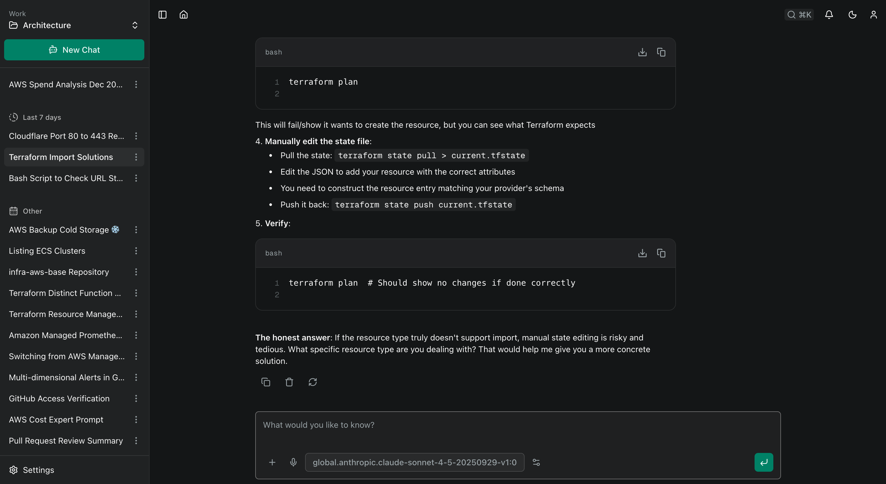

# Platypus

[](https://opensource.org/licenses/MIT)
[](https://www.typescriptlang.org/)
[](https://nextjs.org/)
[](https://hono.dev/)
[](https://www.docker.com/)
[](https://pnpm.io/)

**A modern, multi-tenant platform for building and managing AI Agents.**

Platypus is an open-source, full-stack application designed to help you build AI agents. Built with a focus on extensibility and modern web standards, Platypus allows you to create agents that can reason, use tools, and interact with the world.



## ✨ Key Features

- **🏢 Multi-Tenancy:** Built-in support for Organizations and Workspaces to isolate data and manage teams.
- **🤖 Agentic Workflows:** Create sophisticated agents with custom system prompts, model configurations, and tool assignments.
- **✨ Skills:** Create reusable instruction sets that agents can dynamically load on-demand to handle specialized tasks.
- **🧩 Sub-Agents:** Agents can delegate specialized tasks to other agents, enabling hierarchical multi-agent workflows with isolated contexts and result streaming.
- **📱 Responsive Design:** A fully responsive interface that works seamlessly across desktop, tablet, and mobile devices.
- **🔌 MCP Support:** First-class support for the **Model Context Protocol** (MCP), allowing agents to securely connect to local and remote data sources.
- **📐 Blueprints _(experimental)_:** Define a named, organization-scoped set of shared resources (Agents, Skills, MCPs, Providers) and apply it to a Workspace to attach them all in one step. Applying is additive and idempotent, and it's a snapshot — editing a Blueprint never disturbs Workspaces you've already provisioned from it.
- **🏖️ Sandbox _(experimental)_:** Give agents shell and filesystem access inside an isolated, per-workspace execution environment. Ships with a Docker reference backend (single-node / self-hosted only — see `compose.sandbox.yaml`); the adapter interface is pluggable so other backends can be contributed.
- **🧠 Memory:** Platypus automatically extracts facts and preferences from your conversations in the background and injects them into future chats, so agents remember things about you over time.
- **📋 Kanban Boards:** Organize work visually with drag-and-drop Kanban boards. Agents can create, move, and update cards autonomously via built-in Kanban tools.
- **📊 Dashboards _(experimental)_:** Build widget-based dashboards to surface agent data at a glance. Supports metric, text/markdown, image, weather, line chart, bar chart, and pie chart widgets with a drag-and-drop layout editor. Agents can update widget data autonomously via built-in dashboard tools.
- **🔔 Webhooks:** Receive real-time HTTP callbacks for notification events, with per-event filtering, custom headers, HMAC-SHA256 signing, and automatic retries.
- **⏰ Schedules:** Schedule agents to run automatically at specified times using cron expressions, with support for timezones and one-off executions.
- **⚡ Modern Tech Stack:** Built on the bleeding edge with **Next.js**, **Hono.js**, **Drizzle ORM**, **pgvector**, and **Tailwind CSS**.
- **🌐 Provider Agnostic:** Powered by the Vercel AI SDK, supporting OpenAI, Anthropic, Google, Amazon Bedrock, and OpenRouter.
- **⚖️ MIT Licensed:** Open source and free to use.


## 🏗️ Architecture

Platypus is a monorepo managed by [Turborepo](https://turbo.build/), ensuring a fast and efficient development workflow.

- **`apps/frontend`**: A responsive web interface built with Next.js, ShadCN, and Tailwind. It uses the AI SDK for real-time streaming responses.
- **`apps/backend`**: A high-performance REST API built with Hono.js running on Node.js. It handles agent logic, tool execution, and database interactions.
- **`packages/schemas`**: Shared Zod schemas used by both frontend and backend for end-to-end type safety.

## 🚀 Quick Start (Docker)

The fastest way to get Platypus running is using Docker Compose.

1.  **Clone and configure:**

    ```bash
    git clone https://github.com/willdady/platypus.git
    cd platypus
    cp .env.example .env
    ```

    Edit `.env` and set `BETTER_AUTH_SECRET` to a secure random string and update the admin credentials. See the comments in `.env.example` for all available options.

2.  **Start the application:**

    ```bash
    docker compose up -d
    ```

3.  **Sign in:**

    Navigate to `http://localhost:3000` and sign in with the credentials you configured in `.env`.

> [!CAUTION]
> Change the default password after your first login!

## 🛠️ Local Development

### Prerequisites

- **Docker** (for the local Postgres database with [pgvector](https://github.com/pgvector/pgvector))
- **Node.js v24+**
- **pnpm**
- An AI Provider API Key (e.g., OpenRouter, OpenAI)

### Setup

1.  **Install dependencies:**

    ```bash
    pnpm install
    ```

2.  **Configure Environment:**
    Create `.env` files for both apps:

    ```bash
    cp apps/frontend/.env.example apps/frontend/.env
    cp apps/backend/.env.example apps/backend/.env
    ```

    Edit `apps/backend/.env` and set the following environment variables:
    - `BETTER_AUTH_SECRET`: A secure random string (minimum 32 characters).
    - `ADMIN_EMAIL`: The email address for the initial admin user.
    - `ADMIN_PASSWORD`: A secure password for the initial admin user.
    - `TIMEZONE` (optional): IANA timezone name for e.g., "America/New_York", "Europe/London". Defaults to UTC.
    - `FRONTEND_URL` (optional): The URL of the frontend application, used for generating resource links in tool responses. Defaults to `http://localhost:3001`.

    ```env
    BETTER_AUTH_SECRET: "your-secure-random-string-here"
    ADMIN_EMAIL: "admin@example.com"
    ADMIN_PASSWORD: "your-secure-password-here"
    TIMEZONE: "UTC"
    FRONTEND_URL: "http://localhost:3001"
    ```

3.  **Start Development Server:**
    This command starts the frontend, backend, and a local Postgres container.

    ```bash
    pnpm dev
    ```

4.  **Initialize Database:**
    Apply the schema to your local database (ensure `pnpm dev` is running first).

    ```bash
    pnpm drizzle-kit-push
    ```

5.  **Sign in:**
    Navigate to `http://localhost:3001` and sign in with the default credentials configured in your `.env` file (`ADMIN_EMAIL` and `ADMIN_PASSWORD`).

## 📱 Accessing from Mobile or Other Devices on Your Network

By default the dev setup is configured for `localhost`-only access. To access Platypus from a phone or another device on your local network, a few extra steps are needed due to how browser cookies work — session cookies set on one host (e.g. `192.168.1.10`) are not sent for a different host (e.g. `localhost`), so you must use the same host for both the frontend and backend consistently.

1. **Find your machine's local IP address** (e.g. `192.168.1.10`).

2. **Update `apps/frontend/.env`:**

   ```env
   # URL used by the browser to reach the backend — must be your LAN IP
   BACKEND_URL=http://192.168.1.10:4001

   # URL used by the Next.js server to reach the backend internally (optional but recommended)
   INTERNAL_BACKEND_URL=http://localhost:4001

   # Allow the Next.js dev server to accept requests from your LAN IP
   ALLOWED_DEV_ORIGINS=192.168.1.10
   ```

3. **Update `apps/backend/.env`** to allow requests from both origins:

   ```env
   ALLOWED_ORIGINS=http://localhost:3001,http://192.168.1.10:3001
   ```

4. **Access the app via your LAN IP on all devices** — including your desktop browser. Because session cookies are scoped to the host they were set on, you must use `http://192.168.1.10:3001` consistently. Mixing `localhost` and the IP address on the same browser will cause sign-in to silently fail.

## 📦 Storage

Platypus stores file attachments (images, documents, etc.) separately from chat messages to keep the database efficient. When users attach files to messages, the binary data is extracted and stored in a pluggable storage backend, with only a reference stored in the database.

The following variables are configured in your `.env` file (see `.env.example` for defaults).

### Disk Storage (Default)

By default, files are stored on the local filesystem at `./data/files`. This works well for single-server deployments and local development.

```env
STORAGE_BACKEND=disk
STORAGE_DISK_PATH=/data/files
```

### S3-Compatible Storage

For production deployments, you can use any S3-compatible service (AWS S3, MinIO, Cloudflare R2, DigitalOcean Spaces, etc.):

```env
STORAGE_BACKEND=s3
STORAGE_S3_BUCKET=my-bucket
STORAGE_S3_REGION=us-east-1
STORAGE_S3_ENDPOINT=https://s3.amazonaws.com
STORAGE_S3_ACCESS_KEY_ID=your-access-key
STORAGE_S3_SECRET_ACCESS_KEY=your-secret-key
```

### Direct File Access

For better performance with cloud storage, you can configure a public URL to serve files directly from your storage provider instead of proxying through the backend:

```env
STORAGE_PUBLIC_URL=https://my-bucket.s3.amazonaws.com
```

This allows browsers to fetch files directly from S3 (or via CDN) instead of going through the backend `/files` endpoint.

## ⚠️ Known Issues

- When chatting with Google's image generation models (Nano Banana) you MAY get more than one image returned. See https://blog.laozhang.ai/en/posts/temporary-images-nano-banana-bug

## 🗺️ Roadmap

Curious where Platypus is headed — and where it isn't? See [ROADMAP.md](ROADMAP.md) for
the project vision and the themes we're working towards. If you're planning a substantial
contribution, read it (especially the non-goals) and open a discussion first so the effort
lands well.

## 🤝 Contributing

Contributions are welcome! Please read our [Contributing Guide](CONTRIBUTING.md) for details on branch naming, commit conventions, and how to submit a pull request.

---

Platypus logo by [Thiings.co](https://www.thiings.co/things)
