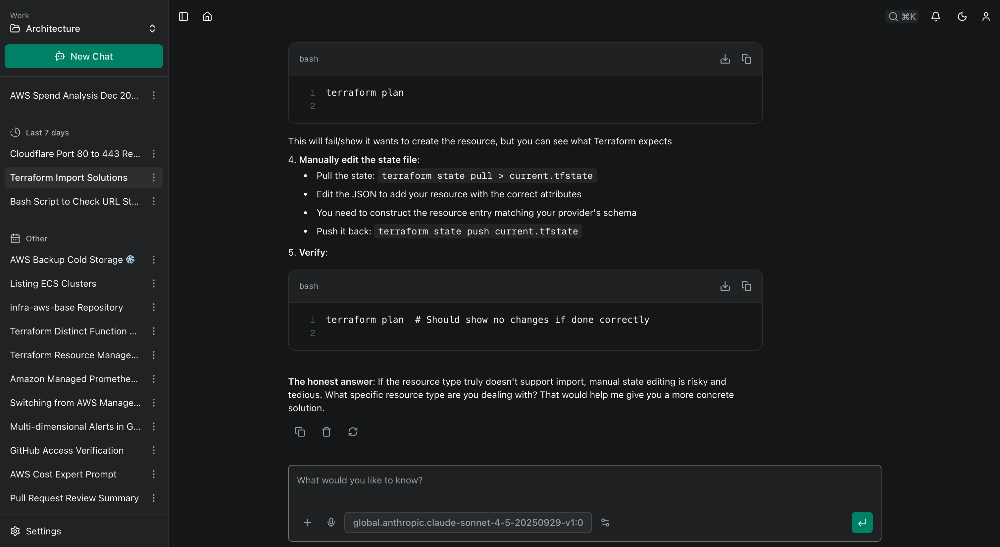
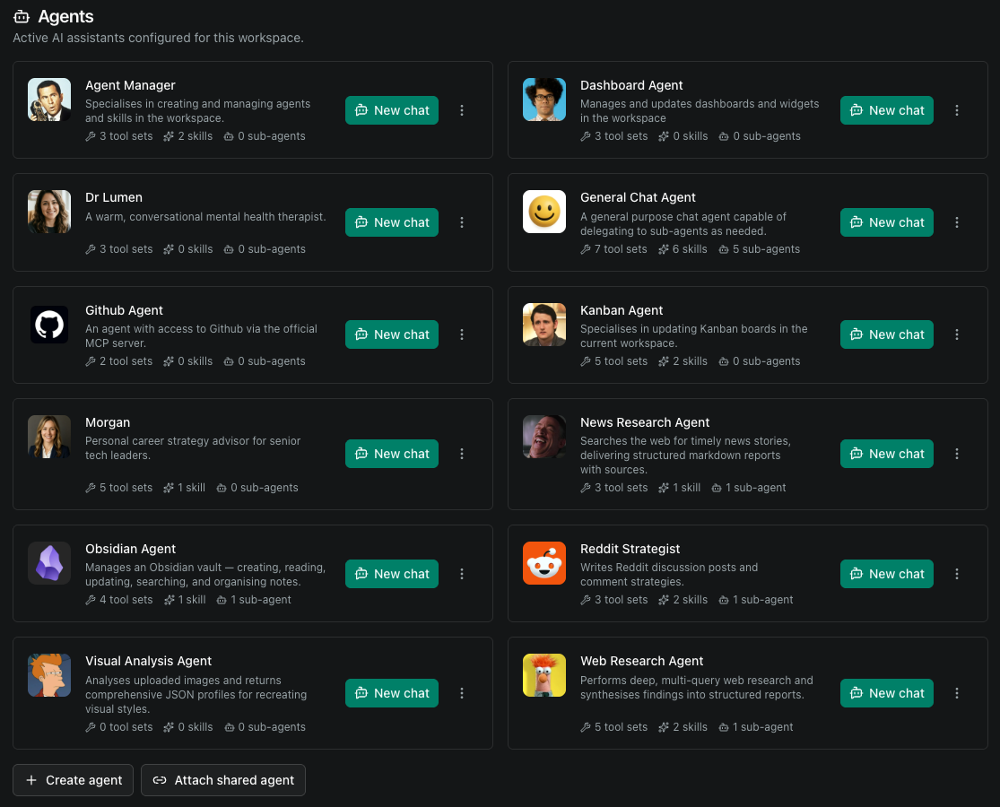

<p align="center">
  
</p>

<h1 align="center">Platypus</h1>

<p align="center">
  <strong>Self-hosted AI Agents for your whole team — on your infrastructure, your models, around the clock.</strong>
</p>

<p align="center">
  <a href="https://opensource.org/licenses/MIT"></a>
  <a href="https://www.typescriptlang.org/"></a>
  <a href="https://nextjs.org/"></a>
  <a href="https://hono.dev/"></a>
  <a href="https://www.docker.com/"></a>
  <a href="https://pnpm.io/"></a>
</p>

Platypus is an open-source, full-stack application for building AI Agents that reason, use tools, and keep working when you aren't watching. You bring the models — hosted, proxied, or running on your own hardware — and Platypus gives you the Agents, the tools they call, the schedules they run on, and the multi-tenant boundaries that keep one team's work out of another's.

🌐 **Visit the website at [platypus.chat](https://platypus.chat).**

📚 **Full documentation lives at [docs.platypus.chat](https://docs.platypus.chat).**



## ✨ Key Features

- **🤖 Agents, Skills & Sub-Agents:** Build an Agent once — model, instructions, and tools — then give it reusable Skills it loads on demand and sub-agents it can delegate to.
- **🔌 MCP Support:** First-class **Model Context Protocol** support, so Agents connect securely to local and remote data sources.
- **🏖️ Sandbox:** Shell and filesystem access inside an isolated, per-workspace execution environment, with pluggable Docker and SSH reference backends.
- **🧠 Memory:** Facts and preferences are extracted from your conversations in the background and injected into future chats, so Agents remember you over time.
- **📋 Boards & Dashboards:** Drag-and-drop Kanban boards and widget-based dashboards, both readable and updatable by Agents through built-in tools.
- **⏰ Schedules & Webhooks:** Run Agents on cron schedules or one-offs, and receive HMAC-signed HTTP callbacks with per-event filtering and automatic retries.
- **🏢 Multi-Tenancy:** Organizations and Workspaces isolate data and keep one team's work out of another's.
- **📐 Blueprints:** Define an organization-scoped set of shared resources and apply it to a Workspace to attach them in one step — additive, idempotent, and a snapshot.
- **🌐 Provider Agnostic:** Powered by the Vercel AI SDK — OpenAI, Anthropic, Google, Bedrock, and OpenRouter, plus Ollama, vLLM, and any OpenAI-compatible endpoint.
- **⚖️ MIT Licensed:** Open source and free to use, on hardware you control.



## 🚀 Quick Start (Docker)

```bash
git clone https://github.com/willdady/platypus.git
cd platypus
cp .env.example .env   # set BETTER_AUTH_SECRET and your admin credentials
docker compose up -d   # then open http://localhost:3000
```

> [!CAUTION]
> Change the default password after your first login!

For configuration, providers, sandbox infrastructure, and production deployment, see the [Self-Hosting guide](https://docs.platypus.chat/self-hosting).

## 📚 Documentation

The docs site is the single source of truth for setup, concepts, and reference material:

- **[Getting Started](https://docs.platypus.chat/getting-started)** — quick start, first run, and the default admin account.
- **[Self-Hosting](https://docs.platypus.chat/self-hosting)** — Docker Compose, configuration & environment, providers & auth, and sandbox infrastructure.
- **[Concepts](https://docs.platypus.chat/concepts)** — the domain model: Organizations, Workspaces, Agents, Skills, MCP, Sandbox, and Memory.
- **[Building with Platypus](https://docs.platypus.chat/building-with-platypus)** — agents & sub-agents, skills, MCP servers, schedules, boards, and dashboards.
- **[Reference](https://docs.platypus.chat/reference)** — backend and frontend configuration reference.

Docs track the latest release; older versions are available by checking out the matching git tag.

## 🏗️ Architecture

Platypus is a monorepo managed by [Turborepo](https://turbo.build/):

- **`apps/frontend`**: A responsive web interface built with Next.js, ShadCN, and Tailwind. It uses the AI SDK for real-time streaming responses.
- **`apps/backend`**: A high-performance REST API built with Hono.js running on Node.js. It handles agent logic, tool execution, and database interactions.
- **`packages/schemas`**: Shared Zod schemas used by both frontend and backend for end-to-end type safety.

The [Extending guide](https://docs.platypus.chat/extending) covers contribution-facing extension points (sandbox backends, tool sets).

## 🗺️ Roadmap

Curious where Platypus is headed — and where it isn't? See [ROADMAP.md](ROADMAP.md) for
the project vision and the themes we're working towards. If you're planning a substantial
contribution, read it (especially the non-goals) and open a discussion first so the effort
lands well.

## 🤝 Contributing

Contributions are welcome! Please read our [Contributing Guide](CONTRIBUTING.md) for details on local development, branch naming, commit conventions, and how to submit a pull request.

**New here?** Browse our [good first issues](https://github.com/willdady/platypus/contribute) — scoped, newcomer-friendly tasks that are a great way to make your first contribution.

---

Platypus logo by [Thiings.co](https://www.thiings.co/things)
