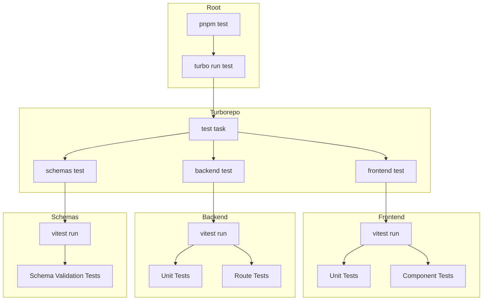

# Vitest Testing Framework Implementation Plan

## Overview

This plan outlines the implementation of Vitest as the testing framework for both the frontend (Next.js) and backend (Hono.js/Node.js) applications in the Platypus monorepo. The implementation follows best practices for each framework and integrates with the existing Turborepo build system.

## Current State Analysis

### Project Structure

- **Monorepo**: pnpm workspaces with Turborepo
- **Frontend**: Next.js 16 with React 19 (App Router)
- **Backend**: Hono.js with Node.js (ESM modules)
- **Shared**: `@platypus/schemas` package with Zod schemas
- **Build System**: Turborepo with task orchestration

### Key Observations

1. Backend uses ESM modules (`"type": "module"`)
2. Frontend uses Next.js with modern React features
3. Both Dockerfiles run in production mode without tests currently
4. Turborepo handles task orchestration via `turbo.json`
5. Existing utility functions are good candidates for validation tests

## Architecture Diagram



## Implementation Tasks

### 1. Install Vitest Dependencies

#### Root Level

No changes needed at root level - Turborepo handles orchestration.

#### Backend (`apps/backend`)

```bash
pnpm add -D vitest @vitest/coverage-v8
```

#### Frontend (`apps/frontend`)

```bash
pnpm add -D vitest @vitejs/plugin-react jsdom @testing-library/react @testing-library/dom @vitest/coverage-v8
```

#### Schemas (`packages/schemas`)

```bash
pnpm add -D vitest
```

### 2. Configuration Files

#### Backend: `apps/backend/vitest.config.ts`

```typescript
import { defineConfig } from "vitest/config";

export default defineConfig({
  test: {
    globals: true,
    environment: "node",
    include: ["**/*.test.ts"],
    exclude: ["node_modules", "drizzle"],
    coverage: {
      provider: "v8",
      reporter: ["text", "json", "html"],
      exclude: [
        "node_modules/**",
        "drizzle/**",
        "**/*.test.ts",
        "bruno/**",
        "scripts/**",
      ],
    },
  },
});
```

#### Frontend: `apps/frontend/vitest.config.ts`

Following Next.js + Vitest best practices:

```typescript
import { defineConfig } from "vitest/config";
import react from "@vitejs/plugin-react";
import path from "path";

export default defineConfig({
  plugins: [react()],
  test: {
    globals: true,
    environment: "jsdom",
    include: ["**/*.test.ts", "**/*.test.tsx"],
    exclude: ["node_modules", ".next"],
    setupFiles: ["./vitest.setup.ts"],
    coverage: {
      provider: "v8",
      reporter: ["text", "json", "html"],
      exclude: ["node_modules/**", ".next/**", "**/*.test.ts", "**/*.test.tsx"],
    },
  },
  resolve: {
    alias: {
      "@": path.resolve(__dirname, "./"),
    },
  },
});
```

#### Frontend: `apps/frontend/vitest.setup.ts`

```typescript
import "@testing-library/jest-dom/vitest";
```

#### Schemas: `packages/schemas/vitest.config.ts`

```typescript
import { defineConfig } from "vitest/config";

export default defineConfig({
  test: {
    globals: true,
    environment: "node",
    include: ["**/*.test.ts"],
    exclude: ["node_modules"],
  },
});
```

### 3. Package.json Updates

#### Root `package.json`

Add test script:

```json
{
  "scripts": {
    "test": "turbo run test"
  }
}
```

#### Backend `apps/backend/package.json`

```json
{
  "scripts": {
    "test": "vitest run",
    "test:watch": "vitest",
    "test:coverage": "vitest run --coverage"
  }
}
```

#### Frontend `apps/frontend/package.json`

```json
{
  "scripts": {
    "test": "vitest run",
    "test:watch": "vitest",
    "test:coverage": "vitest run --coverage"
  }
}
```

#### Schemas `packages/schemas/package.json`

```json
{
  "scripts": {
    "test": "vitest run"
  }
}
```

### 4. Turborepo Configuration

Update `turbo.json` to add test task:

```json
{
  "tasks": {
    "test": {
      "dependsOn": ["^build"],
      "inputs": ["$TURBO_DEFAULT$", "**/*.test.ts", "**/*.test.tsx"],
      "outputs": ["coverage/**"]
    }
  }
}
```

### 5. Validation Test Files

#### Backend: `apps/backend/src/utils.test.ts`

```typescript
import { describe, it, expect } from "vitest";
import { dedupeArray } from "./utils";

describe("dedupeArray", () => {
  it("should remove duplicate strings", () => {
    const input = ["a", "b", "a", "c", "b"];
    const result = dedupeArray(input);
    expect(result).toEqual(["a", "b", "c"]);
  });

  it("should return empty array for empty input", () => {
    expect(dedupeArray([])).toEqual([]);
  });

  it("should return same array when no duplicates", () => {
    const input = ["a", "b", "c"];
    expect(dedupeArray(input)).toEqual(["a", "b", "c"]);
  });
});
```

#### Frontend: `apps/frontend/lib/utils.test.ts`

```typescript
import { describe, it, expect } from "vitest";
import { joinUrl, parseValidationErrors } from "./utils";

describe("joinUrl", () => {
  it("should join base URL and path", () => {
    expect(joinUrl("http://localhost:4000", "/api/test")).toBe(
      "http://localhost:4000/api/test",
    );
  });

  it("should handle base URL with trailing slash", () => {
    expect(joinUrl("http://localhost:4000/", "/api/test")).toBe(
      "http://localhost:4000/api/test",
    );
  });

  it("should handle path without leading slash", () => {
    expect(joinUrl("http://localhost:4000", "api/test")).toBe(
      "http://localhost:4000/api/test",
    );
  });

  it("should return path when base is empty", () => {
    expect(joinUrl("", "/api/test")).toBe("/api/test");
  });
});

describe("parseValidationErrors", () => {
  it("should parse validation errors correctly", () => {
    const errorData = {
      error: [
        { path: ["name"], message: "Name is required" },
        { path: ["email"], message: "Invalid email" },
      ],
    };
    const result = parseValidationErrors(errorData);
    expect(result).toEqual({
      name: "Name is required",
      email: "Invalid email",
    });
  });

  it("should return empty object for invalid input", () => {
    expect(parseValidationErrors(null)).toEqual({});
    expect(parseValidationErrors({})).toEqual({});
    expect(parseValidationErrors({ error: "string" })).toEqual({});
  });
});
```

#### Schemas: `packages/schemas/index.test.ts`

```typescript
import { describe, it, expect } from "vitest";
import {
  organizationSchema,
  workspaceSchema,
  agentSchema,
  organizationCreateSchema,
} from "./index";

describe("Organization Schema", () => {
  it("should validate a valid organization", () => {
    const validOrg = {
      id: "123",
      name: "Test Org",
      createdAt: new Date(),
      updatedAt: new Date(),
    };
    const result = organizationSchema.safeParse(validOrg);
    expect(result.success).toBe(true);
  });

  it("should reject organization with short name", () => {
    const invalidOrg = {
      id: "123",
      name: "AB",
      createdAt: new Date(),
      updatedAt: new Date(),
    };
    const result = organizationSchema.safeParse(invalidOrg);
    expect(result.success).toBe(false);
  });

  it("should reject organization with long name", () => {
    const invalidOrg = {
      id: "123",
      name: "A".repeat(31),
      createdAt: new Date(),
      updatedAt: new Date(),
    };
    const result = organizationSchema.safeParse(invalidOrg);
    expect(result.success).toBe(false);
  });
});

describe("Organization Create Schema", () => {
  it("should validate create input with only required fields", () => {
    const result = organizationCreateSchema.safeParse({ name: "New Org" });
    expect(result.success).toBe(true);
  });

  it("should reject empty name", () => {
    const result = organizationCreateSchema.safeParse({ name: "" });
    expect(result.success).toBe(false);
  });
});

describe("Workspace Schema", () => {
  it("should validate a valid workspace", () => {
    const validWorkspace = {
      id: "456",
      organizationId: "123",
      name: "Test Workspace",
      createdAt: new Date(),
      updatedAt: new Date(),
    };
    const result = workspaceSchema.safeParse(validWorkspace);
    expect(result.success).toBe(true);
  });
});

describe("Agent Schema", () => {
  it("should validate a valid agent", () => {
    const validAgent = {
      id: "789",
      workspaceId: "456",
      providerId: "provider-123",
      name: "Test Agent",
      modelId: "gpt-4",
      createdAt: new Date(),
      updatedAt: new Date(),
    };
    const result = agentSchema.safeParse(validAgent);
    expect(result.success).toBe(true);
  });

  it("should allow optional fields", () => {
    const agentWithOptionals = {
      id: "789",
      workspaceId: "456",
      providerId: "provider-123",
      name: "Test Agent",
      description: "A test agent",
      systemPrompt: "You are a helpful assistant",
      modelId: "gpt-4",
      temperature: 0.7,
      maxSteps: 10,
      createdAt: new Date(),
      updatedAt: new Date(),
    };
    const result = agentSchema.safeParse(agentWithOptionals);
    expect(result.success).toBe(true);
  });
});
```

### 6. Docker Build Integration

Tests should run during the Docker build process to catch issues before deployment.

#### Backend Dockerfile Update (`apps/backend/Dockerfile`)

Add test stage before the runner stage:

```dockerfile
# Stage 1: Builder
FROM node:24-alpine AS builder
WORKDIR /app
RUN corepack enable pnpm

# Copy package files
COPY package.json pnpm-lock.yaml pnpm-workspace.yaml ./
COPY apps/backend/package.json ./apps/backend/
COPY packages/schemas/package.json ./packages/schemas/

# Install dependencies
RUN pnpm install --frozen-lockfile

# Copy source code
COPY apps/backend ./apps/backend
COPY packages/schemas ./packages/schemas

# Stage 2: Test
FROM builder AS test
WORKDIR /app
RUN pnpm --filter @platypus/backend test
RUN pnpm --filter @platypus/schemas test

# Stage 3: Runner
FROM node:24-alpine AS runner
# ... rest of runner stage
```

#### Frontend Dockerfile Update (`apps/frontend/Dockerfile`)

Add test stage after builder:

```dockerfile
# ... existing builder stage ...

# Test stage
FROM builder AS test
WORKDIR /app
RUN pnpm --filter @platypus/frontend test

# Production image
FROM base AS runner
# ... rest of runner stage, unchanged ...
```

### 7. TypeScript Configuration Updates

#### Backend: No changes needed

The backend already uses ESM with TypeScript and Vitest supports this natively.

#### Frontend: Update `tsconfig.json`

Add vitest types to the configuration:

```json
{
  "compilerOptions": {
    "types": ["vitest/globals"]
  }
}
```

## File Summary

| File                                | Action | Purpose                              |
| ----------------------------------- | ------ | ------------------------------------ |
| `package.json`                      | Modify | Add `test` script                    |
| `turbo.json`                        | Modify | Add `test` task                      |
| `apps/backend/package.json`         | Modify | Add test scripts and devDependencies |
| `apps/backend/vitest.config.ts`     | Create | Vitest configuration for backend     |
| `apps/backend/src/utils.test.ts`    | Create | Unit tests for utility functions     |
| `apps/backend/Dockerfile`           | Modify | Add test stage                       |
| `apps/frontend/package.json`        | Modify | Add test scripts and devDependencies |
| `apps/frontend/vitest.config.ts`    | Create | Vitest configuration for frontend    |
| `apps/frontend/vitest.setup.ts`     | Create | Test setup file                      |
| `apps/frontend/lib/utils.test.ts`   | Create | Unit tests for utility functions     |
| `apps/frontend/tsconfig.json`       | Modify | Add vitest types                     |
| `apps/frontend/Dockerfile`          | Modify | Add test stage                       |
| `packages/schemas/package.json`     | Modify | Add test script and devDependency    |
| `packages/schemas/vitest.config.ts` | Create | Vitest configuration for schemas     |
| `packages/schemas/index.test.ts`    | Create | Schema validation tests              |

## Implementation Order

1. **Install dependencies** - Add Vitest and related packages to each app
2. **Create configuration files** - vitest.config.ts for each package
3. **Update package.json scripts** - Add test commands to each package
4. **Update turbo.json** - Add test task for Turborepo
5. **Update root package.json** - Add test script
6. **Create validation tests** - One test file per package
7. **Run and verify tests locally** - Ensure `pnpm test` works
8. **Update Dockerfiles** - Add test stages
9. **Verify Docker builds** - Ensure tests run during builds

## Verification Steps

After implementation, verify the setup by running:

```bash
# Run all tests from root
pnpm test

# Run tests for specific package
pnpm --filter @platypus/backend test
pnpm --filter @platypus/frontend test
pnpm --filter @platypus/schemas test

# Run with watch mode during development
pnpm --filter @platypus/backend test:watch

# Run with coverage
pnpm --filter @platypus/backend test:coverage
```

## Notes and Considerations

1. **Test Isolation**: Each app has its own Vitest configuration to handle environment-specific needs (Node vs jsdom)
2. **Performance**: Turborepo caching will cache test results when source files haven't changed
3. **Coverage**: Coverage reports are optional but included in configuration
4. **Docker Tests**: Running tests in Docker ensures the production build environment passes all tests
5. **Future Expansion**: The setup supports adding more complex tests (integration, e2e) in the future

## Dependencies to Install

### Backend

```
vitest
@vitest/coverage-v8
```

### Frontend

```
vitest
@vitejs/plugin-react
jsdom
@testing-library/react
@testing-library/dom
@testing-library/jest-dom
@vitest/coverage-v8
```

### Schemas

```
vitest
```
