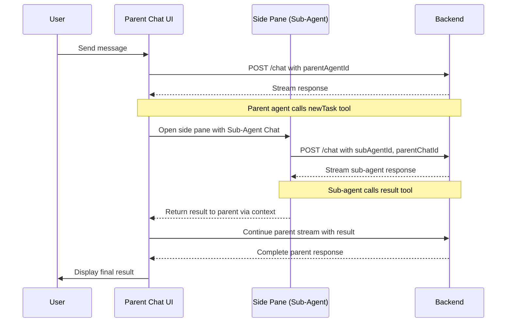
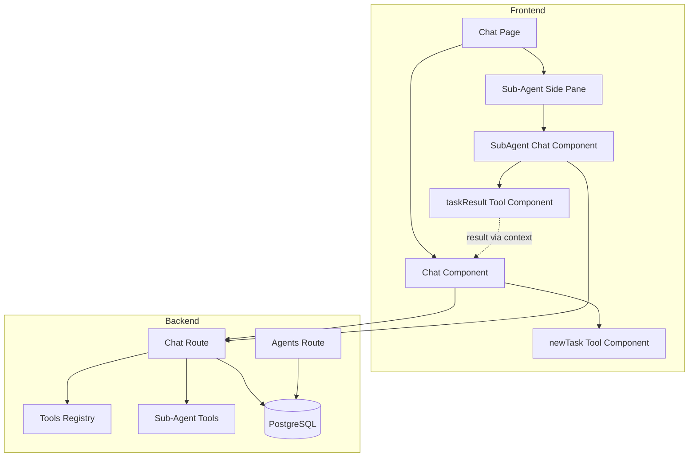

# Sub-Agents Feature - Design Plan

## Overview

This document outlines the design for implementing a "Sub-Agents" feature that allows parent agents to delegate specific sub-tasks to other agents. Sub-agents operate with their own context window and tools, preventing context bloat in the parent agent while enabling specialized task handling.

## Key Decisions Summary

| Decision                 | Choice                                                               |
| ------------------------ | -------------------------------------------------------------------- |
| Sub-agent depth          | Limited to 1 level at runtime (sub-agents don't get `newTask` tool)  |
| Sub-agent assignment     | Static - explicitly assigned to parent agent                         |
| Context passing          | Fresh context with task-specific information from parent             |
| Tool injection           | Single auto-injected `newTask` tool when sub-agents assigned         |
| Result tool              | `taskResult` with `{ result: string, status: 'success' \| 'error' }` |
| Sub-agent stop condition | `taskResult` tool call OR 100 steps (safety limit)                   |
| UI presentation          | **Side pane to the right of the main chat area**                     |
| Persistence              | Save sub-chats with `parentChatId` reference                         |
| Execution                | Client-side tool execution renders side pane with Chat component     |
| Validation               | Self-assignment prevention at agent create/update time               |

---

## Architecture

### High-Level Flow



### Component Relationships



---

## Database Changes

### 1. Agent Table - Add `subAgentIds` Field

Add a new JSONB array field to store assigned sub-agent IDs:

```typescript
// apps/backend/src/db/schema.ts
export const agent = pgTable(
  "agent",
  (t) => ({
    // ... existing fields ...
    subAgentIds: t.jsonb("sub_agent_ids").$type<string[]>().default([]),
    // ... existing fields ...
  }),
  (t) => [
    index("idx_agent_workspace_id").on(t.workspaceId),
    index("idx_agent_provider_id").on(t.providerId),
  ],
);
```

### 2. Chat Table - Add `parentChatId` Field

Add an optional foreign key to support parent-child chat relationships:

```typescript
// apps/backend/src/db/schema.ts
export const chat = pgTable(
  "chat",
  (t) => ({
    // ... existing fields ...
    parentChatId: t.text("parent_chat_id").references(() => chat.id, {
      onDelete: "cascade",
    }),
    // ... existing fields ...
  }),
  (t) => [
    index("idx_chat_workspace_id").on(t.workspaceId),
    index("idx_chat_parent_chat_id").on(t.parentChatId),
  ],
);
```

---

## Schema Changes

### 1. Agent Schema Updates

```typescript
// packages/schemas/index.ts

export const agentSchema = z.object({
  // ... existing fields ...
  subAgentIds: z.array(z.string()).optional(),
  // ... existing fields ...
});

export const agentCreateSchema = agentSchema.pick({
  workspaceId: true,
  providerId: true,
  name: true,
  description: true,
  systemPrompt: true,
  modelId: true,
  maxSteps: true,
  temperature: true,
  topP: true,
  topK: true,
  seed: true,
  presencePenalty: true,
  frequencyPenalty: true,
  toolSetIds: true,
  skillIds: true,
  inputPlaceholder: true,
  subAgentIds: true, // <-- ADDED
});

export const agentUpdateSchema = agentSchema.pick({
  providerId: true,
  name: true,
  description: true,
  systemPrompt: true,
  modelId: true,
  maxSteps: true,
  temperature: true,
  topP: true,
  topK: true,
  seed: true,
  presencePenalty: true,
  frequencyPenalty: true,
  toolSetIds: true,
  skillIds: true,
  inputPlaceholder: true,
  subAgentIds: true, // <-- ADDED
});
```

### 2. Chat Schema Updates

```typescript
// packages/schemas/index.ts

export const chatSchema = z.object({
  // ... existing fields ...
  parentChatId: z.string().optional(),
  // ... existing fields ...
});

export const chatSubmitSchema = chatSchema
  .pick({
    id: true,
    workspaceId: true,
    messages: true,
    systemPrompt: true,
    temperature: true,
    topP: true,
    topK: true,
    seed: true,
    presencePenalty: true,
    frequencyPenalty: true,
  })
  .extend({
    agentId: z.string().optional(),
    providerId: z.string().optional(),
    modelId: z.string().optional(),
    search: z.boolean().optional(),
    parentChatId: z.string().optional(), // <-- ADDED
  })
  .refine(
    (data) => {
      const hasAgent = Boolean(data.agentId);
      const hasProviderModel = Boolean(data.providerId && data.modelId);
      return hasAgent || hasProviderModel;
    },
    {
      message: "Must provide either agentId or (providerId and modelId)",
      path: ["agentId"],
    },
  );
```

### 3. New Task Tool Schema

```typescript
// packages/schemas/index.ts

export const newTaskToolInputSchema = z.object({
  subAgentId: z.string().describe("The ID of the sub-agent to delegate to"),
  task: z
    .string()
    .describe("The task description and context for the sub-agent"),
});

export type NewTaskToolInput = z.infer<typeof newTaskToolInputSchema>;

export const taskResultToolInputSchema = z.object({
  result: z.string().describe("The result of the completed task"),
  status: z
    .enum(["success", "error"])
    .describe("Whether the task succeeded or failed"),
});

export type TaskResultToolInput = z.infer<typeof taskResultToolInputSchema>;
```

---

## Backend Implementation

### 1. Sub-Agent Validation Service

Create a service to validate sub-agent assignments and prevent circular dependencies:

```typescript
// apps/backend/src/services/sub-agent-validation.ts

import { db } from "../index.ts";
import { agent as agentTable } from "../db/schema.ts";
import { and, eq, inArray } from "drizzle-orm";

export const validateSubAgentAssignment = async (
  workspaceId: string,
  agentId: string,
  subAgentIds: string[],
): Promise<{ valid: boolean; error?: string }> => {
  // 1. Check self-assignment
  if (subAgentIds.includes(agentId)) {
    return {
      valid: false,
      error: "An agent cannot assign itself as a sub-agent",
    };
  }

  // 2. Fetch all proposed sub-agents
  const subAgents = await db
    .select()
    .from(agentTable)
    .where(
      and(
        eq(agentTable.workspaceId, workspaceId),
        inArray(agentTable.id, subAgentIds),
      ),
    );

  // 3. Verify all sub-agents exist in workspace
  if (subAgents.length !== subAgentIds.length) {
    return {
      valid: false,
      error: "One or more sub-agents not found in workspace",
    };
  }

  // Note: We allow agents that have their own sub-agents to BE sub-agents.
  // The depth limit is enforced at runtime - when an agent runs as a sub-agent,
  // the newTask tool is NOT injected, preventing nested delegation.

  return { valid: true };
};
```

### 2. Update Agent Routes

Modify the agent create/update routes to include validation:

```typescript
// apps/backend/src/routes/agent.ts

import { validateSubAgentAssignment } from "../services/sub-agent-validation.ts";

// In agent.post("/", ...)
agent.post(
  "/",
  requireAuth,
  requireOrgAccess(),
  requireWorkspaceAccess(["admin", "editor"]),
  sValidator("json", agentCreateSchema),
  async (c) => {
    const data = c.req.valid("json");
    const workspaceId = c.req.param("workspaceId")!;

    // Deduplicate arrays
    if (data.toolSetIds) {
      data.toolSetIds = dedupeArray(data.toolSetIds);
    }
    if (data.skillIds) {
      data.skillIds = dedupeArray(data.skillIds);
    }
    if (data.subAgentIds) {
      data.subAgentIds = dedupeArray(data.subAgentIds);
    }

    // Validate sub-agent assignments
    if (data.subAgentIds && data.subAgentIds.length > 0) {
      const validation = await validateSubAgentAssignment(
        workspaceId,
        "", // No ID yet for new agent
        data.subAgentIds,
      );
      if (!validation.valid) {
        return c.json({ message: validation.error }, 400);
      }
    }

    const record = await db
      .insert(agentTable)
      .values({
        id: nanoid(),
        ...data,
      })
      .returning();
    return c.json(record[0], 201);
  },
);

// In agent.put("/:agentId", ...)
agent.put(
  "/:agentId",
  requireAuth,
  requireOrgAccess(),
  requireWorkspaceAccess(["admin", "editor"]),
  sValidator("json", agentUpdateSchema),
  async (c) => {
    const agentId = c.req.param("agentId");
    const data = c.req.valid("json");

    // Deduplicate arrays
    if (data.toolSetIds) {
      data.toolSetIds = dedupeArray(data.toolSetIds);
    }
    if (data.skillIds) {
      data.skillIds = dedupeArray(data.skillIds);
    }
    if (data.subAgentIds) {
      data.subAgentIds = dedupeArray(data.subAgentIds);
    }

    // Validate sub-agent assignments
    if (data.subAgentIds) {
      const workspaceId = c.req.param("workspaceId")!;
      const validation = await validateSubAgentAssignment(
        workspaceId,
        agentId,
        data.subAgentIds,
      );
      if (!validation.valid) {
        return c.json({ message: validation.error }, 400);
      }
    }

    const record = await db
      .update(agentTable)
      .set({
        ...data,
        updatedAt: new Date(),
      })
      .where(eq(agentTable.id, agentId))
      .returning();
    return c.json(record, 200);
  },
);
```

### 3. Create Sub-Agent Tools

```typescript
// apps/backend/src/tools/sub-agent.ts

import { tool } from "ai";
import { z } from "zod";

/**
 * Creates the newTask tool for delegating to sub-agents.
 * This is a client-side tool - it has no execute function.
 * The frontend handles the tool call by opening the side pane.
 */
export const createNewTaskTool = (
  subAgents: Array<{ id: string; name: string; description?: string }>,
) => {
  const subAgentDescriptions = subAgents
    .map(
      (sa) => `- ${sa.name} (${sa.id}): ${sa.description || "No description"}`,
    )
    .join("\n");

  return tool({
    description: `Delegate a task to a specialized sub-agent. Available sub-agents:\n${subAgentDescriptions}`,
    inputSchema: z.object({
      subAgentId: z.string().describe("The ID of the sub-agent to delegate to"),
      task: z
        .string()
        .describe("Complete task description with all necessary context"),
    }),
    // No execute function - this is a client-side tool
  });
};

/**
 * Creates the taskResult tool for sub-agents to return their results.
 * This tool signals completion of the sub-agent task.
 * It is a client-side tool that the frontend uses to capture the result
 * and return it to the parent agent.
 */
export const createTaskResultTool = () => {
  return tool({
    description:
      "Call this tool when you have completed your assigned task. This will return control to the parent agent.",
    inputSchema: z.object({
      result: z.string().describe("The complete result of your task"),
      status: z
        .enum(["success", "error"])
        .describe("Whether the task was completed successfully"),
    }),
    // No execute function - this is a client-side tool
  });
};
```

### 4. Update Chat Route

Modify the chat POST endpoint to handle sub-agent mode:

```typescript
// apps/backend/src/routes/chat.ts

// Add imports
import { or } from "ai"; // for combining stop conditions
import { createNewTaskTool, createTaskResultTool } from "../tools/sub-agent.ts";
import { agent as agentTable } from "../db/schema.ts";

// In chat.post("/", ...) - after loadTools

chat.post(
  "/",
  requireAuth,
  requireOrgAccess(),
  requireWorkspaceAccess(),
  sValidator("json", chatSubmitSchema),
  async (c) => {
    const orgId = c.req.param("orgId")!;
    const workspaceId = c.req.param("workspaceId")!;
    const data = c.req.valid("json");
    const { messages = [], parentChatId } = data;
    const isSubAgentChat = Boolean(parentChatId);

    // ... existing workspace fetch and context resolution ...
    const context = await resolveChatContext(data, orgId, workspaceId);
    const { provider, agent, resolvedModelId, resolvedMaxSteps } = context;

    // Initialize Model
    const [aiProvider, model] = createModel(provider, resolvedModelId);

    // Load Tools (Static & MCP)
    const { tools, mcpClients } = await loadTools(agent, workspaceId);

    // Configure Search (if enabled)
    if (data.search) {
      Object.assign(tools, createSearchTools(provider, aiProvider));
    }

    // Inject sub-agent tools if applicable (only for parent agents, not sub-agents)
    if (agent?.subAgentIds && agent.subAgentIds.length > 0 && !isSubAgentChat) {
      // Fetch sub-agent details for tool descriptions
      const subAgents = await db
        .select({
          id: agentTable.id,
          name: agentTable.name,
          description: agentTable.description,
        })
        .from(agentTable)
        .where(inArray(agentTable.id, agent.subAgentIds));

      tools.newTask = createNewTaskTool(subAgents);
    }

    // Inject taskResult tool if this is a sub-agent chat
    if (isSubAgentChat) {
      tools.taskResult = createTaskResultTool();
    }

    // Fetch Skills (if any)
    let skills: Array<Pick<Skill, "name" | "description">> = [];
    if (agent?.skillIds && agent.skillIds.length > 0) {
      const skillRecords = await db
        .select({ name: skillTable.name, description: skillTable.description })
        .from(skillTable)
        .where(
          and(
            eq(skillTable.workspaceId, workspaceId),
            inArray(skillTable.id, agent.skillIds),
          ),
        );
      skills = skillRecords;
    }

    // ... existing user context fetch ...

    // Prepare Generation Config
    const config = await resolveGenerationConfig(
      data,
      workspaceId,
      agent,
      workspace.context || undefined,
      skills,
      { id: user.id, name: user.name },
      userGlobalContext,
      userWorkspaceContext,
    );

    // Inject loadSkill tool if skills exist
    if (skills.length > 0) {
      tools.loadSkill = createLoadSkillTool(workspaceId);
    }

    // Prepare stop conditions
    const { systemPrompt, ...restConfig } = config;
    const stopConditions = [];

    // For sub-agents: stop when taskResult tool is called OR after 100 steps
    if (isSubAgentChat) {
      stopConditions.push(hasToolCall("taskResult"));
      stopConditions.push(stepCountIs(100)); // Force safety limit for sub-agents
    } else {
      // For regular chats: stop at maxSteps and optionally askFollowupQuestion
      stopConditions.push(stepCountIs(resolvedMaxSteps));
      if (tools.askFollowupQuestion) {
        stopConditions.push(hasToolCall("askFollowupQuestion"));
      }
    }

    // Stream Response
    const result = streamText({
      model: model as any,
      messages: await convertToModelMessages(messages),
      stopWhen: stopConditions,
      tools,
      system: systemPrompt,
      ...restConfig,
    });

    return result.toUIMessageStreamResponse<PlatypusUIMessage>({
      originalMessages: messages,
      generateMessageId: createIdGenerator({
        prefix: "msg",
        size: 16,
      }),
      onFinish: async ({ messages }) => {
        try {
          // Close all MCP clients
          for (const mcpClient of mcpClients) {
            try {
              await mcpClient.close();
            } catch (error) {
              logger.error({ error }, "Error closing MCP client");
            }
          }

          // Upsert chat record with parentChatId if applicable
          await upsertChatRecord(
            data.id,
            workspaceId,
            messages,
            context,
            config,
            data,
            parentChatId, // Pass parentChatId for sub-agent chats
          );
        } catch (error) {
          logger.error({ error }, "Error in onFinish");
        }
      },
    });
  },
);
```

### 5. Update Chat List Endpoint

Filter out sub-agent chats from the main list:

```typescript
// apps/backend/src/routes/chat.ts

import { isNull } from "drizzle-orm";

chat.get(
  "/",
  requireAuth,
  requireOrgAccess(),
  requireWorkspaceAccess(),
  sValidator(
    "query",
    z.object({ limit: z.string().optional(), offset: z.string().optional() }),
  ),
  async (c) => {
    const workspaceId = c.req.param("workspaceId")!;
    const { limit: limitStr, offset: offsetStr } = c.req.valid("query");

    const limit = Math.min(parseInt(limitStr ?? "100") || 100, 100);
    const offset = parseInt(offsetStr ?? "0") || 0;

    const records = await db
      .select({
        id: chatTable.id,
        title: chatTable.title,
        isPinned: chatTable.isPinned,
        tags: chatTable.tags,
        agentId: chatTable.agentId,
        providerId: chatTable.providerId,
        modelId: chatTable.modelId,
        createdAt: chatTable.createdAt,
        updatedAt: chatTable.updatedAt,
      })
      .from(chatTable)
      .where(
        and(
          eq(chatTable.workspaceId, workspaceId),
          isNull(chatTable.parentChatId), // Only top-level chats
        ),
      )
      .orderBy(desc(chatTable.createdAt))
      .limit(limit)
      .offset(offset);

    return c.json({ results: records });
  },
);
```

### 6. Update upsertChatRecord helper

Update the helper to handle `parentChatId`:

```typescript
// apps/backend/src/routes/chat.ts

/**
 * Upserts the chat record in the database.
 */
const upsertChatRecord = async (
  id: string,
  workspaceId: string,
  messages: PlatypusUIMessage[],
  context: ChatContext,
  config: GenerationConfig,
  data: ChatSubmitData,
  parentChatId?: string, // <-- ADDED parameter
) => {
  const { resolvedAgentId, resolvedProviderId, resolvedModelId } = context;

  // Prepare values for DB
  const dbValues = {
    messages,
    agentId: resolvedAgentId || null,
    providerId: resolvedAgentId ? null : resolvedProviderId,
    modelId: resolvedAgentId ? null : resolvedModelId,
    systemPrompt: resolvedAgentId ? null : config.systemPrompt || null,
    temperature: resolvedAgentId ? null : config.temperature || null,
    topP: resolvedAgentId ? null : config.topP || null,
    topK: resolvedAgentId ? null : config.topK || null,
    seed: resolvedAgentId ? null : data.seed || null,
    presencePenalty: resolvedAgentId ? null : config.presencePenalty || null,
    frequencyPenalty: resolvedAgentId ? null : config.frequencyPenalty || null,
    parentChatId: parentChatId || null, // <-- ADDED
    updatedAt: new Date(),
  };

  try {
    // Upsert chat record - try update first, then insert if not found
    const updateResult = await db
      .update(chatTable)
      .set(dbValues)
      .where(and(eq(chatTable.id, id), eq(chatTable.workspaceId, workspaceId)))
      .returning();

    // If no rows were updated, insert the record
    if (updateResult.length === 0) {
      await db.insert(chatTable).values({
        id,
        workspaceId,
        title: "Untitled",
        createdAt: new Date(),
        ...dbValues,
      });
    }

    logger.info(
      `Successfully upserted chat '${id}' in workspace '${workspaceId}'`,
    );
  } catch (error) {
    logger.error(
      { error, chatId: id, workspaceId },
      "Error upserting chat record",
    );
  }
};
```

### 7. Update Types

Add the new tools to `PlatypusTools` type:

```typescript
// apps/backend/src/types.ts

import {
  type UIMessage,
  type InferUITool,
  type InferUITools,
  type UIDataTypes,
} from "ai";
import * as mathTools from "./tools/math.ts";
import * as elicitationTools from "./tools/elicitation.ts";
import { createLoadSkillTool } from "./tools/skill.ts";
import { createNewTaskTool, createTaskResultTool } from "./tools/sub-agent.ts";

export type MathTools = InferUITools<typeof mathTools>;

export type ElicitationTools = InferUITools<typeof elicitationTools>;

export type SkillTools = {
  loadSkill: InferUITool<ReturnType<typeof createLoadSkillTool>>;
};

export type SubAgentTools = {
  newTask: InferUITool<ReturnType<typeof createNewTaskTool>>;
  taskResult: InferUITool<ReturnType<typeof createTaskResultTool>>;
};

export type PlatypusTools = MathTools &
  ElicitationTools &
  SkillTools &
  SubAgentTools;

export type PlatypusUIMessage = UIMessage<any, UIDataTypes, PlatypusTools>;
```

---

## Frontend Implementation

### 1. Create Sub-Agent Context Provider

Use React Context to manage sub-agent state instead of Zustand (simpler for this use case):

```typescript
// apps/frontend/components/sub-agent-context.tsx

"use client";

import { createContext, useContext, useState, useCallback, ReactNode } from "react";

interface SubAgentState {
  isActive: boolean;
  parentChatId: string | null;
  subAgentId: string | null;
  subChatId: string | null;
  task: string | null;
  result: { result: string; status: "success" | "error" } | null;
}

interface SubAgentContextType extends SubAgentState {
  startSubAgent: (parentChatId: string, subAgentId: string, task: string) => void;
  completeSubAgent: (result: { result: string; status: "success" | "error" }) => void;
  closeSubAgent: () => void;
  resetSubAgent: () => void;
}

const SubAgentContext = createContext<SubAgentContextType | null>(null);

export const SubAgentProvider = ({ children }: { children: ReactNode }) => {
  const [state, setState] = useState<SubAgentState>({
    isActive: false,
    parentChatId: null,
    subAgentId: null,
    subChatId: null,
    task: null,
    result: null,
  });

  const startSubAgent = useCallback((parentChatId: string, subAgentId: string, task: string) => {
    setState({
      isActive: true,
      parentChatId,
      subAgentId,
      subChatId: crypto.randomUUID(),
      task,
      result: null,
    });
  }, []);

  const completeSubAgent = useCallback((result: { result: string; status: "success" | "error" }) => {
    setState((prev) => ({ ...prev, result, isActive: false }));
  }, []);

  const closeSubAgent = useCallback(() => {
    setState((prev) => ({ ...prev, isActive: false }));
  }, []);

  const resetSubAgent = useCallback(() => {
    setState({
      isActive: false,
      parentChatId: null,
      subAgentId: null,
      subChatId: null,
      task: null,
      result: null,
    });
  }, []);

  return (
    <SubAgentContext.Provider
      value={{ ...state, startSubAgent, completeSubAgent, closeSubAgent, resetSubAgent }}
    >
      {children}
    </SubAgentContext.Provider>
  );
};

export const useSubAgent = () => {
  const context = useContext(SubAgentContext);
  if (!context) {
    throw new Error("useSubAgent must be used within a SubAgentProvider");
  }
  return context;
};
```

### 2. NewTask Tool Component

```typescript
// apps/frontend/components/new-task-tool.tsx

"use client";

import { useSubAgent } from "@/components/sub-agent-context";
import { useEffect } from "react";
import { ToolUIPart } from "ai";
import { Loader2Icon } from "lucide-react";
import { Badge } from "@/components/ui/badge";

interface NewTaskToolProps {
  toolPart: ToolUIPart;
  parentChatId: string;
}

export const NewTaskTool = ({ toolPart, parentChatId }: NewTaskToolProps) => {
  const { startSubAgent, isActive } = useSubAgent();
  const input = toolPart.input as { subAgentId: string; task: string };

  useEffect(() => {
    if (toolPart.state === "output" && input?.subAgentId && input?.task && !isActive) {
      startSubAgent(parentChatId, input.subAgentId, input.task);
    }
  }, [toolPart.state, input, parentChatId, startSubAgent, isActive]);

  if (toolPart.state === "input-streaming") {
    return (
      <div className="flex items-center gap-2 text-muted-foreground text-sm py-2">
        <Loader2Icon className="size-4 animate-spin" />
        <span>Preparing to delegate task...</span>
      </div>
    );
  }

  return (
    <div className="border rounded-lg p-4 bg-muted/50 my-2">
      <div className="flex items-center gap-2 mb-2">
        <Badge variant="secondary">Sub-Agent</Badge>
        <span className="text-sm font-medium">Delegating Task</span>
      </div>
      <div className="text-xs text-muted-foreground line-clamp-2">
        {input?.task || "Task delegation in progress..."}
      </div>
    </div>
  );
};
```

### 3. TaskResult Tool Component

```typescript
// apps/frontend/components/task-result-tool.tsx

"use client";

import { useSubAgent } from "@/components/sub-agent-context";
import { useEffect } from "react";
import { ToolUIPart } from "ai";
import { CheckCircle, XCircle } from "lucide-react";
import { Badge } from "@/components/ui/badge";

interface TaskResultToolProps {
  toolPart: ToolUIPart;
}

export const TaskResultTool = ({ toolPart }: TaskResultToolProps) => {
  const { completeSubAgent } = useSubAgent();
  const input = toolPart.input as { result: string; status: "success" | "error" };

  useEffect(() => {
    if (toolPart.state === "output" && input?.result) {
      completeSubAgent(input);
    }
  }, [toolPart.state, input, completeSubAgent]);

  if (!input?.result) return null;

  return (
    <div className="border rounded-lg p-4 bg-muted/50 my-2">
      <div className="flex items-center gap-2 mb-2">
        {input.status === "success" ? (
          <CheckCircle className="size-4 text-green-500" />
        ) : (
          <XCircle className="size-4 text-red-500" />
        )}
        <Badge variant={input.status === "success" ? "default" : "destructive"}>
          Task {input.status === "success" ? "Completed" : "Failed"}
        </Badge>
      </div>
      <div className="text-sm whitespace-pre-wrap">{input.result}</div>
    </div>
  );
};
```

### 4. Sub-Agent Side Pane Component

The side pane slides in from the right side of the chat interface using a flex layout:

```typescript
// apps/frontend/components/sub-agent-pane.tsx

"use client";

import { useSubAgent } from "@/components/sub-agent-context";
import { Chat } from "@/components/chat";
import { Button } from "@/components/ui/button";
import { Badge } from "@/components/ui/badge";
import { XIcon } from "lucide-react";
import { Agent } from "@platypus/schemas";

interface SubAgentPaneProps {
  orgId: string;
  workspaceId: string;
  agents: Agent[];
}

export const SubAgentPane = ({ orgId, workspaceId, agents }: SubAgentPaneProps) => {
  const { isActive, subAgentId, subChatId, task, parentChatId, closeSubAgent, result } = useSubAgent();

  const subAgent = agents.find((a) => a.id === subAgentId);

  // Don't allow closing while streaming - show a warning instead
  const handleClose = () => {
    if (!result) {
      // Could show a warning toast here
      return;
    }
    closeSubAgent();
  };

  if (!isActive && !result) return null;

  return (
    <div className="flex flex-col h-full w-[450px] border-l bg-background">
      {/* Header */}
      <div className="flex items-center justify-between p-4 border-b">
        <div className="flex items-center gap-2">
          <Badge variant="secondary">Sub-Agent</Badge>
          <span className="font-medium truncate">
            {subAgent?.name || "Sub-Agent Task"}
          </span>
        </div>
        <Button
          variant="ghost"
          size="icon"
          className="size-8 cursor-pointer"
          onClick={handleClose}
          disabled={!result}
        >
          <XIcon className="size-4" />
        </Button>
      </div>

      {/* Task Description */}
      {task && (
        <div className="px-4 py-3 bg-muted/50 border-b">
          <div className="text-xs font-medium text-muted-foreground mb-1">Task:</div>
          <div className="text-sm">{task}</div>
        </div>
      )}

      {/* Chat Area */}
      <div className="flex-1 overflow-hidden">
        {subChatId && subAgentId && parentChatId && (
          <Chat
            orgId={orgId}
            workspaceId={workspaceId}
            chatId={subChatId}
            initialAgentId={subAgentId}
            parentChatId={parentChatId}
            initialTask={task}
            isSubAgentMode
          />
        )}
      </div>
    </div>
  );
};
```

### 5. Update Chat Component

Add sub-agent mode support to the existing Chat component:

```typescript
// apps/frontend/components/chat.tsx

// Add new imports
import { useSubAgent } from "@/components/sub-agent-context";
import { TaskResultTool } from "@/components/task-result-tool";

// Update component props
export const Chat = ({
  orgId,
  workspaceId,
  chatId,
  initialAgentId,
  parentChatId, // New prop
  initialTask, // New prop
  isSubAgentMode, // New prop
}: {
  orgId: string;
  workspaceId: string;
  chatId: string;
  initialAgentId?: string;
  parentChatId?: string;
  initialTask?: string;
  isSubAgentMode?: boolean;
}) => {
  // ... existing code ...

  const { result } = useSubAgent();

  // Auto-send initial task for sub-agent mode
  useEffect(() => {
    if (isSubAgentMode && initialTask && messages.length === 0 && agentId) {
      sendMessage(
        { text: initialTask, files: [] },
        {
          body: {
            agentId,
            parentChatId, // Include parentChatId in request
          },
        },
      );
    }
  }, [
    isSubAgentMode,
    initialTask,
    messages.length,
    agentId,
    sendMessage,
    parentChatId,
  ]);

  // ... rest of component ...
};
```

### 6. Update Chat Message Component

Handle rendering of newTask and result tools:

```typescript
// apps/frontend/components/chat-message.tsx

// Add imports
import { NewTaskTool } from "./new-task-tool";
import { TaskResultTool } from "./task-result-tool";
import { useSubAgent } from "./sub-agent-context";

// Add to component props
interface ChatMessageProps {
  // ... existing props ...
  chatId: string;  // <-- ADDED (needed for newTask tool)
}

export const ChatMessage = ({
  // ... existing props ...
  chatId,  // <-- ADDED
}: ChatMessageProps) => {
  // ... existing code ...

  // In the parts mapping, add new cases:
  {message.parts?.map((part, i) => {
    // ... existing part handlers ...

    if (part.type === "tool-newTask") {
      return (
        <NewTaskTool
          key={`${message.id}-${i}`}
          toolPart={part as ToolUIPart}
          parentChatId={chatId}
        />
      );
    }

    if (part.type === "tool-taskResult") {
      return (
        <TaskResultTool
          key={`${message.id}-${i}`}
          toolPart={part as ToolUIPart}
        />
      );
    }

    // ... rest of handlers ...
  })}
};
```

### 7. Update Chat Page Layout

The chat page needs to be restructured to accommodate the side pane:

```typescript
// apps/frontend/app/[orgId]/workspace/[workspaceId]/chat/[chatId]/page.tsx

"use client";

import { use } from "react";
import { Chat } from "@/components/chat";
import { SubAgentPane } from "@/components/sub-agent-pane";
import { SubAgentProvider } from "@/components/sub-agent-context";
import { useSearchParams } from "next/navigation";
import useSWR from "swr";
import { fetcher, joinUrl } from "@/lib/utils";
import { useBackendUrl } from "@/app/client-context";
import { useAuth } from "@/components/auth-provider";
import { Agent } from "@platypus/schemas";

const ChatWithIdPage = ({
  params,
}: {
  params: Promise<{ orgId: string; workspaceId: string; chatId: string }>;
}) => {
  const { orgId, workspaceId, chatId } = use(params);
  const searchParams = useSearchParams();
  const agentId = searchParams.get("agentId") || undefined;

  const { user } = useAuth();
  const backendUrl = useBackendUrl();

  // Fetch agents for the sub-agent pane
  const { data: agentsData } = useSWR<{ results: Agent[] }>(
    backendUrl && user
      ? joinUrl(backendUrl, `/organizations/${orgId}/workspaces/${workspaceId}/agents`)
      : null,
    fetcher,
  );
  const agents = agentsData?.results || [];

  return (
    <SubAgentProvider>
      <div className="flex h-full">
        {/* Main Chat Area */}
        <div className="flex-1 min-w-0">
          <Chat
            orgId={orgId}
            workspaceId={workspaceId}
            chatId={chatId}
            initialAgentId={agentId}
          />
        </div>

        {/* Sub-Agent Side Pane */}
        <SubAgentPane orgId={orgId} workspaceId={workspaceId} agents={agents} />
      </div>
    </SubAgentProvider>
  );
};

export default ChatWithIdPage;
```

### 8. Update Agent Form

Add sub-agent selection to the agent form (similar to skills):

```typescript
// apps/frontend/components/agent-form.tsx

// Add to formData state initialization
const [formData, setFormData] = useState({
  // ... existing fields ...
  subAgentIds: [] as string[],
});

// Add to useEffect that initializes from existing agent
useEffect(() => {
  if (agent) {
    setFormData({
      // ... existing fields ...
      subAgentIds: agent.subAgentIds || [],
    });
  }
}, [agent]);

// Add sub-agent selector UI (after skills section)
{agents.filter(a => a.id !== agentId).length > 0 && (
  <Card className="mb-6">
    <CardHeader>
      <CardTitle>Sub-Agents</CardTitle>
    </CardHeader>
    <CardContent>
      <FieldDescription className="mb-4">
        Select agents that this agent can delegate tasks to.
        When running as a sub-agent, these agents will not be able to delegate further.
      </FieldDescription>
      <FieldGroup className="grid grid-cols-2 gap-4">
        {agents
          .filter((a) => a.id !== agentId)  // Only exclude self-assignment
          .map((agent) => (
            <Field key={agent.id} orientation="horizontal">
              <Switch
                id={`subagent-${agent.id}`}
                className="cursor-pointer"
                checked={formData.subAgentIds.includes(agent.id)}
                onCheckedChange={(checked) => {
                  setFormData((prevData) => ({
                    ...prevData,
                    subAgentIds: checked
                      ? [...prevData.subAgentIds, agent.id]
                      : prevData.subAgentIds.filter((id) => id !== agent.id),
                  }));
                }}
                disabled={isSubmitting}
              />
              <FieldLabel htmlFor={`subagent-${agent.id}`}>
                <div className="flex flex-col">
                  <p>{agent.name}</p>
                  <p className="text-xs text-muted-foreground line-clamp-1">
                    {agent.description || "No description"}
                  </p>
                </div>
              </FieldLabel>
            </Field>
          ))}
      </FieldGroup>
    </CardContent>
  </Card>
)}
```

---

## System Prompt Updates

### 1. Update System Prompt Renderer

Add sub-agent information to the system prompt:

```typescript
// apps/backend/src/system-prompt.ts

interface SystemPromptTemplateData {
  // ... existing params ...
  subAgents?: Array<{ id: string; name: string; description?: string }>;
  isSubAgentMode?: boolean; // <-- ADDED
}

export function renderSystemPrompt(data: SystemPromptTemplateData): string {
  const parts: string[] = [];

  if (data.isSubAgentMode) {
    parts.push(`## Important: Sub-Agent Mode

You are running as a sub-agent delegated a specific task.

CRITICAL INSTRUCTIONS:
- Focus ONLY on the task you have been assigned
- When you have completed the task, you MUST call the \`taskResult\` tool
- The \`taskResult\` tool is the ONLY way to return control to the parent agent
- Include all relevant findings and outputs in your result
- Set status to "success" if you completed the task, "error" if you could not
`);
  }

  if (data.agentSystemPrompt) {
    parts.push(data.agentSystemPrompt.trim());
  } else {
    parts.push("You are a helpful AI assistant.");
  }

  parts.push(renderWorkspaceFragment(data.workspaceId, data.workspaceContext));
  parts.push(renderUserFragment(data.user));

  const userContextFragment = renderUserContextFragment(
    data.userGlobalContext,
    data.userWorkspaceContext,
  );
  if (userContextFragment) {
    parts.push(userContextFragment);
  }

  if (data.skills && data.skills.length > 0) {
    parts.push(renderSkillsFragment(data.skills));
  }

  // Add sub-agent information
  if (data.subAgents && data.subAgents.length > 0) {
    parts.push(`## Available Sub-Agents

You can delegate specialized tasks to the following sub-agents using the \`newTask\` tool:

${data.subAgents.map((sa) => `- **${sa.name}** (ID: ${sa.id}): ${sa.description || "No description provided"}`).join("\n")}

When delegating to a sub-agent:
1. Provide complete context and clear instructions in the task description
2. Include any relevant information the sub-agent needs to complete the task
3. Wait for the sub-agent to complete before continuing
4. Use the result returned by the sub-agent to continue your work`);
  }

  return parts.filter(Boolean).join("\n\n");
}
```

### 2. Update resolveGenerationConfig

Pass sub-agent information when rendering the system prompt:

```typescript
// apps/backend/src/routes/chat.ts

const resolveGenerationConfig = async (
  data: ChatSubmitData,
  workspaceId: string,
  agent: typeof agentTable.$inferSelect | undefined = undefined,
  workspaceContext: string | undefined = undefined,
  skills: Array<Pick<Skill, "name" | "description">> | undefined = undefined,
  user: { id: string; name: string },
  userGlobalContext?: string,
  userWorkspaceContext?: string,
  isSubAgentChat: boolean = false,  // <-- ADDED parameter
  subAgents?: Array<{ id: string; name: string; description?: string | null }>,  // <-- ADDED parameter
): Promise<GenerationConfig> => {
  const config: GenerationConfig = {};
  const source = agent || data;

  Object.assign(
    config,
    source.temperature != null && { temperature: source.temperature },
    source.topP != null && { topP: source.topP },
    source.topK != null && { topK: source.topK },
    source.frequencyPenalty != null && { frequencyPenalty: source.frequencyPenalty },
    source.presencePenalty != null && { presencePenalty: source.presencePenalty },
  );

  const agentSystemPrompt =
    (agent ? agent.systemPrompt : data.systemPrompt) || undefined;

  const systemPrompt = renderSystemPrompt({
    workspaceId,
    workspaceContext,
    agentSystemPrompt,
    skills,
    user,
    userGlobalContext,
    userWorkspaceContext,
    isSubAgentMode: isSubAgentChat,  // <-- ADDED
    subAgents: subAgents?.map(sa => ({ ...sa, description: sa.description || undefined }),  // <-- ADDED
  });

  config.systemPrompt = systemPrompt;
  return config;
};
```

---

## Implementation Checklist

### Phase 1: Database & Schema

- [ ] Add `subAgentIds` field to agent table
- [ ] Add `parentChatId` field to chat table
- [ ] Create database index for `parentChatId`
- [ ] Update agent Zod schemas in `packages/schemas/index.ts`
- [ ] Update chat Zod schemas in `packages/schemas/index.ts`
- [ ] Add newTask and taskResult tool schemas
- [ ] Run `pnpm drizzle-kit-push` to apply changes

### Phase 2: Backend Services

- [ ] Create `apps/backend/src/services/sub-agent-validation.ts`
- [ ] Create `apps/backend/src/tools/sub-agent.ts`
- [ ] Update agent POST route with validation
- [ ] Update agent PUT route with validation

### Phase 3: Backend Integration

- [ ] Update chat POST endpoint for sub-agent mode
- [ ] Update chat GET list endpoint to filter sub-chats
- [ ] Update `upsertChatRecord` to include `parentChatId`
- [ ] Update `resolveGenerationConfig` for sub-agent prompts
- [ ] Update `renderSystemPrompt` for sub-agent instructions
- [ ] Add sub-agent tool types to `PlatypusTools`

### Phase 4: Frontend Context & State

- [ ] Create `apps/frontend/components/sub-agent-context.tsx`
- [ ] Wrap chat page with `SubAgentProvider`

### Phase 5: Frontend Components

- [ ] Create `apps/frontend/components/new-task-tool.tsx`
- [ ] Create `apps/frontend/components/task-result-tool.tsx`
- [ ] Create `apps/frontend/components/sub-agent-pane.tsx`
- [ ] Update `Chat` component for sub-agent mode (new props)
- [ ] Update `ChatMessage` to handle new tools
- [ ] Update chat page layout with side pane

### Phase 6: Frontend Forms

- [ ] Update `AgentForm` with sub-agent selection UI

### Phase 7: Testing & Polish

- [ ] Test self-assignment prevention
- [ ] Test sub-agent delegation flow
- [ ] Test taskResult tool completion
- [ ] Test side pane open/close behavior
- [ ] Test chat persistence with parentChatId
- [ ] Test chat list filtering
- [ ] Add error handling for edge cases

---

## Open Questions / Future Considerations

1. **Token Usage Tracking**: Should we track token usage separately for parent vs sub-agent chats?

2. **Sub-Agent Timeouts**: Should there be a timeout for sub-agent execution to prevent infinite loops?

3. **Sub-Agent Retries**: If a sub-agent fails, should the parent be able to retry automatically?

4. **Sub-Agent History in Parent**: Should we show a collapsed summary of sub-agent chats inline in the parent chat?

5. **Sub-Agent Analytics**: Should we track metrics on sub-agent delegation patterns and success rates?

6. **Multi-Turn Sub-Agent**: Currently sub-agents complete in one turn. Should we support multi-turn conversations with user intervention?

7. **Side Pane Resizing**: Should the side pane be resizable by the user?

---

## Files to Create/Modify

### New Files

- `apps/backend/src/services/sub-agent-validation.ts`
- `apps/backend/src/tools/sub-agent.ts`
- `apps/frontend/components/sub-agent-context.tsx`
- `apps/frontend/components/new-task-tool.tsx`
- `apps/frontend/components/task-result-tool.tsx`
- `apps/frontend/components/sub-agent-pane.tsx`

### Modified Files

- `apps/backend/src/db/schema.ts` - Add fields
- `apps/backend/src/routes/agent.ts` - Add validation
- `apps/backend/src/routes/chat.ts` - Add sub-agent logic
- `apps/backend/src/system-prompt.ts` - Add sub-agent prompts
- `apps/backend/src/types.ts` - Add tool types
- `packages/schemas/index.ts` - Add schemas
- `apps/frontend/components/chat.tsx` - Add sub-agent props
- `apps/frontend/components/chat-message.tsx` - Add tool handlers
- `apps/frontend/components/agent-form.tsx` - Add sub-agent selector
- `apps/frontend/app/[orgId]/workspace/[workspaceId]/chat/[chatId]/page.tsx` - Add layout and provider
