# Better-Auth Implementation Plan

This document outlines the implementation plan for adding authentication to Platypus using [better-auth](https://www.better-auth.com/).

## Overview

Better-auth will provide:
- Email/password authentication
- Session management with database-backed sessions
- Social OAuth providers (optional, can be added later)
- Built-in organization support (for future role-based access)

## Architecture


## Implementation Tasks

### Phase 1: Backend Setup

#### 1.1 Install Dependencies

Add better-auth to the backend:

```bash
cd apps/backend
pnpm add better-auth
```

#### 1.2 Create Auth Configuration

Create `apps/backend/src/auth.ts` first (the CLI needs this to generate the schema):

```typescript
import { betterAuth } from "better-auth";
import { drizzleAdapter } from "better-auth/adapters/drizzle";
import { db } from "./index";

export const auth = betterAuth({
  database: drizzleAdapter(db, {
    provider: "pg",
  }),
  emailAndPassword: {
    enabled: true,
    requireEmailVerification: false, // Set to true for production
  },
  session: {
    expiresIn: 60 * 60 * 24 * 7, // 7 days
    updateAge: 60 * 60 * 24, // Update session every 24 hours
    cookieCache: {
      enabled: true,
      maxAge: 5 * 60, // 5 minutes
    },
  },
  trustedOrigins: process.env.ALLOWED_ORIGINS?.split(",") || [],
});
```

#### 1.3 Generate Auth Schema with CLI

Use the better-auth CLI to generate the Drizzle schema based on your auth configuration:

```bash
cd apps/backend
pnpm dlx @better-auth/cli@latest generate --config ./src/auth.ts --output ./src/db/auth-schema.ts
```

This will create `apps/backend/src/db/auth-schema.ts` with the correct table definitions for:
- `user` - User accounts
- `session` - Active sessions
- `account` - OAuth provider accounts
- `verification` - Email verification tokens

The CLI reads your auth configuration and generates the appropriate schema, ensuring consistency between your auth setup and database tables.

#### 1.4 Update Auth Configuration with Schema

After generating the schema, update `apps/backend/src/auth.ts` to reference it:

```typescript
import { betterAuth } from "better-auth";
import { drizzleAdapter } from "better-auth/adapters/drizzle";
import { db } from "./index";
import * as authSchema from "./db/auth-schema";

export const auth = betterAuth({
  database: drizzleAdapter(db, {
    provider: "pg",
    schema: authSchema,
  }),
  emailAndPassword: {
    enabled: true,
    requireEmailVerification: false, // Set to true for production
  },
  session: {
    expiresIn: 60 * 60 * 24 * 7, // 7 days
    updateAge: 60 * 60 * 24, // Update session every 24 hours
    cookieCache: {
      enabled: true,
      maxAge: 5 * 60, // 5 minutes
    },
  },
  trustedOrigins: process.env.ALLOWED_ORIGINS?.split(",") || [],
});
```

#### 1.5 Mount Auth Routes in Server

Update `apps/backend/src/server.ts` to add auth routes:

```typescript
import { Hono } from "hono";
import { cors } from "hono/cors";
import { db } from "./index.ts";
import { auth } from "./auth.ts";
// ... existing imports

const ALLOWED_ORIGINS = process.env.ALLOWED_ORIGINS!.split(",");

type Variables = {
  db: typeof db;
  user?: typeof auth.$Infer.Session.user;
  session?: typeof auth.$Infer.Session.session;
};

const app = new Hono<{ Variables: Variables }>();

app.use(
  "/*",
  cors({
    origin: ALLOWED_ORIGINS,
    credentials: true, // Important for cookies
  }),
);

// Auth routes - must be before the db middleware
app.on(["POST", "GET"], "/api/auth/**", (c) => auth.handler(c.req.raw));

app.use("*", async (c, next) => {
  c.set("db", db);
  await next();
});

// ... rest of routes
```

#### 1.6 Create Auth Middleware

Update `apps/backend/src/middleware.ts` to add authentication middleware:

```typescript
import { createMiddleware } from "hono/factory";
import { auth } from "./auth";

export const requireAuth = createMiddleware(async (c, next) => {
  const session = await auth.api.getSession({ headers: c.req.raw.headers });
  
  if (!session) {
    return c.json({ error: "Unauthorized" }, 401);
  }
  
  c.set("user", session.user);
  c.set("session", session.session);
  await next();
});
```

#### 1.7 Update Environment Variables

Add to `apps/backend/.example.env`:

```env
BETTER_AUTH_SECRET=your-secret-key-min-32-chars
BETTER_AUTH_URL=http://localhost:3001
```

### Phase 2: Frontend Setup

#### 2.1 Install Dependencies

Add better-auth client to the frontend:

```bash
cd apps/frontend
pnpm add better-auth
```

#### 2.2 Create Auth Client

Create `apps/frontend/lib/auth-client.ts`:

```typescript
import { createAuthClient } from "better-auth/react";

export const authClient = createAuthClient({
  baseURL: process.env.BACKEND_URL || "http://localhost:4000",
});

export const {
  signIn,
  signUp,
  signOut,
  useSession,
  getSession
} = authClient;
```

#### 2.3 Create Auth Provider

Create `apps/frontend/components/auth-provider.tsx`:

```typescript
"use client";

import { createContext, useContext, ReactNode } from "react";
import { useSession } from "@/lib/auth-client";

interface AuthContextType {
  user: ReturnType<typeof useSession>["data"]?.user | null;
  session: ReturnType<typeof useSession>["data"]?.session | null;
  isPending: boolean;
  error: ReturnType<typeof useSession>["error"];
}

const AuthContext = createContext<AuthContextType | undefined>(undefined);

export function AuthProvider({ children }: { children: ReactNode }) {
  const { data, isPending, error } = useSession();

  return (
    <AuthContext.Provider
      value={{
        user: data?.user ?? null,
        session: data?.session ?? null,
        isPending,
        error,
      }}
    >
      {children}
    </AuthContext.Provider>
  );
}

export function useAuth() {
  const context = useContext(AuthContext);
  if (context === undefined) {
    throw new Error("useAuth must be used within an AuthProvider");
  }
  return context;
}
```

#### 2.4 Update Root Layout

Update `apps/frontend/app/layout.tsx` to include the auth provider:

```typescript
import { AuthProvider } from "@/components/auth-provider";
// ... existing imports

export default function RootLayout({ children }: { children: React.ReactNode }) {
  return (
    <html lang="en" suppressHydrationWarning>
      <body>
        <AuthProvider>
          <ThemeProvider>
            {children}
          </ThemeProvider>
        </AuthProvider>
      </body>
    </html>
  );
}
```

#### 2.5 Create Sign In Page

Update `apps/frontend/app/sign-in/page.tsx`:

```typescript
"use client";

import { useState } from "react";
import { useRouter } from "next/navigation";
import { signIn } from "@/lib/auth-client";
import { Button } from "@/components/ui/button";
import { Input } from "@/components/ui/input";
import { Label } from "@/components/ui/label";
import Link from "next/link";

export default function SignInPage() {
  const router = useRouter();
  const [email, setEmail] = useState("");
  const [password, setPassword] = useState("");
  const [error, setError] = useState<string | null>(null);
  const [isLoading, setIsLoading] = useState(false);

  const handleSubmit = async (e: React.FormEvent) => {
    e.preventDefault();
    setError(null);
    setIsLoading(true);

    try {
      const result = await signIn.email({
        email,
        password,
      });

      if (result.error) {
        setError(result.error.message || "Sign in failed");
        return;
      }

      router.push("/");
    } catch (err) {
      setError("An unexpected error occurred");
    } finally {
      setIsLoading(false);
    }
  };

  return (
    <div className="flex min-h-screen items-center justify-center">
      <div className="w-full max-w-md space-y-8 p-8">
        <div className="text-center">
          <h1 className="text-2xl font-bold">Sign in to Platypus</h1>
          <p className="text-muted-foreground mt-2">
            Enter your credentials to continue
          </p>
        </div>

        <form onSubmit={handleSubmit} className="space-y-4">
          {error && (
            <div className="bg-destructive/10 text-destructive rounded-md p-3 text-sm">
              {error}
            </div>
          )}

          <div className="space-y-2">
            <Label htmlFor="email">Email</Label>
            <Input
              id="email"
              type="email"
              placeholder="you@example.com"
              value={email}
              onChange={(e) => setEmail(e.target.value)}
              required
            />
          </div>

          <div className="space-y-2">
            <Label htmlFor="password">Password</Label>
            <Input
              id="password"
              type="password"
              value={password}
              onChange={(e) => setPassword(e.target.value)}
              required
            />
          </div>

          <Button type="submit" className="w-full" disabled={isLoading}>
            {isLoading ? "Signing in..." : "Sign in"}
          </Button>
        </form>

        <p className="text-center text-sm text-muted-foreground">
          Don&apos;t have an account?{" "}
          <Link href="/sign-up" className="text-primary hover:underline">
            Sign up
          </Link>
        </p>
      </div>
    </div>
  );
}
```

#### 2.6 Create Sign Up Page

Create `apps/frontend/app/sign-up/page.tsx`:

```typescript
"use client";

import { useState } from "react";
import { useRouter } from "next/navigation";
import { signUp } from "@/lib/auth-client";
import { Button } from "@/components/ui/button";
import { Input } from "@/components/ui/input";
import { Label } from "@/components/ui/label";
import Link from "next/link";

export default function SignUpPage() {
  const router = useRouter();
  const [name, setName] = useState("");
  const [email, setEmail] = useState("");
  const [password, setPassword] = useState("");
  const [error, setError] = useState<string | null>(null);
  const [isLoading, setIsLoading] = useState(false);

  const handleSubmit = async (e: React.FormEvent) => {
    e.preventDefault();
    setError(null);
    setIsLoading(true);

    try {
      const result = await signUp.email({
        email,
        password,
        name,
      });

      if (result.error) {
        setError(result.error.message || "Sign up failed");
        return;
      }

      router.push("/");
    } catch (err) {
      setError("An unexpected error occurred");
    } finally {
      setIsLoading(false);
    }
  };

  return (
    <div className="flex min-h-screen items-center justify-center">
      <div className="w-full max-w-md space-y-8 p-8">
        <div className="text-center">
          <h1 className="text-2xl font-bold">Create an account</h1>
          <p className="text-muted-foreground mt-2">
            Sign up to get started with Platypus
          </p>
        </div>

        <form onSubmit={handleSubmit} className="space-y-4">
          {error && (
            <div className="bg-destructive/10 text-destructive rounded-md p-3 text-sm">
              {error}
            </div>
          )}

          <div className="space-y-2">
            <Label htmlFor="name">Name</Label>
            <Input
              id="name"
              type="text"
              placeholder="Your name"
              value={name}
              onChange={(e) => setName(e.target.value)}
              required
            />
          </div>

          <div className="space-y-2">
            <Label htmlFor="email">Email</Label>
            <Input
              id="email"
              type="email"
              placeholder="you@example.com"
              value={email}
              onChange={(e) => setEmail(e.target.value)}
              required
            />
          </div>

          <div className="space-y-2">
            <Label htmlFor="password">Password</Label>
            <Input
              id="password"
              type="password"
              placeholder="At least 8 characters"
              value={password}
              onChange={(e) => setPassword(e.target.value)}
              minLength={8}
              required
            />
          </div>

          <Button type="submit" className="w-full" disabled={isLoading}>
            {isLoading ? "Creating account..." : "Sign up"}
          </Button>
        </form>

        <p className="text-center text-sm text-muted-foreground">
          Already have an account?{" "}
          <Link href="/sign-in" className="text-primary hover:underline">
            Sign in
          </Link>
        </p>
      </div>
    </div>
  );
}
```

#### 2.7 Create Protected Route Wrapper

Create `apps/frontend/components/protected-route.tsx`:

```typescript
"use client";

import { useAuth } from "@/components/auth-provider";
import { useRouter } from "next/navigation";
import { useEffect } from "react";

interface ProtectedRouteProps {
  children: React.ReactNode;
}

export function ProtectedRoute({ children }: ProtectedRouteProps) {
  const { user, isPending } = useAuth();
  const router = useRouter();

  useEffect(() => {
    if (!isPending && !user) {
      router.push("/sign-in");
    }
  }, [user, isPending, router]);

  if (isPending) {
    return (
      <div className="flex min-h-screen items-center justify-center">
        <div className="animate-pulse">Loading...</div>
      </div>
    );
  }

  if (!user) {
    return null;
  }

  return <>{children}</>;
}
```

### Phase 3: Integrate Auth with Existing Routes

#### 3.1 Protect API Routes

Update routes that should require authentication. Example for `apps/backend/src/routes/chat.ts`:

```typescript
import { requireAuth } from "../middleware";

// Add requireAuth to routes that need protection
chat.use("/*", requireAuth);

// Or apply to specific routes
chat.post("/", requireAuth, async (c) => {
  const user = c.get("user");
  // ... rest of route logic
});
```

#### 3.2 Protect Frontend Routes

Wrap protected pages with the ProtectedRoute component. Example for the workspace layout:

```typescript
// apps/frontend/app/[orgId]/workspace/[workspaceId]/layout.tsx
import { ProtectedRoute } from "@/components/protected-route";

export default function WorkspaceLayout({ children }) {
  return (
    <ProtectedRoute>
      {children}
    </ProtectedRoute>
  );
}
```

### Phase 4: Database Migration

After implementing the schema changes, apply them to the database:

```bash
# Ensure dev server is running (starts PostgreSQL)
pnpm dev

# Apply schema changes
pnpm drizzle-kit-push
```

## File Changes Summary

### New Files

| File | Purpose |
|------|---------|
| `apps/backend/src/db/auth-schema.ts` | better-auth database tables (CLI-generated) |
| `apps/backend/src/auth.ts` | better-auth configuration |
| `apps/frontend/lib/auth-client.ts` | better-auth React client |
| `apps/frontend/components/auth-provider.tsx` | Auth context provider |
| `apps/frontend/components/protected-route.tsx` | Route protection wrapper |
| `apps/frontend/app/sign-up/page.tsx` | Sign up page |

### Modified Files

| File | Changes |
|------|---------|
| `apps/backend/package.json` | Add better-auth dependency |
| `apps/backend/src/server.ts` | Mount auth routes, update CORS, add Variables type |
| `apps/backend/src/middleware.ts` | Add requireAuth middleware |
| `apps/backend/.example.env` | Add auth environment variables |
| `apps/frontend/package.json` | Add better-auth dependency |
| `apps/frontend/app/layout.tsx` | Wrap with AuthProvider |
| `apps/frontend/app/sign-in/page.tsx` | Complete sign-in form implementation |

## Checklist

- [ ] Install better-auth in backend
- [ ] Create initial auth configuration
- [ ] Generate auth schema with CLI (`pnpm dlx @better-auth/cli@latest generate`)
- [ ] Update auth configuration with generated schema
- [ ] Mount auth routes in server
- [ ] Add requireAuth middleware
- [ ] Update backend environment variables
- [ ] Install better-auth in frontend
- [ ] Create auth client (uses existing `BACKEND_URL` env var)
- [ ] Create auth provider component
- [ ] Update root layout with auth provider
- [ ] Implement sign-in page
- [ ] Create sign-up page
- [ ] Create protected route wrapper
- [ ] Apply database schema changes (`pnpm drizzle-kit-push`)
- [ ] Test sign-up flow
- [ ] Test sign-in flow
- [ ] Test sign-out flow
- [ ] Test protected route access

## Phase 5: Custom Role-Based Access Control (Future)

Rather than using better-auth's organization plugin, we'll implement custom authorization that integrates with your existing `organisation` and `workspace` tables. This provides full control over the two-tier permission model.

### Authorization Architecture


### 5.1 Add Membership Tables

Add to `apps/backend/src/db/schema.ts` (not the auth-schema file):

```typescript
import { user } from "./auth-schema";

// Organisation membership - links users to organisations with roles
export const organisationMember = pgTable("organisation_member", (t) => ({
  id: t.text("id").primaryKey(),
  organisationId: t.text("organisation_id").notNull().references(() => organisation.id, { onDelete: "cascade" }),
  userId: t.text("user_id").notNull().references(() => user.id, { onDelete: "cascade" }),
  role: t.text("role").notNull().default("member"), // owner | admin | member
  createdAt: t.timestamp("created_at").notNull().defaultNow(),
  updatedAt: t.timestamp("updated_at").notNull().defaultNow(),
}), (t) => [
  index("idx_org_member_org_id").on(t.organisationId),
  index("idx_org_member_user_id").on(t.userId),
]);

// Workspace membership - links users to specific workspaces with granular roles
export const workspaceMember = pgTable("workspace_member", (t) => ({
  id: t.text("id").primaryKey(),
  workspaceId: t.text("workspace_id").notNull().references(() => workspace.id, { onDelete: "cascade" }),
  userId: t.text("user_id").notNull().references(() => user.id, { onDelete: "cascade" }),
  orgMemberId: t.text("org_member_id").notNull().references(() => organisationMember.id, { onDelete: "cascade" }),
  role: t.text("role").notNull().default("viewer"), // admin | editor | viewer
  createdAt: t.timestamp("created_at").notNull().defaultNow(),
  updatedAt: t.timestamp("updated_at").notNull().defaultNow(),
}), (t) => [
  index("idx_ws_member_workspace_id").on(t.workspaceId),
  index("idx_ws_member_user_id").on(t.userId),
]);

// Invitations for both org and workspace levels
export const invitation = pgTable("invitation", (t) => ({
  id: t.text("id").primaryKey(),
  email: t.text("email").notNull(),
  organisationId: t.text("organisation_id").references(() => organisation.id, { onDelete: "cascade" }),
  workspaceId: t.text("workspace_id").references(() => workspace.id, { onDelete: "cascade" }),
  role: t.text("role").notNull(),
  invitedBy: t.text("invited_by").notNull().references(() => user.id),
  status: t.text("status").notNull().default("pending"), // pending | accepted | expired
  expiresAt: t.timestamp("expires_at").notNull(),
  createdAt: t.timestamp("created_at").notNull().defaultNow(),
}), (t) => [
  index("idx_invitation_email").on(t.email),
  index("idx_invitation_org_id").on(t.organisationId),
]);
```

### 5.2 Role Hierarchy

The permission model uses inheritance where higher org roles grant implicit workspace access:

| Org Role | Workspace Access |
|----------|------------------|
| `owner` | Full admin access to ALL workspaces |
| `admin` | Full admin access to ALL workspaces |
| `member` | Only workspaces where explicitly assigned |

| Workspace Role | Permissions |
|----------------|-------------|
| `admin` | Full CRUD, settings, member management |
| `editor` | Create/edit chats, agents, MCPs |
| `viewer` | Read-only access |

### 5.3 Authorization Middleware

Create `apps/backend/src/middleware/authorization.ts`:

```typescript
import { createMiddleware } from "hono/factory";
import { eq, and } from "drizzle-orm";
import { organisationMember, workspaceMember } from "../db/schema";

type OrgRole = "owner" | "admin" | "member";
type WorkspaceRole = "admin" | "editor" | "viewer";

// Check if user has access to an organisation
export const requireOrgAccess = (requiredRoles?: OrgRole[]) =>
  createMiddleware(async (c, next) => {
    const user = c.get("user");
    const db = c.get("db");
    
    // Get orgId from URL param or request body
    const orgId = c.req.param("orgId") || c.req.query("organisationId");
    
    if (!orgId) {
      return c.json({ error: "Organisation ID required" }, 400);
    }
    
    const [membership] = await db
      .select()
      .from(organisationMember)
      .where(and(
        eq(organisationMember.userId, user.id),
        eq(organisationMember.organisationId, orgId)
      ))
      .limit(1);
    
    if (!membership) {
      return c.json({ error: "Not a member of this organisation" }, 403);
    }
    
    if (requiredRoles && !requiredRoles.includes(membership.role as OrgRole)) {
      return c.json({ error: "Insufficient organisation permissions" }, 403);
    }
    
    c.set("orgMembership", membership);
    await next();
  });

// Check if user has access to a workspace
export const requireWorkspaceAccess = (requiredRoles?: WorkspaceRole[]) =>
  createMiddleware(async (c, next) => {
    const user = c.get("user");
    const db = c.get("db");
    const orgMembership = c.get("orgMembership");
    
    const workspaceId = c.req.param("workspaceId") || c.req.query("workspaceId");
    
    if (!workspaceId) {
      return c.json({ error: "Workspace ID required" }, 400);
    }
    
    // Org owners and admins have automatic admin access to all workspaces
    if (["owner", "admin"].includes(orgMembership.role)) {
      c.set("workspaceRole", "admin");
      c.set("workspaceMembership", null); // No explicit membership needed
      await next();
      return;
    }
    
    // For regular members, check workspace-specific membership
    const [wsMembership] = await db
      .select()
      .from(workspaceMember)
      .where(and(
        eq(workspaceMember.userId, user.id),
        eq(workspaceMember.workspaceId, workspaceId)
      ))
      .limit(1);
    
    if (!wsMembership) {
      return c.json({ error: "No access to this workspace" }, 403);
    }
    
    if (requiredRoles && !requiredRoles.includes(wsMembership.role as WorkspaceRole)) {
      return c.json({ error: "Insufficient workspace permissions" }, 403);
    }
    
    c.set("workspaceRole", wsMembership.role);
    c.set("workspaceMembership", wsMembership);
    await next();
  });
```

### 5.4 Using Authorization Middleware

Apply middleware to routes. Example for workspace routes:

```typescript
// apps/backend/src/routes/workspace.ts
import { requireAuth } from "../middleware";
import { requireOrgAccess, requireWorkspaceAccess } from "../middleware/authorization";

// List workspaces - any org member
workspace.get("/", requireAuth, requireOrgAccess(), async (c) => {
  // Returns workspaces user has access to
});

// Get workspace - need workspace access
workspace.get("/:workspaceId", requireAuth, requireOrgAccess(), requireWorkspaceAccess(), async (c) => {
  // User has at least viewer access
});

// Create workspace - org admin or owner only
workspace.post("/", requireAuth, requireOrgAccess(["owner", "admin"]), async (c) => {
  // Only org admins can create workspaces
});

// Delete workspace - workspace admin or org admin
workspace.delete("/:workspaceId", requireAuth, requireOrgAccess(), requireWorkspaceAccess(["admin"]), async (c) => {
  // Only workspace/org admins can delete
});
```

### 5.5 Frontend Authorization

The `ProtectedRoute` component and `AuthProvider` need to be enhanced to handle organization and workspace-level access checks on the client side.

#### Updated Auth Provider

Update `apps/frontend/components/auth-provider.tsx` to include membership data:

```typescript
"use client";

import { createContext, useContext, ReactNode, useState, useEffect } from "react";
import { useSession } from "@/lib/auth-client";
import { useParams } from "next/navigation";

interface OrgMembership {
  id: string;
  organisationId: string;
  role: "owner" | "admin" | "member";
}

interface WorkspaceMembership {
  id: string;
  workspaceId: string;
  role: "admin" | "editor" | "viewer";
}

interface AuthContextType {
  user: ReturnType<typeof useSession>["data"]?.user | null;
  session: ReturnType<typeof useSession>["data"]?.session | null;
  isPending: boolean;
  error: ReturnType<typeof useSession>["error"];
  orgMembership: OrgMembership | null;
  workspaceMembership: WorkspaceMembership | null;
  workspaceRole: "admin" | "editor" | "viewer" | null;
  isOrgAdmin: boolean;
  canEdit: boolean;
  canManage: boolean;
}

const AuthContext = createContext<AuthContextType | undefined>(undefined);

export function AuthProvider({ children }: { children: ReactNode }) {
  const { data, isPending, error } = useSession();
  const params = useParams();
  const [orgMembership, setOrgMembership] = useState<OrgMembership | null>(null);
  const [workspaceMembership, setWorkspaceMembership] = useState<WorkspaceMembership | null>(null);
  
  const orgId = params.orgId as string | undefined;
  const workspaceId = params.workspaceId as string | undefined;

  // Fetch org membership when orgId changes
  useEffect(() => {
    if (!data?.user || !orgId) {
      setOrgMembership(null);
      return;
    }
    
    fetch(`${process.env.BACKEND_URL}/organisations/${orgId}/membership`, {
      credentials: "include",
    })
      .then(res => res.ok ? res.json() : null)
      .then(setOrgMembership)
      .catch(() => setOrgMembership(null));
  }, [data?.user, orgId]);

  // Fetch workspace membership when workspaceId changes
  useEffect(() => {
    if (!data?.user || !workspaceId) {
      setWorkspaceMembership(null);
      return;
    }
    
    fetch(`${process.env.BACKEND_URL}/workspaces/${workspaceId}/membership`, {
      credentials: "include",
    })
      .then(res => res.ok ? res.json() : null)
      .then(setWorkspaceMembership)
      .catch(() => setWorkspaceMembership(null));
  }, [data?.user, workspaceId]);

  // Computed permissions
  const isOrgAdmin = orgMembership?.role === "owner" || orgMembership?.role === "admin";
  const workspaceRole = isOrgAdmin ? "admin" : workspaceMembership?.role ?? null;
  const canEdit = workspaceRole === "admin" || workspaceRole === "editor";
  const canManage = workspaceRole === "admin";

  return (
    <AuthContext.Provider
      value={{
        user: data?.user ?? null,
        session: data?.session ?? null,
        isPending,
        error,
        orgMembership,
        workspaceMembership,
        workspaceRole,
        isOrgAdmin,
        canEdit,
        canManage,
      }}
    >
      {children}
    </AuthContext.Provider>
  );
}

export function useAuth() {
  const context = useContext(AuthContext);
  if (context === undefined) {
    throw new Error("useAuth must be used within an AuthProvider");
  }
  return context;
}
```

#### Updated Protected Route Component

Update `apps/frontend/components/protected-route.tsx`:

```typescript
"use client";

import { useAuth } from "@/components/auth-provider";
import { useRouter, useParams } from "next/navigation";
import { useEffect } from "react";

type RequiredRole = "viewer" | "editor" | "admin";

interface ProtectedRouteProps {
  children: React.ReactNode;
  requiredRole?: RequiredRole;
  requireOrgAccess?: boolean;
  requireWorkspaceAccess?: boolean;
}

const roleHierarchy: Record<RequiredRole, number> = {
  viewer: 1,
  editor: 2,
  admin: 3,
};

export function ProtectedRoute({
  children,
  requiredRole = "viewer",
  requireOrgAccess = false,
  requireWorkspaceAccess = false,
}: ProtectedRouteProps) {
  const {
    user,
    isPending,
    orgMembership,
    workspaceRole,
  } = useAuth();
  const router = useRouter();
  const params = useParams();

  useEffect(() => {
    // Not logged in - redirect to sign in
    if (!isPending && !user) {
      router.push("/sign-in");
      return;
    }

    // Need org access but not a member
    if (!isPending && requireOrgAccess && params.orgId && !orgMembership) {
      router.push("/"); // Redirect to org selection
      return;
    }

    // Need workspace access but no role
    if (!isPending && requireWorkspaceAccess && params.workspaceId && !workspaceRole) {
      router.push(`/${params.orgId}`); // Redirect to workspace selection
      return;
    }

    // Have workspace access but insufficient role
    if (!isPending && requireWorkspaceAccess && workspaceRole) {
      const hasRole = roleHierarchy[workspaceRole] >= roleHierarchy[requiredRole];
      if (!hasRole) {
        // Could show an "access denied" page instead
        router.push(`/${params.orgId}/workspace/${params.workspaceId}`);
      }
    }
  }, [user, isPending, orgMembership, workspaceRole, requiredRole, requireOrgAccess, requireWorkspaceAccess, params, router]);

  if (isPending) {
    return (
      <div className="flex min-h-screen items-center justify-center">
        <div className="animate-pulse">Loading...</div>
      </div>
    );
  }

  if (!user) {
    return null;
  }

  if (requireOrgAccess && !orgMembership) {
    return null;
  }

  if (requireWorkspaceAccess && !workspaceRole) {
    return null;
  }

  if (requireWorkspaceAccess && workspaceRole) {
    const hasRole = roleHierarchy[workspaceRole] >= roleHierarchy[requiredRole];
    if (!hasRole) {
      return null;
    }
  }

  return <>{children}</>;
}
```

#### Usage in Layouts

```typescript
// apps/frontend/app/[orgId]/layout.tsx
import { ProtectedRoute } from "@/components/protected-route";

export default function OrgLayout({ children }) {
  return (
    <ProtectedRoute requireOrgAccess>
      {children}
    </ProtectedRoute>
  );
}

// apps/frontend/app/[orgId]/workspace/[workspaceId]/layout.tsx
import { ProtectedRoute } from "@/components/protected-route";

export default function WorkspaceLayout({ children }) {
  return (
    <ProtectedRoute requireOrgAccess requireWorkspaceAccess>
      {children}
    </ProtectedRoute>
  );
}

// For pages requiring edit permissions
// apps/frontend/app/[orgId]/workspace/[workspaceId]/agents/create/page.tsx
import { ProtectedRoute } from "@/components/protected-route";

export default function CreateAgentPage() {
  return (
    <ProtectedRoute requireOrgAccess requireWorkspaceAccess requiredRole="editor">
      {/* Agent creation form */}
    </ProtectedRoute>
  );
}

// For settings pages requiring admin
// apps/frontend/app/[orgId]/workspace/[workspaceId]/settings/providers/page.tsx
import { ProtectedRoute } from "@/components/protected-route";

export default function ProvidersPage() {
  return (
    <ProtectedRoute requireOrgAccess requireWorkspaceAccess requiredRole="admin">
      {/* Provider management - contains API keys */}
    </ProtectedRoute>
  );
}
```

#### Conditional UI Based on Permissions

Use the `useAuth` hook to conditionally render UI elements:

```typescript
"use client";

import { useAuth } from "@/components/auth-provider";
import { Button } from "@/components/ui/button";

export function AgentsList() {
  const { canEdit, canManage } = useAuth();

  return (
    <div>
      <div className="flex justify-between">
        <h1>Agents</h1>
        {canEdit && (
          <Button>Create Agent</Button>
        )}
      </div>
      
      {/* Agent list */}
      {agents.map(agent => (
        <AgentCard
          key={agent.id}
          agent={agent}
          showEditButton={canEdit}
          showDeleteButton={canManage}
        />
      ))}
    </div>
  );
}
```

#### Backend Membership Endpoints

Add endpoints to fetch user's membership for a given org/workspace:

```typescript
// apps/backend/src/routes/organisation.ts
organisation.get("/:orgId/membership", requireAuth, async (c) => {
  const user = c.get("user");
  const db = c.get("db");
  const orgId = c.req.param("orgId");
  
  const [membership] = await db
    .select()
    .from(organisationMember)
    .where(and(
      eq(organisationMember.userId, user.id),
      eq(organisationMember.organisationId, orgId)
    ))
    .limit(1);
  
  if (!membership) {
    return c.json({ error: "Not a member" }, 404);
  }
  
  return c.json(membership);
});

// apps/backend/src/routes/workspace.ts
workspace.get("/:workspaceId/membership", requireAuth, async (c) => {
  const user = c.get("user");
  const db = c.get("db");
  const workspaceId = c.req.param("workspaceId");
  
  // First check if user is org admin (automatic workspace access)
  const [ws] = await db
    .select()
    .from(workspace)
    .where(eq(workspace.id, workspaceId))
    .limit(1);
  
  if (!ws) {
    return c.json({ error: "Workspace not found" }, 404);
  }
  
  const [orgMembership] = await db
    .select()
    .from(organisationMember)
    .where(and(
      eq(organisationMember.userId, user.id),
      eq(organisationMember.organisationId, ws.organisationId)
    ))
    .limit(1);
  
  // Org admins get automatic admin access
  if (orgMembership && ["owner", "admin"].includes(orgMembership.role)) {
    return c.json({
      id: "org-admin",
      workspaceId,
      role: "admin",
      inherited: true,
    });
  }
  
  // Check explicit workspace membership
  const [wsMembership] = await db
    .select()
    .from(workspaceMember)
    .where(and(
      eq(workspaceMember.userId, user.id),
      eq(workspaceMember.workspaceId, workspaceId)
    ))
    .limit(1);
  
  if (!wsMembership) {
    return c.json({ error: "No workspace access" }, 404);
  }
  
  return c.json(wsMembership);
});
```

### 5.6 Permission Matrix

| Resource | Action | Required Permission |
|----------|--------|---------------------|
| Organisation | View | org: member+ |
| Organisation | Edit | org: admin+ |
| Organisation | Delete | org: owner |
| Organisation | Manage members | org: admin+ |
| Workspace | List | org: member+ (sees only accessible) |
| Workspace | View | ws: viewer+ OR org: admin+ |
| Workspace | Create | org: admin+ |
| Workspace | Edit | ws: editor+ OR org: admin+ |
| Workspace | Delete | ws: admin OR org: admin+ |
| Chat | View | ws: viewer+ |
| Chat | Create/Edit | ws: editor+ |
| Chat | Delete | ws: editor+ |
| Agent | View | ws: viewer+ |
| Agent | Create/Edit | ws: editor+ |
| Agent | Delete | ws: editor+ |
| Provider | View | ws: admin (contains API keys) |
| Provider | Create/Edit | ws: admin |
| MCP | View | ws: viewer+ |
| MCP | Create/Edit | ws: admin |

### 5.8 Entity Relationship Diagram

```mermaid
erDiagram
    USER ||--o{ ORGANISATION_MEMBER : "has memberships"
    USER ||--o{ WORKSPACE_MEMBER : "has workspace access"
    USER ||--o{ INVITATION : "sends"
    
    ORGANISATION ||--o{ ORGANISATION_MEMBER : "has members"
    ORGANISATION ||--o{ WORKSPACE : "contains"
    ORGANISATION ||--o{ INVITATION : "has invites"
    
    WORKSPACE ||--o{ WORKSPACE_MEMBER : "has members"
    WORKSPACE ||--o{ INVITATION : "has invites"
    
    ORGANISATION_MEMBER ||--o{ WORKSPACE_MEMBER : "enables"
    
    USER {
        string id PK
        string email
        string name
    }
    
    ORGANISATION {
        string id PK
        string name
    }
    
    WORKSPACE {
        string id PK
        string organisationId FK
        string name
    }
    
    ORGANISATION_MEMBER {
        string id PK
        string organisationId FK
        string userId FK
        string role "owner|admin|member"
    }
    
    WORKSPACE_MEMBER {
        string id PK
        string workspaceId FK
        string userId FK
        string orgMemberId FK
        string role "admin|editor|viewer"
    }
    
    INVITATION {
        string id PK
        string email
        string organisationId FK
        string workspaceId FK
        string role
        string status "pending|accepted|expired"
    }
```



### 5.9 Authorization Checklist

**Backend:**
- [ ] Add `organisationMember` table to schema
- [ ] Add `workspaceMember` table to schema
- [ ] Add `invitation` table to schema
- [ ] Create authorization middleware file (`src/middleware/authorization.ts`)
- [ ] Implement `requireOrgAccess` middleware
- [ ] Implement `requireWorkspaceAccess` middleware
- [ ] Add membership endpoint to organisation routes (`GET /:orgId/membership`)
- [ ] Add membership endpoint to workspace routes (`GET /:workspaceId/membership`)
- [ ] Update organisation routes with authorization middleware
- [ ] Update workspace routes with authorization middleware
- [ ] Update chat routes with authorization middleware
- [ ] Update agent routes with authorization middleware
- [ ] Update provider routes with authorization middleware (admin only)
- [ ] Update MCP routes with authorization middleware
- [ ] Add API endpoints for managing memberships
- [ ] Add API endpoints for invitations

**Frontend:**
- [ ] Update `AuthProvider` to fetch and expose org/workspace membership
- [ ] Update `ProtectedRoute` component with `requireOrgAccess` and `requireWorkspaceAccess` props
- [ ] Update `[orgId]/layout.tsx` to use `requireOrgAccess`
- [ ] Update `[orgId]/workspace/[workspaceId]/layout.tsx` to use `requireWorkspaceAccess`
- [ ] Add role-based conditional rendering with `useAuth` hook (`canEdit`, `canManage`)
- [ ] Update UI components to conditionally show/hide actions based on permissions
- [ ] Add frontend UI for member management

## Future Enhancements

Once basic auth and authorization are working, consider adding:

1. **Email verification** - Enable `requireEmailVerification: true`
2. **Password reset** - better-auth has built-in support
3. **Social OAuth** - Add Google, GitHub providers
4. **Two-factor authentication** - better-auth 2FA plugin
5. **Rate limiting** - Protect auth endpoints from abuse
6. **Audit logging** - Track permission changes and access
