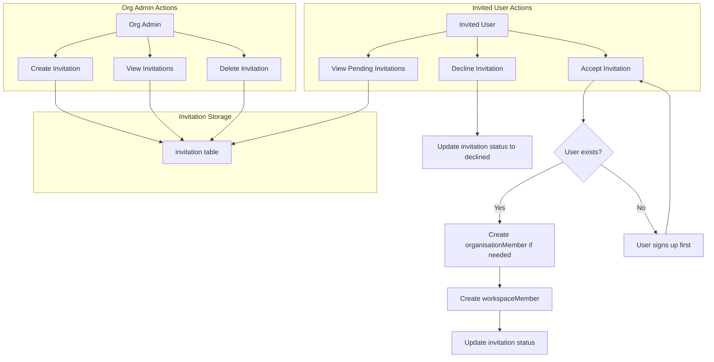
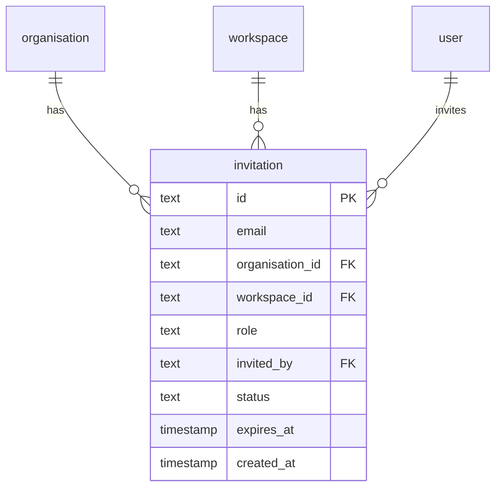

# Invitation Feature Implementation Plan

## Overview

This plan outlines the implementation of a workspace invitation system for Platypus. Users can be invited to join specific workspaces within an organisation. The feature includes:

- Organisation admins creating/managing invitations
- Users receiving and accepting/declining invitations
- A notifications dropdown in the header to surface pending invitations
- An "Invitations" tab in user settings to manage received invitations

## Key Design Decisions

| Decision | Choice |
|----------|--------|
| Invitation scope | Per-workspace (not org-only) |
| Invite existing/new users | Both - email lookup, new users sign up first |
| Email notifications | Not supported at this stage |
| Default expiration | 7 days (configurable via env var) |
| Available roles | All workspace roles: admin, editor, viewer |
| Duplicate prevention | Unique constraint on workspace + email pair |
| Notifications system | Simple - query invitations directly (no separate notifications table) |
| Invite creation UI | New "Invitations" tab in org settings |
| Workspaces per invite | Single workspace per invitation |

## Architecture

### Data Flow



### Database Schema Changes



**Required Schema Changes to [`apps/backend/src/db/schema.ts`](apps/backend/src/db/schema.ts:196):**

1. Add `.notNull()` to `organisationId` field
2. Add `.notNull()` to `workspaceId` field  
3. Add unique index on `(workspaceId, email)` to prevent duplicate invites
4. Add index on `workspaceId` for efficient queries
5. Consider adding `declined` to the status options

### API Endpoints

| Method | Endpoint | Description | Auth |
|--------|----------|-------------|------|
| POST | `/organisations/:orgId/invitations` | Create invitation | Org admin |
| GET | `/organisations/:orgId/invitations` | List org's invitations | Org admin |
| DELETE | `/organisations/:orgId/invitations/:invitationId` | Delete invitation | Org admin |
| GET | `/users/me/invitations` | List user's pending invitations | Authenticated |
| POST | `/users/me/invitations/:invitationId/accept` | Accept invitation | Authenticated |
| POST | `/users/me/invitations/:invitationId/decline` | Decline invitation | Authenticated |

### Frontend Routes

| Route | Description |
|-------|-------------|
| `/[orgId]/settings/invitations` | Manage org invitations (create, view, delete) |
| `/settings/invitations` | User's received invitations (accept/decline) |

## Implementation Tasks

### Phase 1: Database & Schemas

- [ ] Update invitation table schema in [`apps/backend/src/db/schema.ts`](apps/backend/src/db/schema.ts:196)
  - Add `.notNull()` to `organisationId`
  - Add `.notNull()` to `workspaceId`
  - Add unique constraint on `(workspaceId, email)`
  - Add index on `workspaceId`
  - Add `declined` to status options comment
- [ ] Run `pnpm drizzle-kit-push` to apply schema changes
- [ ] Add Zod schemas to [`packages/schemas/index.ts`](packages/schemas/index.ts)
  - `invitationSchema` - full schema
  - `invitationCreateSchema` - for POST requests (email, workspaceId, role)
  - `invitationListItemSchema` - for list responses
  - `invitationStatusEnum` - pending | accepted | declined | expired

### Phase 2: Backend API

- [ ] Add `INVITATION_EXPIRY_DAYS` environment variable support (default: 7)
- [ ] Create invitation routes file at `apps/backend/src/routes/invitation.ts`
- [ ] Implement `POST /organisations/:orgId/invitations` endpoint
  - Validate org admin role
  - Check workspace belongs to org
  - Check for existing pending invitation (workspace + email)
  - Calculate expiry date from env var
  - Create invitation record
- [ ] Implement `GET /organisations/:orgId/invitations` endpoint
  - List all invitations for the organisation
  - Include workspace name in response
  - Filter out expired invitations or mark them
- [ ] Implement `DELETE /organisations/:orgId/invitations/:invitationId` endpoint
  - Validate org admin role
  - Soft delete or hard delete the invitation
- [ ] Create user invitation routes at `apps/backend/src/routes/user-invitation.ts`
- [ ] Implement `GET /users/me/invitations` endpoint
  - Query by authenticated user's email
  - Return pending invitations only
  - Include org name, workspace name in response
- [ ] Implement `POST /users/me/invitations/:invitationId/accept` endpoint
  - Validate invitation belongs to user's email
  - Check invitation not expired
  - Create organisationMember if not exists
  - Create workspaceMember with invitation role
  - Update invitation status to accepted
- [ ] Implement `POST /users/me/invitations/:invitationId/decline` endpoint
  - Validate invitation belongs to user's email
  - Update invitation status to declined
- [ ] Register new routes in [`apps/backend/src/server.ts`](apps/backend/src/server.ts)
- [ ] Add Bruno API collection files for testing
  - `apps/backend/bruno/Invitation/Create Invitation.bru`
  - `apps/backend/bruno/Invitation/List Invitations.bru`
  - `apps/backend/bruno/Invitation/Delete Invitation.bru`
  - `apps/backend/bruno/User Invitation/List My Invitations.bru`
  - `apps/backend/bruno/User Invitation/Accept Invitation.bru`
  - `apps/backend/bruno/User Invitation/Decline Invitation.bru`

### Phase 3: Frontend - Org Admin UI

- [ ] Add "Invitations" menu item to [`apps/frontend/components/org-settings-menu.tsx`](apps/frontend/components/org-settings-menu.tsx)
- [ ] Create invitations page at `apps/frontend/app/[orgId]/settings/invitations/page.tsx`
  - List existing invitations with status
  - Show workspace name, email, role, expiry, created date
  - Delete button for each invitation
- [ ] Create invitation form component at `apps/frontend/components/invitation-form.tsx`
  - Email input field
  - Workspace dropdown (fetch workspaces for org)
  - Role dropdown (admin, editor, viewer)
  - Submit button
  - Validation for duplicate invites
- [ ] Add API fetcher functions for invitation endpoints in `apps/frontend/lib/api.ts` or similar

### Phase 4: Frontend - User Invitations UI

- [ ] Add "Invitations" menu item to [`apps/frontend/components/user-settings-menu.tsx`](apps/frontend/components/user-settings-menu.tsx)
- [ ] Create user invitations page at `apps/frontend/app/settings/invitations/page.tsx`
  - List pending invitations
  - Show org name, workspace name, role, invited by, expiry
  - Accept and Decline buttons for each
  - Success/error feedback via toast

### Phase 5: Notifications Dropdown

- [ ] Create notifications dropdown component at `apps/frontend/components/notifications-dropdown.tsx`
  - Bell icon with badge showing count of pending invitations
  - Dropdown showing list of pending invitations
  - Click on invitation navigates to `/settings/invitations`
  - Poll or refetch periodically for updates
- [ ] Update [`apps/frontend/components/header.tsx`](apps/frontend/components/header.tsx) to include notifications dropdown
  - Add between ModeToggle and UserMenu
- [ ] Consider using React Query or SWR for invitation count caching/polling

### Phase 6: Polish & Edge Cases

- [ ] Handle expired invitations gracefully
  - Backend: filter out expired in queries or return with expired flag
  - Frontend: show expired state, prevent accept action
- [ ] Add loading states to all invitation-related UI
- [ ] Add error handling and user feedback (toasts)
- [ ] Test invitation flow for new users (sign up then accept)
- [ ] Test invitation flow for existing users
- [ ] Test duplicate invitation prevention
- [ ] Test invitation expiration
- [ ] Update environment variable documentation in README

## UI Mockups

### Org Settings - Invitations Tab

```
┌─────────────────────────────────────────────────────────┐
│ Organisation Settings                                   │
├─────────────────────────────────────────────────────────┤
│ ┌──────────┐                                            │
│ │ General  │  Invitations                               │
│ ├──────────┤  ─────────────────────────────────────     │
│ │ Members  │                                            │
│ ├──────────┤  [Invite User]                             │
│ │►Invites  │                                            │
│ └──────────┘  ┌─────────────────────────────────────┐   │
│               │ Email           │ Workspace │ Role  │   │
│               ├─────────────────┼───────────┼───────┤   │
│               │ john@example.com│ Project A │ editor│ 🗑│
│               │ jane@example.com│ Project B │ viewer│ 🗑│
│               └─────────────────┴───────────┴───────┘   │
└─────────────────────────────────────────────────────────┘
```

### User Settings - Invitations Tab

```
┌─────────────────────────────────────────────────────────┐
│ User Settings                                           │
├─────────────────────────────────────────────────────────┤
│ ┌──────────┐                                            │
│ │ Profile  │  Invitations                               │
│ ├──────────┤  ─────────────────────────────────────     │
│ │ Security │                                            │
│ ├──────────┤  You have 2 pending invitations            │
│ │►Invites  │                                            │
│ └──────────┘  ┌─────────────────────────────────────┐   │
│               │ Acme Corp / Project Alpha            │   │
│               │ Role: Editor                         │   │
│               │ Invited by: admin@acme.com           │   │
│               │ Expires: Dec 31, 2024                │   │
│               │ [Accept] [Decline]                   │   │
│               └─────────────────────────────────────┘   │
│               ┌─────────────────────────────────────┐   │
│               │ Beta Inc / Main Workspace            │   │
│               │ Role: Viewer                         │   │
│               │ ...                                  │   │
│               └─────────────────────────────────────┘   │
└─────────────────────────────────────────────────────────┘
```

### Header Notifications Dropdown

```
┌───────────────────────────────────────────────────────────────┐
│ [← Back]                              [🔔 2] [🌙] [👤 Admin ▼]│
│                                         │                     │
│                                         ▼                     │
│                              ┌──────────────────────┐         │
│                              │ Notifications        │         │
│                              ├──────────────────────┤         │
│                              │ 🎟 Workspace invite   │         │
│                              │   Acme / Project A   │         │
│                              ├──────────────────────┤         │
│                              │ 🎟 Workspace invite   │         │
│                              │   Beta / Main        │         │
│                              ├──────────────────────┤         │
│                              │ View all invitations │         │
│                              └──────────────────────┘         │
└───────────────────────────────────────────────────────────────┘
```

## Environment Variables

Add to [`apps/backend/.example.env`](apps/backend/.example.env):

```env
# Invitation expiry in days (default: 7)
INVITATION_EXPIRY_DAYS=7
```

## Open Questions / Future Considerations

1. **Resending invitations**: Should admins be able to resend expired invitations? (Could implement as delete + create new)
2. **Bulk invitations**: Support inviting multiple emails at once?
3. **Invitation link**: Generate a unique link for each invitation that can be shared directly?
4. **Email notifications**: When email support is added, send invitation emails automatically
5. **Audit log**: Track invitation actions for compliance?
6. **Rate limiting**: Prevent spam invitations?

---

## Summary

This plan implements a complete invitation system with:
- **6 new API endpoints** for managing invitations
- **2 new frontend pages** (org invitations, user invitations)
- **1 new header component** (notifications dropdown)
- **Schema updates** to enforce data integrity
- **Environment variable** for configurable expiration

The implementation is broken into 6 phases that can be executed sequentially, with each phase building on the previous one.
