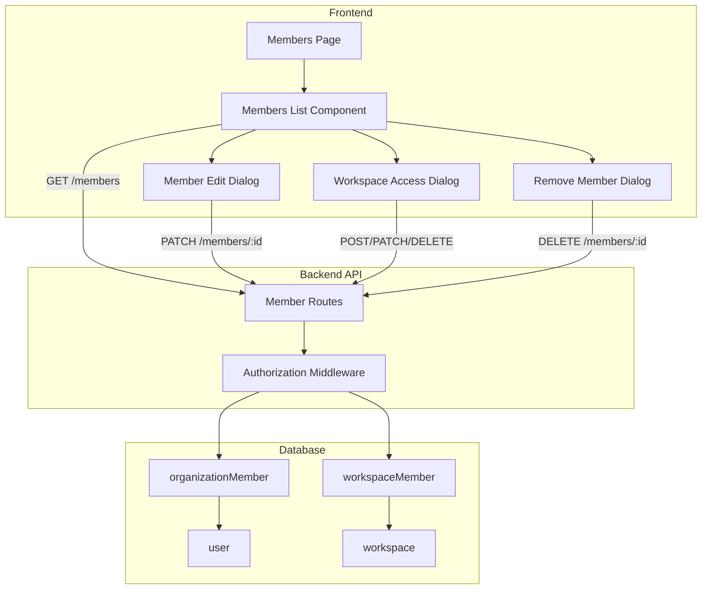
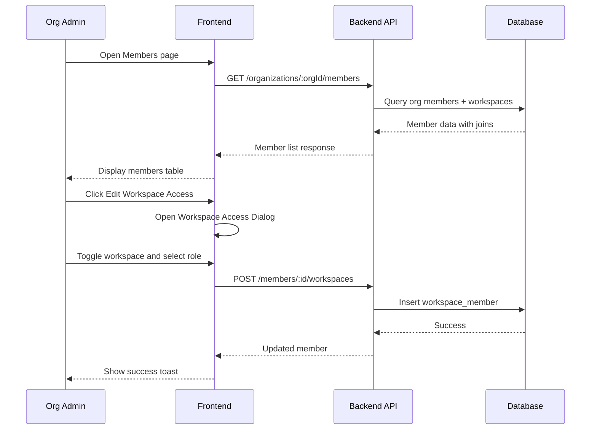

# Member Management Implementation Plan

## Overview

This plan outlines the implementation of a comprehensive member management feature for Platypus. Org admins will be able to:

- View all organization members with their workspace assignments
- Change organization roles (admin ↔ member)
- Manage workspace access (add/remove members from workspaces)
- Change workspace roles (admin | editor | viewer)
- Remove members from the organization entirely

## Current State Analysis

### Existing Database Schema

The schema already supports the membership model:

- [`organizationMember`](apps/backend/src/db/schema.ts:146) - Links users to organizations with roles (admin | member)
- [`workspaceMember`](apps/backend/src/db/schema.ts:169) - Links users to workspaces with roles (admin | editor | viewer)

### Existing Authorization

- [`requireOrgAccess`](apps/backend/src/middleware/authorization.ts:85) - Validates org membership with optional role restrictions
- [`requireWorkspaceAccess`](apps/backend/src/middleware/authorization.ts:169) - Validates workspace access
- Org admins automatically have admin access to all workspaces

---

## Requirements Summary

| Requirement          | Details                                                     |
| -------------------- | ----------------------------------------------------------- |
| Member List          | Show all org members with workspace assignments in one view |
| Workspace Access UI  | Modal dialog with workspace table for editing access        |
| Workspace Assignment | Single workspace at a time                                  |
| Org Role Management  | Admins can change org roles                                 |
| Protection Rules     | Protect last org admin from removal/demotion                |
| Self-Removal         | Members cannot remove themselves                            |
| Self-Demotion        | Admins cannot demote themselves to member                   |
| Confirmation Dialogs | Required for all destructive actions                        |

---

## API Design

### New Endpoints

All endpoints are under `/organizations/:orgId/members`

| Method | Endpoint                             | Description                                     | Auth      |
| ------ | ------------------------------------ | ----------------------------------------------- | --------- |
| GET    | `/`                                  | List all org members with workspace memberships | Org Admin |
| GET    | `/:memberId`                         | Get single member details with workspaces       | Org Admin |
| PATCH  | `/:memberId`                         | Update org member role                          | Org Admin |
| DELETE | `/:memberId`                         | Remove member from organization                 | Org Admin |
| POST   | `/:memberId/workspaces`              | Add member to a workspace                       | Org Admin |
| PATCH  | `/:memberId/workspaces/:workspaceId` | Update workspace role                           | Org Admin |
| DELETE | `/:memberId/workspaces/:workspaceId` | Remove member from workspace                    | Org Admin |

### Response Schemas

#### List Members Response

```typescript
{
  results: [{
    id: string;              // organizationMember.id
    userId: string;
    user: {
      id: string;
      name: string;
      email: string;
      image?: string;
    };
    role: "admin" | "member";
    workspaces: [{
      workspaceMemberId: string;
      workspaceId: string;
      workspaceName: string;
      role: "admin" | "editor" | "viewer";
    }];
    createdAt: Date;
    updatedAt: Date;
  }]
}
```

---

## Architecture Diagram



---

## Implementation Tasks

### Phase 1: Backend - Schemas and Types

- [ ] Add org member schemas to `packages/schemas/index.ts`:
  - `orgMemberSchema` - Full member with user and workspace details
  - `orgMemberUpdateSchema` - For updating org role
  - `workspaceMemberCreateSchema` - For adding to workspace
  - `workspaceMemberUpdateSchema` - For updating workspace role

### Phase 2: Backend - API Routes

- [ ] Create `apps/backend/src/routes/member.ts`:
  - GET `/` - List org members with workspace joins
  - GET `/:memberId` - Get single member with details
  - PATCH `/:memberId` - Update org role with last-admin and self-demotion protection
  - DELETE `/:memberId` - Remove from org with last-admin and self-removal protection
  - POST `/:memberId/workspaces` - Add to workspace
  - PATCH `/:memberId/workspaces/:workspaceId` - Update workspace role
  - DELETE `/:memberId/workspaces/:workspaceId` - Remove from workspace
- [ ] Mount routes in `apps/backend/src/server.ts`
- [ ] Add Bruno API test files for all endpoints

### Phase 3: Frontend - Components

- [ ] Create `apps/frontend/components/members-list.tsx`:
  - Table with member rows showing email, name, org role, workspace count
  - Actions column with edit/remove buttons
  - Expandable rows or quick-view for workspace access
- [ ] Create `apps/frontend/components/member-edit-dialog.tsx`:
  - Form to change org role
  - Display current workspace assignments
- [ ] Create `apps/frontend/components/workspace-access-dialog.tsx`:
  - Table of all workspaces in org
  - Checkbox to grant/revoke access
  - Role dropdown for granted workspaces
  - Save button to apply changes
- [ ] Create `apps/frontend/components/remove-member-dialog.tsx`:
  - Confirmation dialog with warning about losing all access
  - List of workspaces member will lose access to

### Phase 4: Frontend - Page Integration

- [ ] Update `apps/frontend/app/[orgId]/settings/members/page.tsx`:
  - Integrate members list component
  - Add SWR hooks for data fetching
  - Handle loading and error states

### Phase 5: Testing and Polish

- [ ] Test all CRUD operations via Bruno
- [ ] Test protection rules work correctly
- [ ] Test UI flows end-to-end
- [ ] Handle edge cases and error states

---

## UI Wireframe

### Members List View

```
┌─────────────────────────────────────────────────────────────────┐
│ Members                                                          │
│ Manage members of this organization.                            │
├─────────────────────────────────────────────────────────────────┤
│ ┌─────────────────────────────────────────────────────────────┐ │
│ │ Name          │ Email           │ Org Role │ Workspaces │ ⋮ │ │
│ ├───────────────┼─────────────────┼──────────┼────────────┼───┤ │
│ │ John Doe      │ john@example    │ Admin    │ 3          │ ⋮ │ │
│ │ Jane Smith    │ jane@example    │ Member   │ 2          │ ⋮ │ │
│ │ Bob Wilson    │ bob@example     │ Member   │ 1          │ ⋮ │ │
│ └─────────────────────────────────────────────────────────────┘ │
└─────────────────────────────────────────────────────────────────┘
```

### Workspace Access Dialog

```
┌─────────────────────────────────────────────────────────────┐
│ Workspace Access - John Doe                              X  │
├─────────────────────────────────────────────────────────────┤
│ Configure which workspaces this member can access.          │
│                                                              │
│ ┌─────────────────────────────────────────────────────────┐ │
│ │ ☑ │ Workspace      │ Role                              │ │
│ ├───┼────────────────┼───────────────────────────────────┤ │
│ │ ☑ │ Development    │ [Admin    ▼]                      │ │
│ │ ☑ │ Production     │ [Editor   ▼]                      │ │
│ │ ☐ │ Staging        │ [Viewer   ▼]                      │ │
│ │ ☑ │ Testing        │ [Viewer   ▼]                      │ │
│ └─────────────────────────────────────────────────────────┘ │
│                                                              │
│                              [Cancel]  [Save Changes]        │
└─────────────────────────────────────────────────────────────┘
```

---

## Protection Rules Implementation

### Last Admin Protection

```typescript
// Before demoting or removing an admin
const adminCount = await db
  .select({ count: count() })
  .from(organizationMember)
  .where(
    and(
      eq(organizationMember.organizationId, orgId),
      eq(organizationMember.role, "admin"),
    ),
  );

if (adminCount[0].count <= 1 && targetMember.role === "admin") {
  return c.json(
    {
      error: "Cannot remove or demote the last organization admin",
    },
    400,
  );
}
```

### Self-Removal Prevention

```typescript
// In DELETE /members/:memberId
if (memberToRemove.userId === currentUser.id) {
  return c.json(
    {
      error: "You cannot remove yourself from the organization",
    },
    400,
  );
}
```

### Self-Demotion Prevention

```typescript
// In PATCH /members/:memberId when changing role
if (memberToUpdate.userId === currentUser.id && newRole === "member") {
  return c.json(
    {
      error: "You cannot demote yourself from admin",
    },
    400,
  );
}
```

---

## Data Flow



---

## Summary

This implementation adds robust member management capabilities while following the existing patterns in the codebase. Key considerations:

1. **Database**: No schema changes needed - existing tables support all requirements
2. **Backend**: 7 new API endpoints following existing route patterns
3. **Frontend**: 4 new components plus page updates, following existing UI patterns
4. **Security**: Multiple protection rules to prevent accidental data loss
5. **UX**: Modal-based editing with confirmation dialogs for destructive actions
