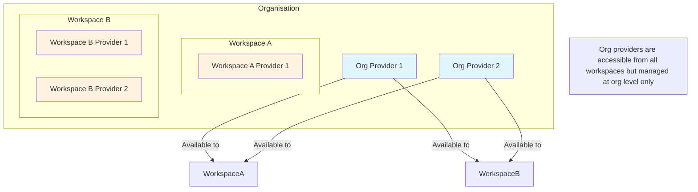

# Org-Level Providers Implementation Plan

## Overview

Currently, providers are scoped only at the workspace level. This plan describes the changes needed to support organisation-level providers that are automatically available to all workspaces under an organisation.

## Requirements Summary

- **Org-scoped providers**: Available to all workspaces under the organisation
- **Workspace-scoped providers**: Available only to the specific workspace (existing behavior)
- **Provider must have either**: `organisationId` OR `workspaceId` (never neither, never both)
- **Duplicate names**: Disallowed within the same scope
- **Org providers in workspace UI**: Display with visual badge indicator, but not editable
- **Org settings UI**: Add new "Providers" section for managing org-level providers

---

## Architecture Diagram



---

## Database Changes

### File: [`apps/backend/src/db/schema.ts`](apps/backend/src/db/schema.ts)

Modify the `provider` table definition:

1. Add optional `organisationId` field with foreign key reference to `organisation`
2. Make `workspaceId` optional (nullable)
3. Add database-level constraint to ensure exactly one of `organisationId` or `workspaceId` is set
4. Add index on `organisationId` for efficient queries

**Updated Schema:**

```typescript
export const provider = pgTable(
  "provider",
  (t) => ({
    id: t.text("id").primaryKey(),
    organisationId: t
      .text("organisation_id")
      .references(() => organisation.id, {
        onDelete: "cascade",
      }),
    workspaceId: t
      .text("workspace_id")
      .references(() => workspace.id, {
        onDelete: "cascade",
      }),
    name: t.text("name").notNull(),
    providerType: t.text("provider_type").notNull(),
    apiKey: t.text("api_key").notNull(),
    region: t.text("region"),
    baseUrl: t.text("base_url"),
    headers: t.jsonb().$type<Record<string, string>>(),
    extraBody: t.jsonb().$type<Record<string, unknown>>(),
    organization: t.text("organization"),
    project: t.text("project"),
    modelIds: t.jsonb().$type<string[]>().notNull(),
    taskModelId: t.text("task_model_id").notNull(),
    createdAt: t.timestamp("created_at").notNull().defaultNow(),
    updatedAt: t.timestamp("updated_at").notNull().defaultNow(),
  }),
  (t) => [
    index("idx_provider_workspace_id").on(t.workspaceId),
    index("idx_provider_organisation_id").on(t.organisationId),
    // Ensure unique name within org scope
    unique("unique_provider_name_org").on(t.organisationId, t.name),
    // Ensure unique name within workspace scope
    unique("unique_provider_name_workspace").on(t.workspaceId, t.name),
  ],
);
```

**Note:** Drizzle ORM does not natively support CHECK constraints. The validation that exactly one of `organisationId` or `workspaceId` is set will be enforced at the application level in the API routes.

---

## Schema Changes

### File: [`packages/schemas/index.ts`](packages/schemas/index.ts)

Update the provider schemas to support both org and workspace scopes:

1. Make `workspaceId` optional
2. Add optional `organisationId` field
3. Add computed `scope` field for frontend convenience
4. Create separate create schemas for org and workspace providers
5. Add refinement to ensure exactly one scope field is set

**Updated Schemas:**

```typescript
export const providerSchema = z
  .object({
    id: z.string(),
    organisationId: z.string().optional(),
    workspaceId: z.string().optional(),
    name: z.string().min(3).max(32),
    providerType: z.enum(["OpenAI", "OpenRouter", "Bedrock", "Google"]),
    apiKey: z.string().min(1),
    region: z
      .string()
      .regex(/^[a-z]{2}-[a-z]+-\d+$/, "Invalid AWS region format")
      .optional(),
    baseUrl: z.string().optional(),
    headers: z.record(z.string(), z.string()).optional(),
    extraBody: z.record(z.string(), z.unknown()).optional(),
    organization: z.string().optional(),
    project: z.string().optional(),
    modelIds: z.array(z.string()).min(1),
    taskModelId: z.string(),
    createdAt: z.date(),
    updatedAt: z.date(),
  })
  .refine(/* Bedrock region validation */)
  .refine(
    (data) => {
      const hasOrg = Boolean(data.organisationId);
      const hasWorkspace = Boolean(data.workspaceId);
      return (hasOrg || hasWorkspace) && !(hasOrg && hasWorkspace);
    },
    {
      message: "Provider must have either organisationId or workspaceId, but not both",
      path: ["organisationId"],
    }
  );

// Create schema for org-scoped providers
export const providerCreateOrgSchema = providerSchema.pick({
  organisationId: true,
  name: true,
  providerType: true,
  apiKey: true,
  region: true,
  baseUrl: true,
  headers: true,
  extraBody: true,
  organization: true,
  project: true,
  modelIds: true,
  taskModelId: true,
});

// Create schema for workspace-scoped providers (existing behavior)
export const providerCreateWorkspaceSchema = providerSchema.pick({
  workspaceId: true,
  name: true,
  providerType: true,
  apiKey: true,
  region: true,
  baseUrl: true,
  headers: true,
  extraBody: true,
  organization: true,
  project: true,
  modelIds: true,
  taskModelId: true,
});
```

---

## Backend API Changes

### 1. New Org-Level Provider Routes

**File:** `apps/backend/src/routes/org-provider.ts` (new file)

Create new routes for org-level provider management:

| Method | Endpoint | Description | Auth |
|--------|----------|-------------|------|
| `POST` | `/organisations/:orgId/providers` | Create org provider | Org admin |
| `GET` | `/organisations/:orgId/providers` | List org providers | Org member |
| `GET` | `/organisations/:orgId/providers/:providerId` | Get org provider | Org member |
| `PUT` | `/organisations/:orgId/providers/:providerId` | Update org provider | Org admin |
| `DELETE` | `/organisations/:orgId/providers/:providerId` | Delete org provider | Org admin |

### 2. Update Existing Workspace Provider Routes

**File:** [`apps/backend/src/routes/provider.ts`](apps/backend/src/routes/provider.ts)

Modify the list providers endpoint to include org-scoped providers:

```typescript
/** List all providers (workspace + org-scoped) */
provider.get("/", requireAuth, requireOrgAccess(), requireWorkspaceAccess(), async (c) => {
  const orgId = c.req.param("orgId")!;
  const workspaceId = c.req.param("workspaceId")!;
  
  // Get workspace-scoped providers
  const workspaceProviders = await db
    .select()
    .from(providerTable)
    .where(eq(providerTable.workspaceId, workspaceId));
  
  // Get org-scoped providers
  const orgProviders = await db
    .select()
    .from(providerTable)
    .where(eq(providerTable.organisationId, orgId));
  
  // Tag providers with their scope for frontend
  const results = [
    ...orgProviders.map(p => ({ ...p, scope: "organisation" as const })),
    ...workspaceProviders.map(p => ({ ...p, scope: "workspace" as const })),
  ];
  
  return c.json({ results });
});
```

### 3. Update Server Routes

**File:** [`apps/backend/src/server.ts`](apps/backend/src/server.ts)

Add the new org provider routes:

```typescript
import { orgProvider } from "./routes/org-provider.ts";

// ... existing routes ...
app.route("/organisations/:orgId/providers", orgProvider);
```

### 4. Update Provider Validation

Add logic to prevent editing/deleting org-scoped providers from workspace routes. Add validation in the existing provider PUT and DELETE handlers to check if the provider belongs to the workspace scope.

---

## Frontend Changes

### 1. Update Types

The `Provider` type from schemas will automatically include the new fields. Add a display helper:

```typescript
// In a utils or types file
export type ProviderScope = "organisation" | "workspace";

export interface ProviderWithScope extends Provider {
  scope: ProviderScope;
}
```

### 2. Update Providers List Component

**File:** [`apps/frontend/components/providers-list.tsx`](apps/frontend/components/providers-list.tsx)

- Add visual badge indicator for org-scoped providers
- Disable edit action for org-scoped providers
- Show tooltip explaining why editing is disabled

```tsx
// Badge component example
{provider.scope === "organisation" && (
  <Badge variant="secondary" className="ml-2">
    <Building className="size-3 mr-1" />
    Organisation
  </Badge>
)}
```

### 3. Add Org Providers Settings Page

**File:** `apps/frontend/app/[orgId]/settings/providers/page.tsx` (new)

Create a new page for managing org-level providers, following the existing org settings pattern.

**File:** `apps/frontend/app/[orgId]/settings/providers/create/page.tsx` (new)

Create page for adding new org providers.

**File:** `apps/frontend/app/[orgId]/settings/providers/[providerId]/page.tsx` (new)

Edit page for existing org providers.

### 4. Create Org Provider Form Component

**File:** `apps/frontend/components/org-provider-form.tsx` (new)

Similar to the workspace provider form but:
- Uses org-level API endpoints
- Submits `organisationId` instead of `workspaceId`

### 5. Create Org Providers List Component

**File:** `apps/frontend/components/org-providers-list.tsx` (new)

List component for org settings page, fetching from `/organisations/:orgId/providers`.

### 6. Update Org Settings Menu

**File:** [`apps/frontend/components/org-settings-menu.tsx`](apps/frontend/components/org-settings-menu.tsx)

Add "Providers" menu item:

```tsx
<SidebarMenuItem>
  <SidebarMenuButton
    asChild
    isActive={pathname.startsWith(providersHref)}
  >
    <Link href={providersHref}>
      <Unplug /> Providers
    </Link>
  </SidebarMenuButton>
</SidebarMenuItem>
```

### 7. Update Provider Form Component

**File:** [`apps/frontend/components/provider-form.tsx`](apps/frontend/components/provider-form.tsx)

Add read-only mode for org-scoped providers when accessed from workspace settings:
- Disable all form fields
- Hide save/delete buttons
- Show informational banner explaining the provider is org-scoped

---

## Bruno API Tests

### New Files

- `apps/backend/bruno/OrgProvider/folder.bru` - Folder config
- `apps/backend/bruno/OrgProvider/Create Org Provider.bru`
- `apps/backend/bruno/OrgProvider/List Org Providers.bru`
- `apps/backend/bruno/OrgProvider/Get Org Provider.bru`
- `apps/backend/bruno/OrgProvider/Update Org Provider.bru`
- `apps/backend/bruno/OrgProvider/Delete Org Provider.bru`

---

## Implementation Order

1. **Database schema changes** - Update [`schema.ts`](apps/backend/src/db/schema.ts)
2. **Schema changes** - Update [`packages/schemas/index.ts`](packages/schemas/index.ts)
3. **Create org provider routes** - New file `org-provider.ts`
4. **Update workspace provider routes** - Modify existing [`provider.ts`](apps/backend/src/routes/provider.ts)
5. **Register routes in server** - Update [`server.ts`](apps/backend/src/server.ts)
6. **Add backend tests** - Tests for new routes
7. **Update org settings menu** - Add Providers link
8. **Create org providers list component** - New frontend component
9. **Create org provider form component** - New frontend component
10. **Create org providers settings pages** - New Next.js pages
11. **Update workspace providers list** - Add scope badge and disable edit for org providers
12. **Update workspace provider form** - Handle read-only mode
13. **Add Bruno API test files** - Document new endpoints

---

## Migration Notes

- Existing providers will have `workspaceId` set and `organisationId` as NULL
- No data migration required - existing providers continue to work as workspace-scoped
- The schema push will make `workspaceId` nullable, which is a backward-compatible change

---

## Testing Considerations

### Backend Tests

- Create org provider - valid data
- Create org provider - invalid (missing required fields)
- Create org provider - duplicate name in same org
- List org providers - returns only org-scoped providers
- List workspace providers - returns both workspace and org providers
- Update org provider - valid
- Update org provider - non-admin denied
- Delete org provider - cascade restrictions
- Workspace route cannot edit/delete org provider

### Frontend Tests

- Org providers display in workspace list with badge
- Edit button disabled for org providers in workspace view
- Org providers editable from org settings
- Create workspace provider still works
- Create org provider works from org settings

---

## Questions Resolved

| # | Question | Answer |
|---|----------|--------|
| 1 | API routes structure | Separate routes at org level |
| 2 | Duplicate name handling | Disallow within same scope |
| 3 | UI display in workspace | Visual badge indicator |
| 4 | Org settings UI | Yes, add Providers to org settings menu |
