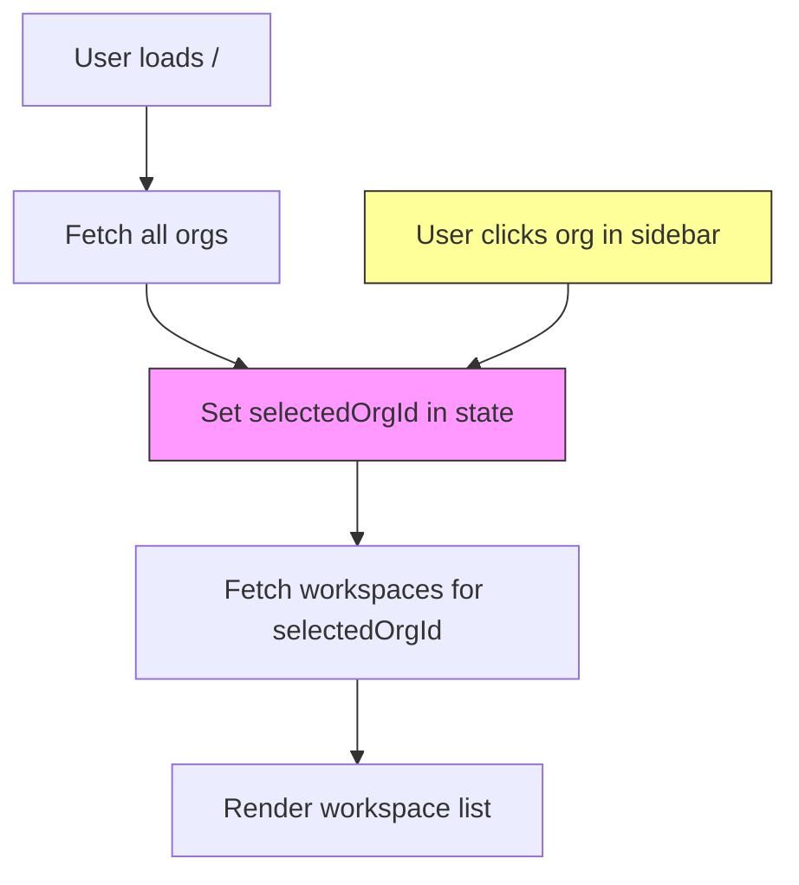

# Organization Routing Architecture

## Route Structure Comparison

### Current Architecture (Before)

```
/
├── [State-based org selection]
└── Displays: Header + OrgSidebar + WorkspaceList

/[orgId]
└── Redirects to /
```

### New Architecture (After)

```
/
├── Checks for organizations
│   ├── If orgs exist → redirect to /{firstOrgId}
│   └── If no orgs → show empty state
└── Minimal page (redirect or empty state)

/[orgId]
└── (home) ← Route group (not in URL)
    ├── layout.tsx: Header + OrgListSidebar
    └── page.tsx: WorkspaceList for selected org

/[orgId]/workspace/[workspaceId]
└── Unaffected (has own layout)

/[orgId]/settings
└── Unaffected (has own layout)
```

**Note**: Route groups using `(parentheses)` don't appear in the URL but allow isolated layouts.

## Component Hierarchy

### Before

```
/ (page.tsx)
└── ProtectedRoute
    └── SidebarProvider
        ├── Header
        └── Content
            ├── OrgList Sidebar (inline, state-based)
            └── WorkspaceList (for selected org)
```

### After

```
/ (page.tsx)
└── ProtectedRoute
    ├── Header
    └── Empty State OR Redirect to /{orgId}

/[orgId]/(home) (layout.tsx + page.tsx)
└── ProtectedRoute (requireOrgAccess)
    └── SidebarProvider
        ├── Header
        └── Content
            ├── OrgListSidebar (component, route-based)
            │   └── Renders all orgs, highlights current
            └── [children] → page.tsx
                └── WorkspaceList (for params.orgId)

/[orgId]/workspace/[workspaceId] (separate layout)
└── ProtectedRoute
    └── SidebarProvider
        ├── AppSidebar
        └── Workspace content

/[orgId]/settings (separate layout)
└── ProtectedRoute
    └── SidebarProvider
        ├── OrgSettingsMenu
        └── Settings content
```

**Key Point**: The `(home)` route group isolates the org home layout from other `/[orgId]/*` routes.

## Data Flow Comparison

### Before: State-Based Selection



**Problem**: State is lost on page refresh or when sharing URL

### After: Route-Based Selection

```mermaid
graph TD
    A[User loads /] --> B[Fetch all orgs]
    B --> C{Has orgs?}
    C -->|Yes| D[Redirect to /{firstOrgId}]
    C -->|No| E[Show empty state]
    D --> F[Load /orgId layout]
    F --> G[Fetch workspaces for orgId]
    G --> H[Render workspace list]
    I[User clicks org in sidebar] --> J[Navigate to /{newOrgId}]
    J --> F

    style D fill:#9f9,stroke:#333
    style J fill:#9f9,stroke:#333
```

**Benefit**: URL contains the state, can be bookmarked/shared

## Layout Comparison with Existing Patterns

### Organization Settings Layout Pattern

```
/[orgId]/settings (layout.tsx)
├── ProtectedRoute (requireOrgAccess, requiredOrgRole=admin)
└── SidebarProvider
    ├── Header (with back button, home button)
    └── Content Container
        ├── Fixed Sidebar (OrgSettingsMenu)
        └── Content Area (children)
```

### New Organization Home Layout Pattern

```
/[orgId]/(home) (layout.tsx) ← Route group
├── ProtectedRoute (requireOrgAccess)
└── SidebarProvider
    ├── Header (with home button)
    └── Content Container
        ├── Fixed Sidebar (OrgListSidebar)
        └── Content Area (children)
```

**Key Differences from Modifying `/[orgId]/layout.tsx`**:

- Using route group `(home)` keeps layout isolated
- Won't affect `/[orgId]/workspace/*` or `/[orgId]/settings/*`
- Clean separation - each route section has its own layout

## Component Responsibilities

### OrgListSidebar (New Component)

```typescript
// apps/frontend/components/org-list-sidebar.tsx
"use client"

interface OrgListSidebarProps {
  currentOrgId: string;  // From route params
}

Responsibilities:
- Fetch all organizations user has access to
- Render list with Building icon + org name
- Highlight current org (based on currentOrgId)
- Link each org to /{orgId}
- Show "Add Organization" link at bottom
- Handle loading states
```

### Root Page `/` (Simplified)

```typescript
// apps/frontend/app/page.tsx

Responsibilities:
- Check if user has organizations
- Redirect to first org if available
- Show empty state if no orgs
- Handle loading/error states
- No longer manages org selection
```

### Org Page `/[orgId]` (New Content)

```typescript
// apps/frontend/app/[orgId]/page.tsx

interface OrgPageProps {
  params: { orgId: string };
}

Responsibilities:
- Fetch workspaces for params.orgId
- Render WorkspaceList component
- Show empty state if no workspaces
- Render action buttons (Add Workspace, Settings)
- No longer manages org selection
```

### Org Home Layout `/[orgId]/(home)` (New)

```typescript
// apps/frontend/app/[orgId]/(home)/layout.tsx

interface OrgHomeLayoutProps {
  children: React.ReactNode;
  params: Promise<{ orgId: string }>;
}

Responsibilities:
- Wrap content with ProtectedRoute
- Provide SidebarProvider context
- Render Header component
- Render OrgListSidebar with currentOrgId
- Render children (org page content)
- Apply responsive layout styling
- Isolated to home page only via route group
```

**Note**: The existing `/[orgId]/layout.tsx` remains unchanged and still wraps all org routes with basic auth.

## URL Patterns & Navigation

### Supported URLs

| URL Pattern                        | Behavior                                          | Use Case                |
| ---------------------------------- | ------------------------------------------------- | ----------------------- |
| `/`                                | Redirects to `/{firstOrgId}` or shows empty state | Landing page, bookmarks |
| `/{orgId}`                         | Shows workspaces for org (via route group)        | Direct org access       |
| `/{orgId}/create`                  | Create workspace form                             | New workspace           |
| `/{orgId}/settings`                | Org settings (own layout)                         | Manage org              |
| `/{orgId}/workspace/{workspaceId}` | Workspace chat (own layout)                       | Work in workspace       |

**Important**: The `/[orgId]` URL actually renders the `(home)/page.tsx` content, but the route group is invisible in the URL.

### Navigation Flows

#### First-time User

```
/ → (no orgs) → Empty state → /create → / → /{newOrgId}
```

#### Returning User

```
/ → /{orgId} (redirect to first/last org)
```

#### Direct Link

```
/{orgId} → Shows that org's workspaces immediately
```

#### Org Switching

```
/{orgA} → Click orgB in sidebar → /{orgB}
```

## Responsive Layout Structure

### Desktop (md breakpoint and above)

```
┌─────────────────────────────────────────┐
│ Header                                  │
├──────────┬──────────────────────────────┤
│          │                              │
│  Fixed   │                              │
│  Sidebar │   Workspace List             │
│  (Orgs)  │   (Scrollable)               │
│          │                              │
│          │                              │
└──────────┴──────────────────────────────┘
```

### Mobile (below md breakpoint)

```
┌──────────────────┐
│ Header           │
├──────────────────┤
│ Sidebar          │
│ (Full width)     │
├──────────────────┤
│                  │
│ Workspace List   │
│ (Full width)     │
│ (Scrollable)     │
│                  │
└──────────────────┘
```

## Authentication & Authorization

### Route Protection

```
/
└── ProtectedRoute (basic auth check)

/[orgId] (existing layout)
└── ProtectedRoute (requireOrgAccess=true)
    - Shared across all /[orgId]/* routes

/[orgId]/(home) (route group layout)
└── ProtectedRoute (requireOrgAccess=true)
    - Additional check for home page

/[orgId]/settings
└── ProtectedRoute (requireOrgAccess=true, requiredOrgRole=admin)
    - Requires admin role in org
```

**Note**: Both the existing `/[orgId]/layout.tsx` and the new `(home)/layout.tsx` apply protection, but this is fine - the inner one is more specific.

### Sidebar Behavior

The [`OrgListSidebar`](apps/frontend/components/org-list-sidebar.tsx:1) only shows organizations the user has access to:

- Fetches from `/organizations` (filtered by backend)
- No client-side filtering needed
- Backend enforces access control

## State Management

### Before: Local Component State

- `useState` for `selectedOrgId`
- Lost on refresh
- Not shareable
- Managed by page component

### After: URL State

- `params.orgId` from route
- Persists across refreshes
- Shareable via URL
- Managed by Next.js router

## Loading States

### Root Page `/`

```
Loading → Fetch orgs → Redirect to first org OR show empty state
```

### Org Page `/[orgId]`

```
Layout loads (with sidebar) → Page loads → Fetch workspaces → Render
```

### Sidebar

```
Shows skeleton/loading → Fetch orgs → Render list with current highlighted
```

## Error Handling

| Scenario                 | Handling                    |
| ------------------------ | --------------------------- |
| Invalid orgId            | ProtectedRoute returns 404  |
| No orgs                  | Root page shows empty state |
| Fetch error (orgs)       | Alert message at root       |
| Fetch error (workspaces) | Alert in org page           |
| Network error            | Toast error message         |

## Implementation Sequence

1. **Create OrgListSidebar** → Self-contained component
2. **Update [orgId]/layout.tsx** → Add Header + Sidebar structure
3. **Update [orgId]/page.tsx** → Move workspace list content
4. **Update root page** → Simplify to redirect/empty state
5. **Test all flows** → Verify routing works

This sequence minimizes breaking changes and allows incremental testing.
