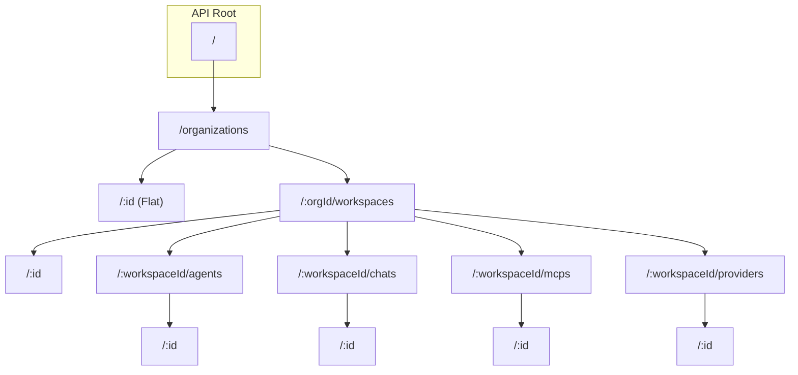

# Plan: API Route Restructuring

This plan outlines the steps to restructure the Platypus API routes from a flat structure to a hierarchical/hybrid structure. This will improve consistency with the frontend routing and simplify authorization logic.

## Proposed API Structure

### Organizations

- `GET /organizations` - List all organizations (Super Admin)
- `POST /organizations` - Create an organization (Super Admin)
- `GET /organizations/:id` - Get organization details
- `PUT /organizations/:id` - Update organization
- `DELETE /organizations/:id` - Delete organization

### Workspaces (Nested under Organization)

- `GET /organizations/:orgId/workspaces` - List workspaces in an organization
- `POST /organizations/:orgId/workspaces` - Create a workspace in an organization
- `GET /organizations/:orgId/workspaces/:id` - Get workspace details
- `PUT /organizations/:orgId/workspaces/:id` - Update workspace
- `DELETE /organizations/:orgId/workspaces/:id` - Delete workspace

### Agents (Nested under Workspace)

- `GET /organizations/:orgId/workspaces/:workspaceId/agents` - List agents in a workspace
- `POST /organizations/:orgId/workspaces/:workspaceId/agents` - Create an agent in a workspace
- `GET /organizations/:orgId/workspaces/:workspaceId/agents/:id` - Get agent details
- `PUT /organizations/:orgId/workspaces/:workspaceId/agents/:id` - Update agent
- `DELETE /organizations/:orgId/workspaces/:workspaceId/agents/:id` - Delete agent

### Chats (Nested under Workspace)

- `GET /organizations/:orgId/workspaces/:workspaceId/chats` - List chats in a workspace
- `POST /organizations/:orgId/workspaces/:workspaceId/chats` - Create a chat in a workspace
- `GET /organizations/:orgId/workspaces/:workspaceId/chats/:id` - Get chat details
- `PUT /organizations/:orgId/workspaces/:workspaceId/chats/:id` - Update chat
- `DELETE /organizations/:orgId/workspaces/:workspaceId/chats/:id` - Delete chat

### MCPs (Nested under Workspace)

- `GET /organizations/:orgId/workspaces/:workspaceId/mcps` - List MCPs in a workspace
- `POST /organizations/:orgId/workspaces/:workspaceId/mcps` - Create an MCP in a workspace
- `GET /organizations/:orgId/workspaces/:workspaceId/mcps/:id` - Get MCP details
- `PUT /organizations/:orgId/workspaces/:workspaceId/mcps/:id` - Update MCP
- `DELETE /organizations/:orgId/workspaces/:workspaceId/mcps/:id` - Delete MCP

### Providers (Nested under Workspace)

- `GET /organizations/:orgId/workspaces/:workspaceId/providers` - List providers in a workspace
- `POST /organizations/:orgId/workspaces/:workspaceId/providers` - Create a provider in a workspace
- `GET /organizations/:orgId/workspaces/:workspaceId/providers/:id` - Get provider details
- `PUT /organizations/:orgId/workspaces/:workspaceId/providers/:id` - Update provider
- `DELETE /organizations/:orgId/workspaces/:workspaceId/providers/:id` - Delete provider

## Implementation Steps

### 1. Backend Changes

#### 1.1. Update `apps/backend/src/server.ts`

- Define a hierarchical router structure using Hono's `.route()` method.
- Mount sub-routers under `/:orgId/workspaces/:workspaceId/...` where appropriate.

#### 1.2. Refactor Route Files

- **`organization.ts`**: Keep mostly as is, but ensure it handles the top-level `/organizations` routes.
- **`workspace.ts`**: Remove `/` prefix from routes that will be mounted under `/organizations/:orgId/workspaces`.
- **`agent.ts`, `chat.ts`, `mcp.ts`, `provider.ts`**: Refactor to handle both nested collection routes and flat instance routes.

#### 1.3. Update Middleware

- Verify `requireOrgAccess` and `requireWorkspaceAccess` correctly pick up `orgId` and `workspaceId` from path parameters. (Already confirmed they check `c.req.param`).

### 2. Bruno Collection Updates

- Update all `.bru` files in `apps/backend/bruno/` to reflect the new URL structure.

### 3. Frontend Changes

#### 3.1. Update API Calls

- Search for all usages of `joinUrl(backendUrl, ...)` and update the paths.
- Ensure `orgId` and `workspaceId` are passed correctly to the URL construction logic.
- Update components:
  - `apps/frontend/components/agents-list.tsx`
  - `apps/frontend/components/mcp-list.tsx`
  - `apps/frontend/components/providers-list.tsx`
  - `apps/frontend/components/workspace-list.tsx`
  - `apps/frontend/components/app-sidebar.tsx`
  - `apps/frontend/app/[orgId]/workspace/[workspaceId]/page.tsx`
  - And others identified in the search.

### 4. Verification

- Run `pnpm dev` to start the full stack.
- Test navigation between organizations and workspaces.
- Test CRUD operations for agents, chats, MCPs, and providers.
- Verify that authorization still works as expected (e.g., a user cannot access a workspace they don't belong to).

## Mermaid Diagram of New Structure

