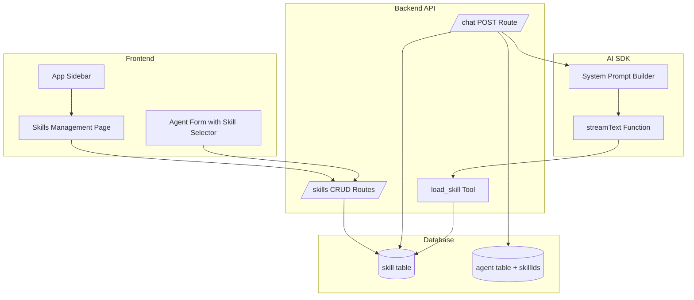
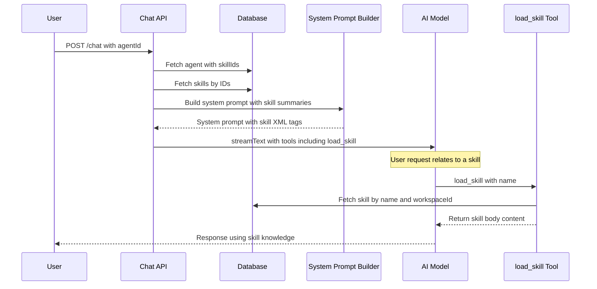

# Skills Feature Implementation Plan

## Overview

This document outlines the technical implementation plan for adding a Skills feature to Platypus, modeled after Claude Skills. Skills are reusable instruction sets that can be assigned to agents and dynamically loaded during chat sessions.

## Requirements Summary

### Core Functionality

- Skills are standalone, reusable components assignable to multiple agents
- Each skill has a unique kebab-case `name` and a `body` containing instructions
- Skills are scoped to workspaces (workspace-level resource)
- Agents can reference multiple skills via a `skillIds` JSONB array
- During chat, skill descriptions are appended to the system prompt
- A hidden `load_skill` tool allows agents to fetch full skill content on-demand

### Authorization Model

| Action           | Viewer | Editor | Admin |
| ---------------- | ------ | ------ | ----- |
| List/Read Skills | ✅     | ✅     | ✅    |
| Create Skills    | ❌     | ✅     | ✅    |
| Update Skills    | ❌     | ✅     | ✅    |
| Delete Skills    | ❌     | ✅     | ✅    |

### Constraints

- Skill `name`: max 128 characters, unique per workspace, kebab-case enforced
- Skill `body`: max 2000 characters
- Character limits enforced via Zod schemas (not database constraints)
- Cannot delete a skill if it's referenced by any agent

---

## Architecture

### System Flow Diagram



### Data Flow for Chat with Skills



---

## Implementation Tasks

### Phase 1: Database Schema

#### 1.1 Create Skill Table

**File:** [`apps/backend/src/db/schema.ts`](apps/backend/src/db/schema.ts)

Add new `skill` table definition:

```typescript
export const skill = pgTable(
  "skill",
  (t) => ({
    id: t.text("id").primaryKey(),
    workspaceId: t
      .text("workspace_id")
      .notNull()
      .references(() => workspace.id, {
        onDelete: "cascade",
      }),
    name: t.text("name").notNull(),
    body: t.text("body").notNull(),
    createdAt: t.timestamp("created_at").notNull().defaultNow(),
    updatedAt: t.timestamp("updated_at").notNull().defaultNow(),
  }),
  (t) => [
    index("idx_skill_workspace_id").on(t.workspaceId),
    unique("unique_skill_name_workspace").on(t.workspaceId, t.name),
  ],
);
```

**Notes:**

- `workspaceId` is NOT NULL with an index for efficient querying
- Unique constraint on `workspaceId + name` enforces workspace-scoped uniqueness
- No database-level character limits (enforced at application layer)

#### 1.2 Update Agent Table

**File:** [`apps/backend/src/db/schema.ts`](apps/backend/src/db/schema.ts:62)

Add `skillIds` JSONB field to existing agent table:

```typescript
skillIds: t.jsonb("skill_ids").$type<string[]>().default([]),
```

---

### Phase 2: Shared Schemas

#### 2.1 Create Skill Schemas

**File:** [`packages/schemas/index.ts`](packages/schemas/index.ts)

```typescript
// Skill name validation - kebab-case, 1-128 chars
const skillNameRegex = /^[a-z0-9]+(?:-[a-z0-9]+)*$/;

export const skillSchema = z.object({
  id: z.string(),
  workspaceId: z.string(),
  name: z
    .string()
    .min(1)
    .max(128)
    .regex(skillNameRegex, "Skill name must be kebab-case"),
  body: z.string().min(1).max(2000),
  createdAt: z.date(),
  updatedAt: z.date(),
});

export type Skill = z.infer<typeof skillSchema>;

export const skillCreateSchema = skillSchema.pick({
  workspaceId: true,
  name: true,
  body: true,
});

export const skillUpdateSchema = skillSchema.pick({
  name: true,
  body: true,
});
```

#### 2.2 Update Agent Schema

**File:** [`packages/schemas/index.ts`](packages/schemas/index.ts:135)

Add `skillIds` to agent schema and create/update schemas:

```typescript
// In agentSchema
skillIds: z.array(z.string()).optional(),

// Add to agentCreateSchema.pick() and agentUpdateSchema.pick()
skillIds: true,
```

---

### Phase 3: Backend Routes

#### 3.1 Create Skill Routes

**File:** `apps/backend/src/routes/skill.ts` (new file)

Implement full CRUD operations:

| Method | Endpoint    | Auth    | Description                         |
| ------ | ----------- | ------- | ----------------------------------- |
| GET    | `/`         | viewer+ | List all skills in workspace        |
| GET    | `/:skillId` | viewer+ | Get single skill by ID              |
| POST   | `/`         | editor+ | Create new skill                    |
| PUT    | `/:skillId` | editor+ | Update existing skill               |
| DELETE | `/:skillId` | editor+ | Delete skill (with reference check) |

**Route structure following existing patterns from** [`apps/backend/src/routes/agent.ts`](apps/backend/src/routes/agent.ts):

```typescript
import { Hono } from "hono";
import { sValidator } from "@hono/standard-validator";
import { requireAuth } from "../middleware/authentication.ts";
import {
  requireOrgAccess,
  requireWorkspaceAccess,
} from "../middleware/authorization.ts";

const skill = new Hono<{ Variables: Variables }>();

// List skills - viewer+
skill.get(
  "/",
  requireAuth,
  requireOrgAccess(),
  requireWorkspaceAccess(),
  async (c) => {
    /* ... */
  },
);

// Create skill - editor+ with uniqueness violation handling
// Reference: apps/backend/src/routes/provider.ts lines 30-56
skill.post(
  "/",
  requireAuth,
  requireOrgAccess(),
  requireWorkspaceAccess(["admin", "editor"]),
  sValidator("json", skillCreateSchema),
  async (c) => {
    try {
      // Insert skill...
    } catch (error: any) {
      // Handle unique constraint violation (PostgreSQL error code 23505)
      const isUniqueViolation =
        error.code === "23505" ||
        error.cause?.code === "23505" ||
        error.message?.includes("unique constraint") ||
        error.cause?.message?.includes("unique constraint");

      if (isUniqueViolation) {
        return c.json(
          {
            message: "A skill with this name already exists in this workspace",
          },
          409,
        );
      }
      throw error;
    }
  },
);

// Update skill - editor+ with uniqueness violation handling
skill.put(
  "/:skillId",
  requireAuth,
  requireOrgAccess(),
  requireWorkspaceAccess(["admin", "editor"]),
  sValidator("json", skillUpdateSchema),
  async (c) => {
    try {
      // Update skill...
    } catch (error: any) {
      // Handle unique constraint violation (same pattern as POST)
      const isUniqueViolation =
        error.code === "23505" ||
        error.cause?.code === "23505" ||
        error.message?.includes("unique constraint") ||
        error.cause?.message?.includes("unique constraint");

      if (isUniqueViolation) {
        return c.json(
          {
            message: "A skill with this name already exists in this workspace",
          },
          409,
        );
      }
      throw error;
    }
  },
);

// Delete skill - editor+ with reference check
skill.delete(
  "/:skillId",
  requireAuth,
  requireOrgAccess(),
  requireWorkspaceAccess(["admin", "editor"]),
  async (c) => {
    // Check if skill is referenced by any agent
    // Return 409 Conflict if referenced
    // Otherwise delete
  },
);
```

#### 3.2 Mount Skill Routes

**File:** [`apps/backend/src/server.ts`](apps/backend/src/server.ts)

```typescript
import { skill } from "./routes/skill.ts";

// Add to route mounting section
app.route("/organizations/:orgId/workspaces/:workspaceId/skills", skill);
```

---

### Phase 4: Chat Integration

#### 4.1 Create load_skill Tool

**File:** `apps/backend/src/tools/skill.ts` (new file)

```typescript
import { tool } from "ai";
import { z } from "zod";
import { db } from "../index.ts";
import { skill as skillTable } from "../db/schema.ts";
import { and, eq } from "drizzle-orm";

export const createLoadSkillTool = (workspaceId: string) =>
  tool({
    description:
      "Load the full content of a skill by name. Use this when a user request relates to one of the available skills.",
    parameters: z.object({
      name: z.string().describe("The kebab-case name of the skill to load"),
    }),
    execute: async ({ name }) => {
      const [result] = await db
        .select()
        .from(skillTable)
        .where(
          and(
            eq(skillTable.workspaceId, workspaceId),
            eq(skillTable.name, name),
          ),
        )
        .limit(1);

      if (!result) {
        return { error: `Skill '${name}' not found` };
      }

      return { name: result.name, body: result.body };
    },
  });
```

#### 4.2 Update System Prompt Builder

**File:** [`apps/backend/src/system-prompt.ts`](apps/backend/src/system-prompt.ts)

Add skill rendering functionality:

```typescript
interface SystemPromptTemplateData {
  workspaceId: string;
  workspaceContext?: string;
  agentSystemPrompt?: string;
  skills?: Array<{ name: string; body: string }>; // New field
}

/**
 * Renders skill summaries as XML tags for the system prompt.
 */
export function renderSkillsFragment(
  skills: Array<{ name: string; body: string }>,
): string {
  if (!skills || skills.length === 0) return "";

  const skillsXml = skills
    .map((skill) => `<skill name="${skill.name}">${skill.body}</skill>`)
    .join("\n");

  return `
You have access to the following skills. When a user's request relates to one of these skills, use the load_skill tool to retrieve the full skill content before responding.

<skills>
${skillsXml}
</skills>
  `.trim();
}

export function renderSystemPrompt(data: SystemPromptTemplateData): string {
  const parts: string[] = [];

  if (data.agentSystemPrompt) {
    parts.push(data.agentSystemPrompt.trim());
  } else {
    parts.push("You are a helpful AI assistant.");
  }

  parts.push(renderWorkspaceFragment(data.workspaceId, data.workspaceContext));

  // Add skills fragment if skills are present
  if (data.skills && data.skills.length > 0) {
    parts.push(renderSkillsFragment(data.skills));
  }

  return parts.join("\n\n");
}
```

#### 4.3 Modify Chat POST Endpoint

**File:** [`apps/backend/src/routes/chat.ts`](apps/backend/src/routes/chat.ts:479)

Update the chat POST handler to:

1. Fetch skills when agent has `skillIds`
2. Pass skills to system prompt builder
3. Inject `load_skill` tool dynamically

```typescript
// After loading agent, fetch associated skills
let skills: Array<{ name: string; body: string }> = [];
if (agent?.skillIds && agent.skillIds.length > 0) {
  const skillRecords = await db
    .select({ name: skillTable.name, body: skillTable.body })
    .from(skillTable)
    .where(
      and(
        eq(skillTable.workspaceId, workspaceId),
        inArray(skillTable.id, agent.skillIds),
      ),
    );
  skills = skillRecords;
}

// Update resolveGenerationConfig call
const config = await resolveGenerationConfig(
  data,
  workspaceId,
  agent,
  workspace.context || undefined,
  skills, // Pass skills
);

// In loadTools or after - inject load_skill tool if skills exist
if (skills.length > 0) {
  tools.load_skill = createLoadSkillTool(workspaceId);
}
```

---

### Phase 5: Frontend Implementation

#### 5.1 Skills Management Page

**File:** `apps/frontend/app/[orgId]/workspace/[workspaceId]/skills/page.tsx` (new file)

Create a skills listing and management page:

- List all skills in the workspace
- Create new skill form (modal or inline)
- Edit skill functionality
- Delete skill with confirmation dialog
- Display validation errors from API

**Reference pattern:** Similar structure to agents page with cards/table layout

#### 5.2 Skill Form Component

**File:** `apps/frontend/components/skill-form.tsx` (new file)

Reusable form component for create/edit:

- Name field (kebab-case validation, 128 char limit with counter)
- Body textarea (2000 char limit with counter)
- Character count indicators
- Validation error display

#### 5.3 Update App Sidebar

**File:** [`apps/frontend/components/app-sidebar.tsx`](apps/frontend/components/app-sidebar.tsx:294)

Add Skills navigation link above Settings in the footer:

```typescript
const footerItems = [
  {
    title: "Skills",
    url: `/${orgId}/workspace/${workspaceId}/skills`,
    icon: Sparkles, // or BookOpen, Lightbulb
  },
  {
    title: "Settings",
    url: `/${orgId}/workspace/${workspaceId}/settings`,
    icon: Settings,
  },
];
```

#### 5.4 Update Agent Form

**File:** [`apps/frontend/components/agent-form.tsx`](apps/frontend/components/agent-form.tsx:385)

Add skill selection UI similar to tool sets:

```typescript
// Fetch skills
const { data: skillsData } = useSWR<{ results: Skill[] }>(
  backendUrl && user
    ? joinUrl(
        backendUrl,
        `/organizations/${orgId}/workspaces/${workspaceId}/skills`,
      )
    : null,
  fetcher,
);
const skills = skillsData?.results || [];

// In form state
const [formData, setFormData] = useState({
  // ... existing fields
  skillIds: [] as string[],
});

// Render skill toggles similar to tool sets
{skills.length > 0 && (
  <Card>
    <CardHeader>
      <CardTitle>Skills</CardTitle>
    </CardHeader>
    <CardContent>
      <FieldGroup className="grid grid-cols-2 gap-4">
        {skills.map((skill) => (
          <Field key={skill.id} orientation="horizontal">
            <Switch
              id={`skill-${skill.id}`}
              checked={formData.skillIds.includes(skill.id)}
              onCheckedChange={(checked) => {
                setFormData((prev) => ({
                  ...prev,
                  skillIds: checked
                    ? [...prev.skillIds, skill.id]
                    : prev.skillIds.filter((id) => id !== skill.id),
                }));
              }}
            />
            <FieldLabel htmlFor={`skill-${skill.id}`}>
              {skill.name}
            </FieldLabel>
          </Field>
        ))}
      </FieldGroup>
    </CardContent>
  </Card>
)}
```

#### 5.5 Create Skill Edit Page

**File:** `apps/frontend/app/[orgId]/workspace/[workspaceId]/skills/[skillId]/page.tsx` (new file)

Individual skill edit page following the agent edit pattern.

#### 5.6 Create Skill Create Page

**File:** `apps/frontend/app/[orgId]/workspace/[workspaceId]/skills/create/page.tsx` (new file)

Skill creation page.

#### 5.7 Update AgentInfoDialog Component

**File:** [`apps/frontend/components/agent-info-dialog.tsx`](apps/frontend/components/agent-info-dialog.tsx:83)

Add a "Skills" section similar to the existing "Tools" section to display assigned skills:

```typescript
// Add skills prop to interface
interface AgentInfoDialogProps {
  agent: Agent;
  toolSets: ToolSet[];
  skills: Skill[];  // New prop
  providers: Provider[];
  onClose?: () => void;
}

// After the Tools section (around line 103), add:
{skills.length > 0 &&
  agent.skillIds &&
  agent.skillIds.length > 0 && (
    <div className="grid gap-2">
      <Label>Skills</Label>
      <div className="flex flex-wrap gap-2">
        {agent.skillIds.map((id) => {
          const skill = skills.find((s) => s.id === id);
          return skill ? (
            <Badge
              key={id}
              className="cursor-default"
              variant="secondary"
            >
              {skill.name}
            </Badge>
          ) : null;
        })}
      </div>
    </div>
  )}
```

**Note:** The parent component [`apps/frontend/components/chat.tsx`](apps/frontend/components/chat.tsx:380) that renders `AgentInfoDialog` will need to fetch skills and pass them as a prop.

---

### Phase 6: Bruno API Collection

#### 6.1 Create Skill API Tests

**Directory:** `apps/backend/bruno/Skill/` (new directory)

Create Bruno request files:

- `folder.bru` - Folder metadata
- `Create Skill.bru`
- `Get Skill.bru`
- `List Skills.bru`
- `Update Skill.bru`
- `Delete Skill.bru`

---

### Phase 7: Testing

#### 7.1 Skill Route Tests

**File:** `apps/backend/src/routes/skill.test.ts` (new file)

Following the pattern from [`apps/backend/src/routes/agent.test.ts`](apps/backend/src/routes/agent.test.ts):

```typescript
describe("Skill Routes", () => {
  describe("POST /", () => {
    it("should return 401 if not authenticated");
    it("should return 403 if user is viewer");
    it("should create skill if user is editor");
    it("should create skill if user is admin");
    it("should return 400 if name is not kebab-case");
    it("should return 400 if name exceeds 128 characters");
    it("should return 400 if body exceeds 2000 characters");
    it("should return 409 if skill name already exists in workspace");
  });

  describe("GET /", () => {
    it("should list all skills for viewer");
    it("should list all skills for editor");
    it("should list all skills for admin");
  });

  describe("GET /:skillId", () => {
    it("should return 404 if skill not found");
    it("should return skill if found");
  });

  describe("PUT /:skillId", () => {
    it("should return 403 if user is viewer");
    it("should update skill if user is editor");
    it("should return 400 if updated name is not kebab-case");
    it("should return 409 if updated name conflicts");
  });

  describe("DELETE /:skillId", () => {
    it("should return 403 if user is viewer");
    it("should return 409 if skill is referenced by an agent");
    it("should delete skill if not referenced and user is editor");
    it("should delete skill if not referenced and user is admin");
  });
});
```

#### 7.2 Schema Validation Tests

**File:** `packages/schemas/skill.test.ts` (new file)

```typescript
describe("Skill Schemas", () => {
  describe("skillSchema", () => {
    it("should accept valid kebab-case names");
    it("should reject names with uppercase letters");
    it("should reject names with spaces");
    it("should reject names exceeding 128 characters");
    it("should reject body exceeding 2000 characters");
  });

  describe("skillCreateSchema", () => {
    it("should require workspaceId, name, and body");
    it("should not allow id field");
  });

  describe("skillUpdateSchema", () => {
    it("should allow partial updates");
    it("should not allow workspaceId changes");
  });
});
```

#### 7.3 Chat Integration Tests

**File:** Update `apps/backend/src/routes/chat.test.ts`

Add tests for skill integration:

```typescript
describe("Chat with Skills", () => {
  it("should include skill summaries in system prompt when agent has skills");
  it("should inject load_skill tool when agent has skills");
  it("should not inject load_skill tool when agent has no skills");
  it("should handle missing skills gracefully");
});
```

#### 7.4 System Prompt Tests

**File:** `apps/backend/src/system-prompt.test.ts` (new or update existing)

```typescript
describe("renderSkillsFragment", () => {
  it("should return empty string for empty skills array");
  it("should format skills as XML tags");
  it("should include instruction to use load_skill tool");
});

describe("renderSystemPrompt with skills", () => {
  it("should include skills fragment when skills provided");
  it("should not include skills fragment when no skills");
});
```

---

## File Change Summary

### New Files

| File                                                                          | Description                    |
| ----------------------------------------------------------------------------- | ------------------------------ |
| `apps/backend/src/routes/skill.ts`                                            | Skill CRUD routes              |
| `apps/backend/src/routes/skill.test.ts`                                       | Skill route tests              |
| `apps/backend/src/tools/skill.ts`                                             | load_skill tool implementation |
| `apps/frontend/app/[orgId]/workspace/[workspaceId]/skills/page.tsx`           | Skills list page               |
| `apps/frontend/app/[orgId]/workspace/[workspaceId]/skills/[skillId]/page.tsx` | Skill edit page                |
| `apps/frontend/app/[orgId]/workspace/[workspaceId]/skills/create/page.tsx`    | Skill create page              |
| `apps/frontend/components/skill-form.tsx`                                     | Skill form component           |
| `apps/backend/bruno/Skill/folder.bru`                                         | Bruno folder                   |
| `apps/backend/bruno/Skill/Create Skill.bru`                                   | Bruno create request           |
| `apps/backend/bruno/Skill/Get Skill.bru`                                      | Bruno get request              |
| `apps/backend/bruno/Skill/List Skills.bru`                                    | Bruno list request             |
| `apps/backend/bruno/Skill/Update Skill.bru`                                   | Bruno update request           |
| `apps/backend/bruno/Skill/Delete Skill.bru`                                   | Bruno delete request           |

### Modified Files

| File                                             | Changes                                  |
| ------------------------------------------------ | ---------------------------------------- |
| `apps/backend/src/db/schema.ts`                  | Add skill table, add skillIds to agent   |
| `packages/schemas/index.ts`                      | Add skill schemas, update agent schemas  |
| `apps/backend/src/server.ts`                     | Mount skill routes                       |
| `apps/backend/src/system-prompt.ts`              | Add skill rendering functions            |
| `apps/backend/src/routes/chat.ts`                | Integrate skills into chat flow          |
| `apps/frontend/components/app-sidebar.tsx`       | Add Skills nav link                      |
| `apps/frontend/components/agent-form.tsx`        | Add skill selection UI                   |
| `apps/frontend/components/agent-info-dialog.tsx` | Add Skills display section               |
| `apps/frontend/components/chat.tsx`              | Fetch skills and pass to AgentInfoDialog |

---

## Implementation Order

1. **Database & Schemas** (Foundation)
   - Add skill table to schema
   - Add skillIds to agent table
   - Create Zod schemas in packages/schemas
   - Run `pnpm drizzle-kit-push`

2. **Backend Routes** (Core API)
   - Create skill.ts routes file
   - Mount routes in server.ts
   - Write skill route tests

3. **Chat Integration** (AI Features)
   - Create load_skill tool
   - Update system-prompt.ts
   - Modify chat.ts POST handler
   - Write integration tests

4. **Frontend** (User Interface)
   - Update app-sidebar with Skills link
   - Create skills management pages
   - Create skill-form component
   - Update agent-form with skill selection

5. **Documentation & Testing**
   - Create Bruno API collection
   - Complete all test coverage
   - Manual E2E testing

---

## Acceptance Criteria

- [ ] Skills can be created with unique kebab-case names within a workspace
- [ ] Skill name limited to 128 chars, body limited to 2000 chars (Zod validation)
- [ ] Viewers can list/read skills; editors+ can create/update/delete
- [ ] Skills referenced by agents cannot be deleted (409 Conflict)
- [ ] Agents can have multiple skills assigned via skillIds
- [ ] Chat system prompt includes skill descriptions in XML format
- [ ] load_skill tool is injected only when agent has skills
- [ ] load_skill tool is not visible in frontend tool selection
- [ ] Skills management page accessible from sidebar
- [ ] Agent form includes skill toggle UI matching tool sets pattern
- [ ] All new endpoints have integration tests
- [ ] All Zod schemas have validation tests
