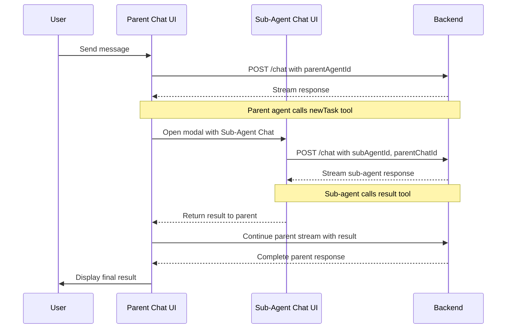
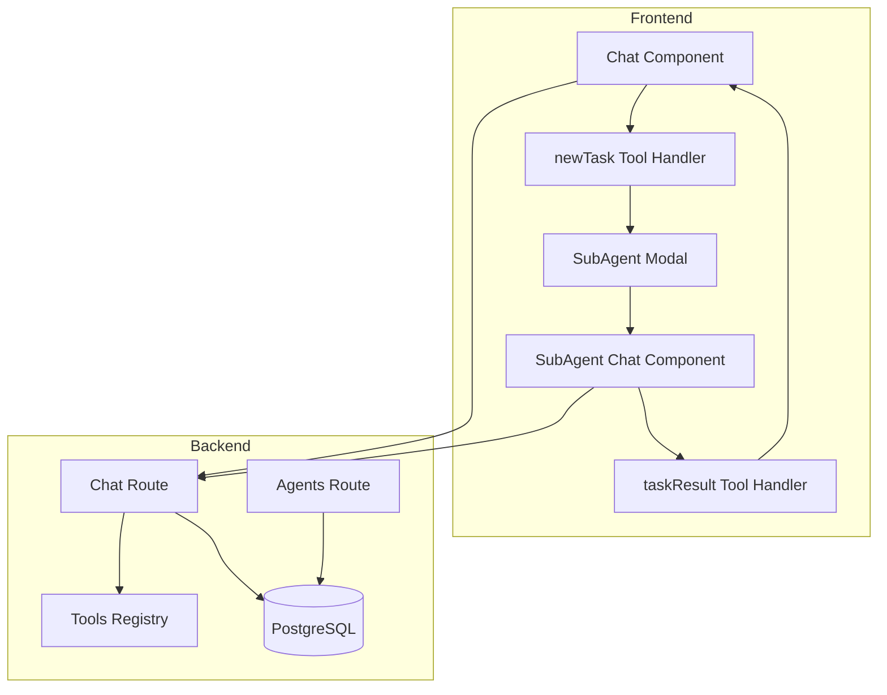

# Sub-Agents Feature - Design Plan

## Overview

This document outlines the design for implementing a "Sub-Agents" feature that allows parent agents to delegate specific sub-tasks to other agents. Sub-agents operate with their own context window and tools, preventing context bloat in the parent agent while enabling specialized task handling.

## Key Decisions Summary

| Decision | Choice |
|----------|--------|
| Sub-agent depth | Limited to 1 level at runtime (sub-agents dont get `newTask` tool) |
| Sub-agent assignment | Static - explicitly assigned to parent agent |
| Context passing | Fresh context with task-specific information from parent |
| Tool injection | Single auto-injected `newTask` tool when sub-agents assigned |
| Result tool | `taskResult` with `{ result: string, status: 'success' \| 'error' }` |
| Sub-agent stop condition | `taskResult` tool call OR 100 steps (safety limit) |
| UI presentation | Modal dialog for sub-agent chat |
| Persistence | Save sub-chats with `parentChatId` reference |
| Execution | Client-side tool execution starts new Chat component |
| Validation | Self-assignment prevention at agent create/update time |

---

## Architecture

### High-Level Flow



### Component Relationships



---

## Database Changes

### 1. Agent Table - Add `subAgentIds` Field

Add a new JSONB array field to store assigned sub-agent IDs:

```typescript
// apps/backend/src/db/schema.ts
export const agent = pgTable(
  "agent",
  (t) => ({
    // ... existing fields ...
    subAgentIds: t.jsonb("sub_agent_ids").$type<string[]>().default([]),
    // ... existing fields ...
  }),
  // ... indexes ...
);
```

### 2. Chat Table - Add `parentChatId` Field

Add an optional foreign key to support parent-child chat relationships:

```typescript
// apps/backend/src/db/schema.ts
export const chat = pgTable(
  "chat",
  (t) => ({
    // ... existing fields ...
    parentChatId: t.text("parent_chat_id").references(() => chat.id, {
      onDelete: "cascade",
    }),
    // ... existing fields ...
  }),
  (t) => [
    index("idx_chat_workspace_id").on(t.workspaceId),
    index("idx_chat_parent_chat_id").on(t.parentChatId),
  ],
);
```

---

## Schema Changes

### 1. Agent Schema Updates

```typescript
// packages/schemas/index.ts

export const agentSchema = z.object({
  // ... existing fields ...
  subAgentIds: z.array(z.string()).optional(),
  // ... existing fields ...
});

export const agentCreateSchema = agentSchema.pick({
  // ... existing fields ...
  subAgentIds: true,
});

export const agentUpdateSchema = agentSchema.pick({
  // ... existing fields ...
  subAgentIds: true,
});
```

### 2. Chat Schema Updates

```typescript
// packages/schemas/index.ts

export const chatSchema = z.object({
  // ... existing fields ...
  parentChatId: z.string().optional(),
  // ... existing fields ...
});

export const chatSubmitSchema = chatSchema
  .pick({
    // ... existing fields ...
  })
  .extend({
    // ... existing fields ...
    parentChatId: z.string().optional(),
  });
```

### 3. New Task Tool Schema

```typescript
// packages/schemas/index.ts

export const newTaskToolInputSchema = z.object({
  subAgentId: z.string().describe("The ID of the sub-agent to delegate to"),
  task: z.string().describe("The task description and context for the sub-agent"),
});

export type NewTaskToolInput = z.infer<typeof newTaskToolInputSchema>;

export const taskResultToolInputSchema = z.object({
  result: z.string().describe("The result of the completed task"),
  status: z.enum(["success", "error"]).describe("Whether the task succeeded or failed"),
});

export type TaskResultToolInput = z.infer<typeof taskResultToolInputSchema>;
```

---

## Backend Implementation

### 1. Sub-Agent Validation Service

Create a service to validate sub-agent assignments and prevent circular dependencies:

```typescript
// apps/backend/src/services/sub-agent-validation.ts

export const validateSubAgentAssignment = async (
  db: Database,
  workspaceId: string,
  agentId: string,
  subAgentIds: string[]
): Promise<{ valid: boolean; error?: string }> => {
  // 1. Check self-assignment
  if (subAgentIds.includes(agentId)) {
    return { valid: false, error: "An agent cannot assign itself as a sub-agent" };
  }

  // 2. Fetch all proposed sub-agents
  const subAgents = await db
    .select()
    .from(agentTable)
    .where(
      and(
        eq(agentTable.workspaceId, workspaceId),
        inArray(agentTable.id, subAgentIds)
      )
    );

  // 3. Verify all sub-agents exist in workspace
  if (subAgents.length !== subAgentIds.length) {
    return { valid: false, error: "One or more sub-agents not found in workspace" };
  }

  // Note: We allow agents that have their own sub-agents to BE sub-agents.
  // The depth limit is enforced at runtime - when an agent runs as a sub-agent,
  // the newTask tool is NOT injected, preventing nested delegation.

  return { valid: true };
};
```

### 2. Update Agent Routes

Modify the agent create/update routes to include validation:

```typescript
// apps/backend/src/routes/agent.ts

agent.post("/", /* ... middleware ... */, async (c) => {
  const data = c.req.valid("json");
  
  // Validate sub-agent assignments
  if (data.subAgentIds && data.subAgentIds.length > 0) {
    const validation = await validateSubAgentAssignment(
      db,
      workspaceId,
      "", // No ID yet for new agent
      data.subAgentIds
    );
    if (!validation.valid) {
      return c.json({ message: validation.error }, 400);
    }
  }
  
  // ... rest of create logic ...
});

agent.put("/:agentId", /* ... middleware ... */, async (c) => {
  const agentId = c.req.param("agentId");
  const data = c.req.valid("json");
  
  // Validate sub-agent assignments
  if (data.subAgentIds) {
    const validation = await validateSubAgentAssignment(
      db,
      workspaceId,
      agentId,
      data.subAgentIds
    );
    if (!validation.valid) {
      return c.json({ message: validation.error }, 400);
    }
  }
  
  // ... rest of update logic ...
});
```

### 3. Create Sub-Agent Tools

```typescript
// apps/backend/src/tools/sub-agent.ts

import { tool } from "ai";
import { z } from "zod";

/**
 * Creates the newTask tool for delegating to sub-agents.
 * This is a client-side tool - it has no execute function.
 * The frontend handles the tool call by spawning a new sub-agent chat.
 */
export const createNewTaskTool = (
  subAgents: Array<{ id: string; name: string; description?: string }>
) => {
  const subAgentDescriptions = subAgents
    .map((sa) => `- ${sa.name} (${sa.id}): ${sa.description || "No description"}`)
    .join("\n");

  return tool({
    description: `Delegate a task to a specialized sub-agent. Available sub-agents:\n${subAgentDescriptions}`,
    parameters: z.object({
      subAgentId: z.string().describe("The ID of the sub-agent to delegate to"),
      task: z.string().describe("Complete task description with all necessary context"),
    }),
    // No execute function - this is a client-side tool
  });
};

/**
 * Creates the taskResult tool for sub-agents to return their results.
 * This tool signals completion of the sub-agent task.
 * It is a client-side tool that the frontend uses to close the sub-agent modal
 * and return the result to the parent agent.
 */
export const createTaskResultTool = () => {
  return tool({
    description: "Call this tool when you have completed your assigned task. This will return control to the parent agent.",
    parameters: z.object({
      result: z.string().describe("The complete result of your task"),
      status: z.enum(["success", "error"]).describe("Whether the task was completed successfully"),
    }),
    // No execute function - this is a client-side tool
  });
};
```

### 4. Update Chat Route

Modify the chat POST endpoint to handle sub-agent mode:

```typescript
// apps/backend/src/routes/chat.ts

chat.post("/", /* ... middleware ... */, async (c) => {
  const data = c.req.valid("json");
  const { parentChatId } = data;
  const isSubAgentChat = Boolean(parentChatId);

  // ... existing context resolution ...

  // 4. Load Tools (Static & MCP)
  const { tools, mcpClients } = await loadTools(agent, workspaceId);

  // 5. Inject sub-agent tools if applicable
  if (agent?.subAgentIds && agent.subAgentIds.length > 0 && !isSubAgentChat) {
    // Fetch sub-agent details for tool descriptions
    const subAgents = await db
      .select({ id: agentTable.id, name: agentTable.name, description: agentTable.description })
      .from(agentTable)
      .where(inArray(agentTable.id, agent.subAgentIds));
    
    tools.newTask = createNewTaskTool(subAgents);
  }

  // 6. Inject taskResult tool if this is a sub-agent chat
  if (isSubAgentChat) {
    tools.taskResult = createTaskResultTool();
  }

  // 7. Determine stop condition
  // For sub-agents: stop when taskResult tool is called OR after 100 steps (safety limit)
  // For regular chats: stop after configured maxSteps
  const maxSteps = isSubAgentChat
    ? 100  // Force minimum for sub-agents
    : context.resolvedMaxSteps;

  // 8. Stream Response with appropriate stop condition
  const result = streamText({
    model: model as any,
    messages: await convertToModelMessages(messages),
    stopWhen: isSubAgentChat
      ? or(hasToolCall("taskResult"), stepCountIs(maxSteps))  // Stop on taskResult OR max steps
      : stepCountIs(maxSteps),
    tools,
    system: systemPrompt,
    ...restConfig,
  });

  return result.toUIMessageStreamResponse<PlatypusUIMessage>({
    originalMessages: messages,
    generateMessageId: createIdGenerator({
      prefix: "msg",
      size: 16,
    }),
    onFinish: async ({ messages }) => {
      // Upsert chat record with parentChatId if applicable
      await upsertChatRecord(
        data.id,
        workspaceId,
        messages,
        context,
        config,
        data,
        parentChatId  // Pass parentChatId for sub-agent chats
      );
    },
  });
});
```

### 5. Update Chat List Endpoint

Filter out sub-agent chats from the main list:

```typescript
// apps/backend/src/routes/chat.ts

chat.get("/", /* ... middleware ... */, async (c) => {
  // ... existing code ...

  const records = await db
    .select({
      // ... fields ...
    })
    .from(chatTable)
    .where(
      and(
        eq(chatTable.workspaceId, workspaceId),
        isNull(chatTable.parentChatId)  // Only top-level chats
      )
    )
    .orderBy(desc(chatTable.createdAt))
    .limit(limit)
    .offset(offset);

  return c.json({ results: records });
});
```

### 6. Sub-Chats Access

Sub-agent chats are saved with a `parentChatId` reference. To view sub-chats:
- When viewing a parent chat's history, the UI can fetch associated sub-chats by querying chats where `parentChatId` matches the current chat ID
- This could be done via an optional query parameter on the existing GET chat endpoint, or by fetching the parent chat and then querying for its children
- For now, we'll rely on the chat detail view to show linked sub-agent conversations inline, without needing a separate endpoint

---

## Frontend Implementation

### 1. Sub-Agent Context & State Management

```typescript
// apps/frontend/hooks/use-sub-agent-chat.ts

import { create } from "zustand";

interface SubAgentState {
  isActive: boolean;
  parentChatId: string | null;
  subAgentId: string | null;
  subChatId: string | null;
  task: string | null;
  result: { result: string; status: "success" | "error" } | null;
  
  startSubAgent: (parentChatId: string, subAgentId: string, task: string) => void;
  setSubChatId: (id: string) => void;
  completeSubAgent: (result: { result: string; status: "success" | "error" }) => void;
  closeSubAgent: () => void;
  resetSubAgent: () => void;
}

export const useSubAgentStore = create<SubAgentState>((set) => ({
  isActive: false,
  parentChatId: null,
  subAgentId: null,
  subChatId: null,
  task: null,
  result: null,

  startSubAgent: (parentChatId, subAgentId, task) =>
    set({
      isActive: true,
      parentChatId,
      subAgentId,
      subChatId: crypto.randomUUID(),
      task,
      result: null,
    }),

  setSubChatId: (id) => set({ subChatId: id }),

  completeSubAgent: (result) => set({ result, isActive: false }),

  closeSubAgent: () => set({ isActive: false }),

  resetSubAgent: () =>
    set({
      isActive: false,
      parentChatId: null,
      subAgentId: null,
      subChatId: null,
      task: null,
      result: null,
    }),
}));
```

### 2. NewTask Tool Component

```typescript
// apps/frontend/components/new-task-tool.tsx

import { useSubAgentStore } from "@/hooks/use-sub-agent-chat";
import { useEffect } from "react";
import { ToolUIPart } from "ai";

interface NewTaskToolProps {
  toolPart: ToolUIPart;
  parentChatId: string;
}

export const NewTaskTool = ({ toolPart, parentChatId }: NewTaskToolProps) => {
  const { startSubAgent, isActive } = useSubAgentStore();
  const input = toolPart.input as { subAgentId: string; task: string };

  useEffect(() => {
    if (toolPart.state === "output" && input?.subAgentId && input?.task && !isActive) {
      startSubAgent(parentChatId, input.subAgentId, input.task);
    }
  }, [toolPart.state, input, parentChatId, startSubAgent, isActive]);

  if (toolPart.state === "input-streaming") {
    return (
      <div className="text-muted-foreground text-sm">
        Preparing to delegate task...
      </div>
    );
  }

  return (
    <div className="border rounded-lg p-4 bg-muted/50">
      <div className="text-sm font-medium mb-2">Delegating to Sub-Agent</div>
      <div className="text-xs text-muted-foreground">
        Task: {input?.task?.substring(0, 100)}...
      </div>
    </div>
  );
};
```

### 3. SubAgentResultTool Component

```typescript
// apps/frontend/components/sub-agent-result-tool.tsx

import { useSubAgentStore } from "@/hooks/use-sub-agent-chat";
import { useEffect } from "react";
import { ToolUIPart } from "ai";
import { CheckCircle, XCircle } from "lucide-react";

interface SubAgentResultToolProps {
  toolPart: ToolUIPart;
}

export const SubAgentResultTool = ({ toolPart }: SubAgentResultToolProps) => {
  const { completeSubAgent } = useSubAgentStore();
  const input = toolPart.input as { result: string; status: "success" | "error" };

  useEffect(() => {
    if (toolPart.state === "output" && input?.result) {
      completeSubAgent(input);
    }
  }, [toolPart.state, input, completeSubAgent]);

  if (!input?.result) return null;

  return (
    <div className="border rounded-lg p-4 bg-muted/50">
      <div className="flex items-center gap-2 mb-2">
        {input.status === "success" ? (
          <CheckCircle className="size-4 text-green-500" />
        ) : (
          <XCircle className="size-4 text-red-500" />
        )}
        <span className="text-sm font-medium">
          Task {input.status === "success" ? "Completed" : "Failed"}
        </span>
      </div>
      <div className="text-sm">{input.result}</div>
    </div>
  );
};
```

### 4. Sub-Agent Modal Component

```typescript
// apps/frontend/components/sub-agent-modal.tsx

import { Dialog, DialogContent, DialogHeader, DialogTitle } from "@/components/ui/dialog";
import { Chat } from "@/components/chat";
import { useSubAgentStore } from "@/hooks/use-sub-agent-chat";
import { Badge } from "@/components/ui/badge";
import { Agent } from "@platypus/schemas";

interface SubAgentModalProps {
  orgId: string;
  workspaceId: string;
  agents: Agent[];
}

export const SubAgentModal = ({ orgId, workspaceId, agents }: SubAgentModalProps) => {
  const { 
    isActive, 
    subAgentId, 
    subChatId, 
    task, 
    parentChatId,
    closeSubAgent,
    result 
  } = useSubAgentStore();

  const subAgent = agents.find((a) => a.id === subAgentId);

  // Don't allow closing while streaming - show a warning instead
  const handleOpenChange = (open: boolean) => {
    if (!open && !result) {
      // Could show a warning toast here
      return;
    }
    if (!open) {
      closeSubAgent();
    }
  };

  return (
    <Dialog open={isActive} onOpenChange={handleOpenChange}>
      <DialogContent className="max-w-4xl h-[80vh] flex flex-col">
        <DialogHeader>
          <DialogTitle className="flex items-center gap-2">
            <Badge variant="secondary">Sub-Agent</Badge>
            {subAgent?.name || "Sub-Agent Task"}
          </DialogTitle>
        </DialogHeader>
        <div className="flex-1 overflow-hidden">
          {subChatId && subAgentId && (
            <Chat
              orgId={orgId}
              workspaceId={workspaceId}
              chatId={subChatId}
              initialAgentId={subAgentId}
              parentChatId={parentChatId!}
              initialTask={task!}
              isSubAgentMode
            />
          )}
        </div>
      </DialogContent>
    </Dialog>
  );
};
```

### 5. Update Chat Component

Add sub-agent mode support to the existing Chat component:

```typescript
// apps/frontend/components/chat.tsx

export const Chat = ({
  orgId,
  workspaceId,
  chatId,
  initialAgentId,
  parentChatId,      // New prop
  initialTask,       // New prop
  isSubAgentMode,    // New prop
}: {
  orgId: string;
  workspaceId: string;
  chatId: string;
  initialAgentId?: string;
  parentChatId?: string;
  initialTask?: string;
  isSubAgentMode?: boolean;
}) => {
  // ... existing code ...

  // Auto-send initial task for sub-agent mode
  useEffect(() => {
    if (isSubAgentMode && initialTask && messages.length === 0 && agentId) {
      sendMessage(
        { text: initialTask, files: [] },
        { 
          body: { 
            agentId, 
            parentChatId  // Include parentChatId in request
          } 
        }
      );
    }
  }, [isSubAgentMode, initialTask, messages.length, agentId, sendMessage, parentChatId]);

  // ... rest of component ...
};
```

### 6. Update Agent Form

Add sub-agent selection to the agent form:

```typescript
// apps/frontend/components/agent-form.tsx

// Add to formData state
const [formData, setFormData] = useState({
  // ... existing fields ...
  subAgentIds: [] as string[],
});

// Add sub-agent selector UI (similar to tools/skills)
{agents.filter(a => a.id !== agentId).length > 0 && (
  <Card className="mb-6">
    <CardHeader>
      <CardTitle>Sub-Agents</CardTitle>
    </CardHeader>
    <CardContent>
      <FieldDescription className="mb-4">
        Select agents that this agent can delegate tasks to.
        When running as a sub-agent, these agents will not be able to delegate further.
      </FieldDescription>
      <FieldGroup className="grid grid-cols-2 gap-4">
        {agents
          .filter((a) => a.id !== agentId)  // Only exclude self-assignment
          .map((agent) => (
            <Field key={agent.id} orientation="horizontal">
              <Switch
                id={`subagent-${agent.id}`}
                className="cursor-pointer"
                checked={formData.subAgentIds.includes(agent.id)}
                onCheckedChange={(checked) => {
                  setFormData((prevData) => ({
                    ...prevData,
                    subAgentIds: checked
                      ? [...prevData.subAgentIds, agent.id]
                      : prevData.subAgentIds.filter((id) => id !== agent.id),
                  }));
                }}
                disabled={isSubmitting}
              />
              <FieldLabel htmlFor={`subagent-${agent.id}`}>
                <div className="flex flex-col">
                  <p>{agent.name}</p>
                  <p className="text-xs text-muted-foreground line-clamp-1">
                    {agent.description || "No description"}
                  </p>
                </div>
              </FieldLabel>
            </Field>
          ))}
      </FieldGroup>
    </CardContent>
  </Card>
)}
```

### 7. Update Chat Message Component

Handle rendering of newTask and result tools:

```typescript
// apps/frontend/components/chat-message.tsx

// Add to the tool rendering logic
if (part.toolInvocation.toolName === "newTask") {
  return (
    <NewTaskTool
      key={`${message.id}-${index}`}
      toolPart={part}
      parentChatId={chatId}
    />
  );
}

if (part.toolInvocation.toolName === "taskResult") {
  return (
    <SubAgentResultTool
      key={`${message.id}-${index}`}
      toolPart={part}
    />
  );
}
```

---

## System Prompt Updates

### 1. Update System Prompt Renderer

Add sub-agent information to the system prompt:

```typescript
// apps/backend/src/system-prompt.ts

interface RenderSystemPromptParams {
  // ... existing params ...
  subAgents?: Array<{ id: string; name: string; description?: string }>;
}

export const renderSystemPrompt = ({
  // ... existing params ...
  subAgents,
}: RenderSystemPromptParams): string => {
  const parts: string[] = [];
  
  // ... existing parts ...

  // Add sub-agent information
  if (subAgents && subAgents.length > 0) {
    parts.push(`## Available Sub-Agents

You can delegate specialized tasks to the following sub-agents using the \`newTask\` tool:

${subAgents.map((sa) => `- **${sa.name}** (ID: ${sa.id}): ${sa.description || "No description provided"}`).join("\n")}

When delegating to a sub-agent:
1. Provide complete context and clear instructions in the task description
2. Include any relevant information the sub-agent needs to complete the task
3. Wait for the sub-agent to complete before continuing
4. Use the result returned by the sub-agent to continue your work`);
  }

  return parts.filter(Boolean).join("\n\n");
};
```

### 2. Sub-Agent System Prompt Addition

When running as a sub-agent, append this to the system prompt:

```typescript
const subAgentSystemPromptAddition = `
## Important: Sub-Agent Mode

You are running as a sub-agent delegated a specific task. 

CRITICAL INSTRUCTIONS:
- Focus ONLY on the task you have been assigned
- When you have completed the task, you MUST call the \`taskResult\` tool
- The \`taskResult\` tool is the ONLY way to return control to the parent agent
- Include all relevant findings and outputs in your result
- Set status to "success" if you completed the task, "error" if you could not
`;
```

---

## Implementation Checklist

### Phase 1: Database & Schema
- [ ] Add `subAgentIds` field to agent table
- [ ] Add `parentChatId` field to chat table
- [ ] Create database index for `parentChatId`
- [ ] Update agent Zod schemas
- [ ] Update chat Zod schemas
- [ ] Add newTask and taskResult tool schemas
- [ ] Run `pnpm drizzle-kit-push` to apply changes

### Phase 2: Backend Services
- [ ] Create sub-agent validation service
- [ ] Update agent create route with validation
- [ ] Update agent update route with validation
- [ ] Create newTask tool factory
- [ ] Create taskResult tool factory
- [ ] Update chat POST endpoint for sub-agent mode
- [ ] Update chat list endpoint to filter sub-chats

### Phase 3: Backend Integration
- [ ] Update system prompt renderer for sub-agents
- [ ] Update tool loading in chat route
- [ ] Implement stop condition for sub-agent chats (taskResult OR maxSteps)
- [ ] Update chat upsert to include parentChatId
- [ ] Add sub-agent types to PlatypusTools

### Phase 4: Frontend State
- [ ] Create useSubAgentStore hook
- [ ] Create sub-agent context provider
- [ ] Update Chat transport to include parentChatId

### Phase 5: Frontend Components
- [ ] Create NewTaskTool component
- [ ] Create SubAgentResultTool component
- [ ] Create SubAgentModal component
- [ ] Update ChatMessage to handle new tools
- [ ] Update Chat component for sub-agent mode
- [ ] Update AgentForm with sub-agent selection

### Phase 6: Testing & Polish
- [ ] Test self-assignment prevention
- [ ] Test sub-agent delegation flow
- [ ] Test taskResult tool completion
- [ ] Test modal open/close behavior
- [ ] Test chat persistence with parentChatId
- [ ] Test chat list filtering
- [ ] Add error handling for edge cases

---

## Open Questions / Future Considerations

1. **Token Usage Tracking**: Should we track token usage separately for parent vs sub-agent chats?

2. **Sub-Agent Timeouts**: Should there be a timeout for sub-agent execution to prevent infinite loops?

3. **Sub-Agent Retries**: If a sub-agent fails, should the parent be able to retry automatically?

4. **Sub-Agent History in Parent**: Should we show a collapsed summary of sub-agent chats inline in the parent chat?

5. **Sub-Agent Analytics**: Should we track metrics on sub-agent delegation patterns and success rates?

6. **Multi-Turn Sub-Agent**: Currently sub-agents complete in one turn. Should we support multi-turn conversations with user intervention?

---

## Files to Create/Modify

### New Files
- `apps/backend/src/services/sub-agent-validation.ts`
- `apps/backend/src/tools/sub-agent.ts`
- `apps/frontend/hooks/use-sub-agent-chat.ts`
- `apps/frontend/components/new-task-tool.tsx`
- `apps/frontend/components/sub-agent-result-tool.tsx`
- `apps/frontend/components/sub-agent-modal.tsx`

### Modified Files
- `apps/backend/src/db/schema.ts`
- `apps/backend/src/routes/agent.ts`
- `apps/backend/src/routes/chat.ts`
- `apps/backend/src/system-prompt.ts`
- `apps/backend/src/types.ts`
- `packages/schemas/index.ts`
- `apps/frontend/components/chat.tsx`
- `apps/frontend/components/chat-message.tsx`
- `apps/frontend/components/agent-form.tsx`
